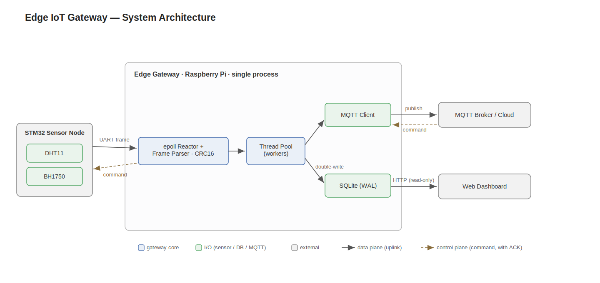

# embedded-edge-gateway

C++17 多协议嵌入式 Linux 边缘网关,目标运行环境:Raspberry Pi 4B。单进程串起从串口采集到云端上行的完整数据链路,并内嵌一个轻量 HTTP 监控服务,提供实时网页与历史曲线。

## 架构



STM32 节点经 UART 把传感器数据按自定义二进制帧发到网关。网关主线程是一个 epoll 事件循环:串口与信号(SIGHUP)都作为 channel 挂在同一个循环里。串口数据经帧解析状态机(CRC16 校验)解码成一条条记录后,提交给线程池;每个 worker 同时做两件事——落本地 SQLite、向 MQTT broker 上行发布,即「双写」。

HTTP 监控服务跑在独立线程,持有一个**只读** SQLite 连接,靠 WAL 与主链的读写连接并发——查询不阻塞落库。浏览器访问即可看到实时设备卡片与 uPlot 历史曲线。

关键设计:

- **三入口统一事件驱动**:串口数据与 SIGHUP 信号都封装成 channel,挂在主线程同一个 epoll 循环上,避免阻塞 read 卡死信号处理。
- **双写**:每条记录由线程池 worker 同时落本地 SQLite 和 MQTT 上行,互不阻塞。
- **读写并发**:HTTP 查询用独立的只读 SQLite 连接(`SQLITE_OPEN_READONLY`),靠 WAL 与主链写连接并发。
- **配置热加载**:`SIGHUP` 触发 load-then-swap 原子换配置,失败回滚不影响运行中的旧配置;串口/MQTT/DB 按 diff 仅重建真正变化的资源。
- **RAII 析构顺序**:`pool` 最后声明 => 最先析构(drain 在飞任务),此时 `db`/`client` 仍被任务的 shared_ptr 快照持有,无 use-after-free。
- **致命退出**:broker 连不上 / 串口打不开 / 磁盘异常统一被 catch,优雅致命退出,交由 systemd 重启接管。

详细的串口帧协议见 [docs/m5_frame_protocol.md](docs/m5_frame_protocol.md)。

## 构建

依赖:

```bash
sudo apt install -y libsqlite3-dev libmosquitto-dev
```

```bash
cmake -B build -S . -DCMAKE_BUILD_TYPE=Debug
cmake --build build
```

## 运行(端到端)

`gateway` 单进程串起完整数据流,需要本机有一个 MQTT broker(网关启动即连接,连不上会退出)。

```bash
sudo systemctl start mosquitto          # 或 mosquitto -c /etc/mosquitto/mosquitto.conf
```

开发环境用虚拟串口对模拟 STM32 与网关之间的 UART。需要 4 个终端:

**终端 1** — 创建虚拟串口对(`/tmp/ttyV0` 网关侧、`/tmp/ttyV1` STM32 侧),保持运行:

```bash
./scripts/start_vserial.sh
```

**终端 2** — 启动网关:

```bash
./build/gateway /tmp/ttyV0
```

**终端 3** — 假 STM32 喂数据(每秒一帧,循环发四类业务帧):

```bash
cd experiments/m5_parser
g++ -std=c++17 -Wall CRC16.cpp fake_stm32.cpp -o fake_stm32
./fake_stm32 /tmp/ttyV1
```

## 验证

浏览器打开 **http://localhost:8888** —— 实时设备卡片,点卡片切换 uPlot 历史曲线。

命令行交叉验证:

```bash
# SQLite 落库
sqlite3 /tmp/gateway.db "SELECT * FROM device_data ORDER BY ts DESC LIMIT 5;"

# MQTT 上行
mosquitto_sub -h localhost -t 'gateway/up/#' -v

# HTTP API(只读连接查询,按 ts 倒序)
curl 'http://localhost:8888/api/data?dev=temperature&n=10'
```

业务解码产出的设备:`temperature` / `humidity`(温湿度帧拆两条)、`illuminance`(光照)、`device_status`(状态);心跳帧不落库。

## 部署

生产环境以 systemd 服务运行,配置文件位于 `/etc/gateway.conf`,支持热加载:

```bash
sudo systemctl reload gateway           # 发 SIGHUP 重读配置,无需重启
```

部署相关文件见 `src/deploy/`(`gateway.service` 与 `gateway.conf` 模板)。

## License

本项目以 [MIT License](LICENSE) 开源,© 2026 manbaaa-out。
