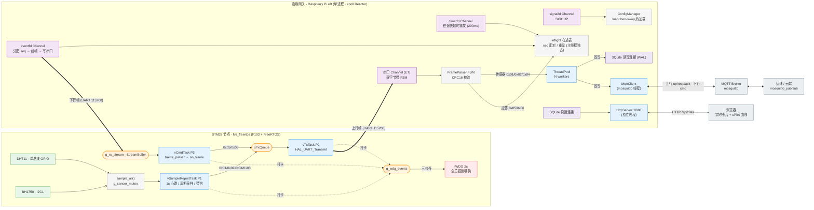

# embedded-edge-gateway

> 跑在树莓派上的 **C++17 嵌入式边缘网关** —— 单进程、事件驱动,把 STM32 节点的串口数据**双写**到本地 SQLite 与云端 MQTT,并支持云端下发命令、内嵌实时监控页、systemd 托管与配置热加载。

[](https://github.com/manbaaa-out/embedded-edge-gateway/actions/workflows/ci.yml)


一条 epoll 主循环统一调度**串口 I/O、下行命令、超时重试、信号热加载**;配合**单一写者** + **线程池双写** + **读写分离**,在资源受限的树莓派上把「采集上云」与「云端控制」两条链路做得稳、省、可观测。配套的 STM32 节点固件见 [stm32-learning · N6_freertos](https://github.com/manbaaa-out/stm32-learning/tree/main/N6_freertos)。

```
STM32 节点  ──UART(自定义帧)──▶  网关  ──┬──▶  SQLite(本地历史)
                                          ├──▶  MQTT broker(云端上行)
   ▲                                      └──▶  HTTP :8888(实时网页 + 曲线)
   └─────── 下行命令(MQTT → 串口,带 ACK/重发)◀──────┘
```

## 目录

- [特性](#特性)
- [架构](#架构)
- [协议速览](#协议速览)
- [快速开始](#快速开始)
- [运行与测试](#运行与测试)
  - [方式一:虚拟串口(本地开发,无需硬件)](#方式一虚拟串口本地开发无需硬件)
  - [方式二:真实 STM32(真机联调)](#方式二真实-stm32真机联调)
  - [验证上行数据](#验证上行数据)
  - [下行命令](#下行命令)
- [配置](#配置)
- [部署](#部署)
- [里程碑](#里程碑)
- [项目结构](#项目结构)
- [许可证](#许可证)

## 特性

- **双向链路** — 上行(采集 → 双写 → 上云)+ 下行(MQTT 命令 → 串口控制),命令带 `seq`、ACK 配对、超时重发(同 seq 幂等)。
- **统一事件驱动** — 串口数据、下行命令(eventfd)、超时重试(timerfd)、SIGHUP 信号(signalfd)全部封装成 `channel`,挂在主线程同一个 epoll 循环上。
- **单一写者** — 串口 fd 只由主线程写,跨线程命令经线程安全队列 + eventfd 投递,`SerialPort` 无需加锁。
- **线程池双写** — 每条记录由 worker 同时落本地 SQLite 与 MQTT 上行,互不阻塞主链。
- **读写并发** — HTTP 查询走独立的**只读** SQLite 连接(`SQLITE_OPEN_READONLY`),靠 WAL 与主链写连接并发,查询不阻塞落库。
- **内嵌监控页** — HTML/JS/CSS 在 CMake 配置期嵌入二进制,单文件部署、离线自包含、不依赖 CDN。
- **配置热加载** — `SIGHUP` 触发 load-then-swap 原子换配置,解析失败保留旧配置不中断;串口 / MQTT / DB 按 diff 仅重建真正变化的资源。
- **稳健工程化** — RAII 管控资源与析构顺序(无 use-after-free)、致命错误优雅退出交由 systemd 重启接管、编译零警告(`-Wall -Wextra -Wpedantic`)。

## 架构

下图把**两端内部**都画了出来:左侧是 STM32 节点([N6_freertos](https://github.com/manbaaa-out/stm32-learning/tree/main/N6_freertos))的 FreeRTOS 任务 / IPC / 看门狗,右侧是网关单进程内的 epoll Reactor、线程池、双写与监控;中间一条 UART 串起**上行采集**与**下行命令**两条链路。



**上行(采集)** — STM32 经 UART 把传感器数据按自定义二进制帧发来。主线程的 epoll 循环把串口、eventfd、timerfd、信号(SIGHUP)统统作为 channel 挂在一起;串口数据经帧解析状态机(CRC16 校验)解码成一条条记录后提交线程池,每个 worker 同时**落本地 SQLite + 向 MQTT 上行发布**,即「双写」。

**下行(命令)** — 运维往 `gateway/cmd/<命令>` 发 MQTT 消息,mosquitto 网络线程把它翻译成命令、塞进线程安全队列、戳一下 eventfd 唤醒主循环——**自己绝不碰串口**。主循环在 eventfd 回调里分配 seq、组帧、写串口,并登记到「在途表」。STM32 的 ACK / 查询应答经串口回来,由解析器配对在途表后销账、再经 MQTT 回发结果;另有 timerfd 周期扫描在途表,超时未收 ACK 就按同一 seq 重发(幂等),重试耗尽判失败。

**监控** — HTTP 服务跑在独立线程,持有一个**只读** SQLite 连接,靠 WAL 与主链读写连接并发——查询不阻塞落库。浏览器访问即可看到实时设备卡片与 uPlot 历史曲线。

**STM32 节点内部**(图左)— 三任务按 命令(P3)> 发送(P2)> 采样上报(P1)分工,经 `xTxQueue` / `g_rx_stream` 流缓冲 / `g_sensor_mutex` 解耦;USART1 `ReceiveToIdle + DMA` 收、RX-IDLE 中断 `FromISR` 唤醒命令任务;三任务在事件组 `g_wdg_events` 各自「打卡」,集齐才喂 IWDG(2s),配合 tickless Sleep 低功耗。

## 协议速览

自定义二进制帧:`AA 55 | LEN | TYPE | payload… | CRC16_LO CRC16_HI`。CRC16-MODBUS(多项式 `0xA001`,初值 `0xFFFF`),覆盖 `LEN..payload`;`LEN = 1 + len(payload)`(含 TYPE)。

| 方向 | TYPE | 含义 | 网关行为 |
|---|---|---|---|
| 上行 | `0x01` / `0x02` | 温湿度 / 光照 | 解码 → 双写 SQLite + `gateway/up/<dev>` |
| 上行 | `0x03` | 心跳(1s) | 不落库 |
| 上行 | `0x04` | 设备状态(bitmask) | 拆 `status_dht11` / `status_bh1750` |
| 应答 | `0x05` / `0x06` | 查询应答 / 命令 ACK | 配对在途表 → `gateway/resp/<seq>` / `gateway/ack/<seq>` |
| 下行 | `0x20` / `0x21` | 查光照 / 查温湿度 | 组帧 → 写串口 → 等 ACK |
| 下行 | `0x22` | 设采样周期(秒) | 同上,参数 2B 大端 |

完整规约见 [docs/m5_frame_protocol.md](docs/m5_frame_protocol.md)。

## 快速开始

```bash
# 1. 构建工具链 + 库依赖
sudo apt update
sudo apt install -y build-essential cmake libsqlite3-dev libmosquitto-dev

# 2. 运行 / 测试用:MQTT broker、客户端、SQLite CLI、虚拟串口
sudo apt install -y mosquitto mosquitto-clients sqlite3 socat

# 3. 构建(产物为单个可执行 build/gateway,参数是配置文件路径)
cmake -B build -S . -DCMAKE_BUILD_TYPE=Debug
cmake --build build
```

## 运行与测试

网关启动即连接 MQTT broker(连不上会致命退出),两种方式都先确保 broker 在跑:

```bash
sudo systemctl start mosquitto        # 或:mosquitto -c /etc/mosquitto/mosquitto.conf
```

### 方式一:虚拟串口(本地开发,无需硬件)

用 `socat` 造一对虚拟串口,再用仓库自带的 `fake_stm32` 模拟节点喂帧。需要 4 个终端。

```bash
# ① 创建虚拟串口对(/tmp/ttyV0 网关侧、/tmp/ttyV1 节点侧),保持运行
./scripts/start_vserial.sh

# ② 准备一份指向虚拟串口的配置(默认 serial_path 是真机串口,复制一份改掉)
sed 's#^serial_path =.*#serial_path = /tmp/ttyV0#' src/deploy/gateway.conf > /tmp/gateway.dev.conf

# ③ 启动网关
./build/gateway /tmp/gateway.dev.conf

# ④ 编译并运行假 STM32(每秒发一帧,循环发光照/温湿度/状态/心跳)
cd experiments/m5_parser
g++ -std=c++17 -Wall CRC16.cpp fake_stm32.cpp -o fake_stm32
./fake_stm32 /tmp/ttyV1
```

随后浏览器打开 <http://localhost:8888> 即可看到实时数据,再按 [验证上行数据](#验证上行数据) 交叉验证。

### 方式二:真实 STM32(真机联调)

在树莓派上用真实 STM32 节点经 UART 通信。节点固件按 [帧协议](docs/m5_frame_protocol.md) 组帧上报,并响应下行命令(`0x20/0x21/0x22`)回 ACK(`0x06`)/ 查询应答(`0x05`)—— 即配套的 [N6_freertos](https://github.com/manbaaa-out/stm32-learning/tree/main/N6_freertos)。

**① 接线**(STM32 与树莓派都是 3.3V TTL 电平,可直连;**切勿**接 RS232 或 5V,会烧片)。二选一:

- **USB-TTL 转接器**(最省事):STM32 `TX → 适配器 RX`、`RX → 适配器 TX`、`GND ↔ GND`;适配器插树莓派 USB,设备名通常是 `/dev/ttyUSB0`。
- **树莓派板载 GPIO UART**:STM32 `TX → RPi RXD(GPIO15 / pin10)`、`RX → RPi TXD(GPIO14 / pin8)`、`GND ↔ GND`;设备名是 `/dev/serial0`(通常软链到 `/dev/ttyAMA0` 或 `/dev/ttyS0`)。板载 UART 还需 `raspi-config` 关串口控制台、开串口硬件,并确认 `enable_uart=1`(Pi 3/4 建议加 `dtoverlay=disable-bt`),改完重启。

**② 串口权限**(免 sudo 读写),加入 `dialout` 组后重新登录:

```bash
sudo usermod -aG dialout $USER
ls -l /dev/ttyUSB* /dev/serial*        # 确认设备名
```

**③ 一键预检 + 联调**(仓库自带脚本,自动检查串口/权限/工具/broker 并生成配置):

```bash
# 预检:检查环境,生成 /tmp/gateway.e2e.conf(波特率默认 115200,需与固件一致)
./scripts/e2e_preflight.sh

# 另起一个终端,用生成的配置前台跑网关(方便看日志)
./build/gateway /tmp/gateway.e2e.conf

# 回到原终端,验证上行落库 + 上行 MQTT + 下行命令 ACK 闭环
./scripts/e2e_verify.sh
```

> 设备名 / 波特率非默认时,用环境变量覆盖:`SERIAL_DEV=/dev/serial0 SERIAL_BAUD=115200 ./scripts/e2e_preflight.sh`。真机长期运行建议用 systemd 托管,见 [部署](#部署)。

### 验证上行数据

```bash
# SQLite 落库(按时间倒序看最近 5 条)
sqlite3 /tmp/gateway.db "SELECT * FROM device_data ORDER BY ts DESC LIMIT 5;"

# MQTT 上行
mosquitto_sub -h localhost -t 'gateway/up/#' -v

# HTTP API(只读连接查询,按 ts 倒序)
curl 'http://localhost:8888/api/data?dev=temperature&n=10'
```

业务解码产出的设备:`temperature` / `humidity`(温湿度帧拆两条)、`illuminance`(光照)、`status_dht11` / `status_bh1750`(0x04 状态帧按 bitmask 拆两路健康状态,1=在线 0=故障);心跳帧不落库。

### 下行命令

往 `gateway/cmd/<命令>` 发 MQTT 消息即可下发控制(网关组帧、写串口、等 ACK、超时重发):

```bash
# 先订阅回执:ACK 走 gateway/ack/<seq>,查询应答走 gateway/resp/<seq>
mosquitto_sub -h localhost -t 'gateway/ack/#' -t 'gateway/resp/#' -v &

mosquitto_pub -h localhost -t gateway/cmd/query_light -m ''      # 查询光照(0x20)
mosquitto_pub -h localhost -t gateway/cmd/query_th    -m ''      # 查询温湿度(0x21)
mosquitto_pub -h localhost -t gateway/cmd/set_period  -m 2000    # 设采样周期 2000 秒(0x22)
```

> 虚拟串口下,`fake_stm32` 只发数据、不回应命令,所以下行命令会触发 3 次重试后判失败(可在日志观察重试 / 超时逻辑);要看完整 ACK 闭环,需用能回应命令的真实 STM32 固件。
>
> 命令名 → TYPE 映射在 [src/main.cpp](src/main.cpp) 的下行 handler 里;未知命令名、超范围参数会被丢弃并告警。

## 配置

配置文件示例见 [src/deploy/gateway.conf](src/deploy/gateway.conf)。按「改完是否需要重启」分三档:

| 档 | 键 | 默认值 | 含义 |
|---|---|---|---|
| **A**(改内存即生效) | `log_level` | `1` | 日志级别 0=DEBUG 1=INFO 2=WARN 3=ERROR |
| | `idle_timeout` | `5` | HTTP 空闲连接超时(秒) |
| | `report_n` | `10` | HTTP 曲线默认拉取点数 |
| | `mqtt_keepalive` | `60` | MQTT keepalive(秒) |
| **B**(热加载重建对应资源) | `serial_path` | `/dev/ttyUSB0` | 串口设备路径 |
| | `serial_baud` | `115200` | 波特率(9600/19200/38400/57600/115200) |
| | `mqtt_host` | `localhost` | MQTT broker 地址 |
| | `db_path` | `/tmp/gateway.db` | SQLite 路径(真机建议 `/var/lib/gateway/gateway.db`) |
| **C**(改了需重启进程) | `mqtt_port` | `1883` | MQTT 端口 |
| | `http_port` | `8888` | HTTP 监控端口 |
| | `worker_count` | `4` | 线程池工作线程数 |

热加载:改完配置发 `SIGHUP`(`kill -HUP $(pgrep -x gateway)`,或 systemd 下 `systemctl reload gateway`)。A 档改内存即生效;B 档按 diff 仅重建变化的资源;C 档热加载会忽略并告警。

## 部署

生产环境以 systemd 服务运行,配置文件位于 `/etc/gateway.conf`:

```bash
sudo install -m 755 build/gateway /usr/local/bin/gateway
sudo install -m 644 src/deploy/gateway.conf /etc/gateway.conf      # 按需改 serial_path/db_path
sudo install -m 644 src/deploy/gateway.service /etc/systemd/system/gateway.service

sudo systemctl daemon-reload
sudo systemctl enable --now gateway        # 开机自启 + 立即启动
sudo systemctl reload gateway              # 发 SIGHUP 热加载配置,无需重启
journalctl -u gateway -f                   # 看日志
```

服务单元见 [src/deploy/gateway.service](src/deploy/gateway.service)(`ExecReload` 发 SIGHUP、`Restart=on-failure`、含 `ProtectSystem` 等安全加固选项)。

## 里程碑

按里程碑迭代搭起整条链路,每步都可独立验证;模块解耦,逐层往上叠:

| | 里程碑 | 能力 |
|---|---|---|
| M2 | 配置 | 配置解析 + load-then-swap 热加载 |
| M3 | 日志 | 异步双缓冲日志(后台线程落盘) |
| M4 | 串口 | termios 串口 RAII(读 + 写,非阻塞) |
| M5 | 协议 | 帧解析 FSM + CRC16 + 下行组帧 |
| M6 / M8 | 并发 | 线程安全队列 + 线程池 |
| M7 / M9 | Reactor | epoll 事件循环 + timerfd 定时 |
| M10 | 上云 | MQTT 客户端(上行发布 + 下行订阅) |
| M11 | 监控 | epoll HTTP 服务 + 内嵌网页 + uPlot 曲线 |
| M12 | 持久化 | SQLite 封装(读写 / 只读连接 + WAL) |
| 方案B | 下行闭环 | seq 分配 / ACK 配对 / 超时重发(幂等) |
| M15 | 落地 | systemd 服务 + 优雅退出 + 安全加固 |

## 项目结构

```
embedded-edge-gateway/
├── src/
│   ├── log/         # M3 异步双缓冲日志
│   ├── serial/      # M4 串口 termios RAII(读 + 写)
│   ├── protocol/    # M5 帧解析 FSM + CRC16 + 下行组帧 FrameBuilder
│   ├── concurrent/  # M6 线程安全队列 + M8 线程池
│   ├── net/         # M7 epoll Reactor + M9 timerfd + M11 HTTP + 内嵌监控服务
│   ├── db/          # M12 SQLite 封装(读写连接 / 只读连接 / WAL)
│   ├── mqtt/        # M10 MQTT 客户端(上行发布 + 下行订阅)
│   ├── config/      # M2 配置解析 + 热加载(load-then-swap)
│   ├── deploy/      # systemd unit + 配置文件示例
│   └── main.cpp     # 装配全链路:采集→双写→上云 + 下行命令 + 热加载
├── web/             # 内嵌监控页(编译期 asset embedding)
├── docs/            # 帧协议规约 + 各模块速记
├── scripts/         # 虚拟串口 + 实体 STM32 端到端联调脚本
├── experiments/     # 学习沙箱(各里程碑原型 + fake_stm32 模拟节点)
└── CMakeLists.txt
```

## 许可证

本项目以 [MIT License](LICENSE) 开源,© 2026 manbaaa-out。
