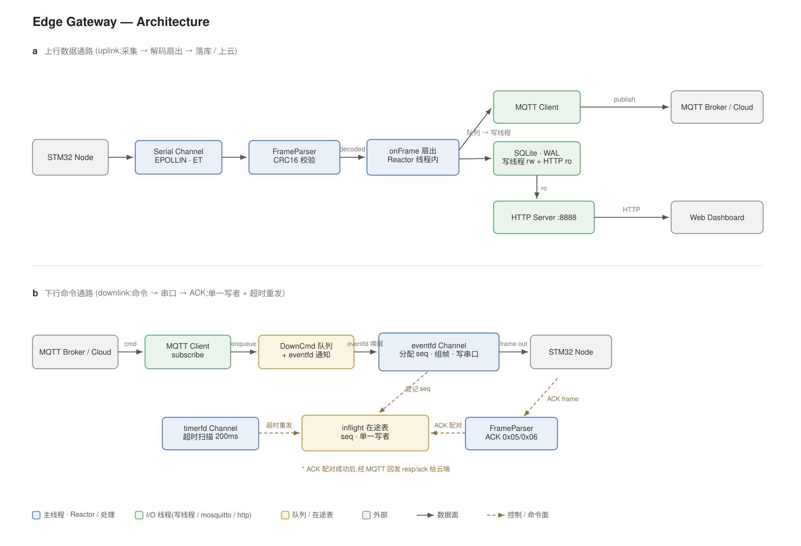

# embedded-edge-gateway

> 跑在树莓派上的 **C++17 嵌入式边缘网关** —— 单进程、事件驱动,把 STM32 节点的串口数据同时**落本地 SQLite**与**上行云端 MQTT**,并支持云端下发命令、内嵌实时监控页、systemd 托管与配置热加载。

[](https://github.com/manbaaa-out/embedded-edge-gateway/actions/workflows/ci.yml)


一条 epoll 主循环统一调度**串口 I/O、下行命令、超时重试、信号热加载**;配合**单一写者** + **单写线程 + 有类型队列** + **读写分离**,在资源受限的树莓派上把「采集上云」与「云端控制」两条链路做得稳、省、可观测。

与配套的 [STM32 FreeRTOS 传感节点](https://github.com/manbaaa-out/stm32-learning) **编译同一份协议源码** —— 见 [协议契约](#协议契约一份源码两端共用)。

```
STM32 节点  ──UART(自定义帧)──▶  网关  ──┬──▶  SQLite(本地历史)
                                          ├──▶  MQTT broker(云端上行)
   ▲                                      └──▶  HTTP :8888(实时网页 + 曲线)
   └─────── 下行命令(MQTT → 串口,带 ACK/重发)◀──────┘
```

## 目录

- [特性](#特性)
- [架构](#架构)
- [协议契约:一份源码,两端共用](#协议契约一份源码两端共用)
- [快速开始](#快速开始)
- [运行与测试](#运行与测试)
  - [方式一:节点模拟器(本地开发,无需硬件)](#方式一节点模拟器本地开发无需硬件)
  - [方式二:真实 STM32(真机联调)](#方式二真实-stm32真机联调)
  - [验证上行数据](#验证上行数据)
  - [下行命令](#下行命令)
- [测试](#测试)
- [配置](#配置)
- [已知边界](#已知边界)
- [部署](#部署)
- [项目结构](#项目结构)
- [许可证](#许可证)

## 特性

- **双向链路** — 上行(采集 → 双写 → 上云)+ 下行(MQTT 命令 → 串口控制),命令带 `seq`、ACK 配对、超时重发。重发的安全性不押在节点那个深度为 1 的幂等窗口上,而是由协议 §6.6 从语义层保证:下行命令只能是查询型或绝对值设置型,**重复执行无害**。
- **协议单一真相** — TYPE 字典、结果码、量纲、时序契约集中在一份 C99 头文件里,**网关与 STM32 固件编译同一份源码**、跑同一份金标准向量,漂移由脚本机器检测。
- **统一事件驱动** — 串口数据、下行命令(eventfd)、超时重试(timerfd)、SIGHUP 信号(signalfd)全部封装成 `channel`,挂在主线程同一个 epoll 循环上。
- **单一写者** — 串口 fd 只由主线程写,跨线程命令经线程安全队列 + eventfd 投递,`SerialPort` 无需加锁。
- **单写线程 + 机会式攒批** — 遥测经有界队列交给一条专属写线程,它独占 SQLite 写连接(连接活在它的栈上,别处拿不到,故 `Database` 内部零锁);取一条后再用 `try_pop` 把此刻已排队的一并取走合进同一个事务——**不引入任何等待**,空闲时一批就是一帧,忙时批量自动变大。上云则在 Reactor 线程直接 `publish`(µs 级,只塞进库的发送队列),两条路并列而非串联。
- **读写并发** — HTTP 查询走独立的**只读** SQLite 连接(`SQLITE_OPEN_READONLY`),靠 WAL 与主链写连接并发,查询不阻塞落库。
- **内嵌监控页** — HTML/JS/CSS 在 CMake 配置期嵌入二进制,单文件部署、离线自包含、不依赖 CDN。
- **配置热加载** — `SIGHUP` 触发 load-then-swap 原子换配置,解析失败保留旧配置不中断;串口 / MQTT / DB 按 diff 仅重建真正变化的资源。
- **可测性** — 协议编解码、在途命令表、业务解码、命令翻译均为无 I/O 的纯逻辑,99 个单测覆盖;另有 22 项 e2e 断言在虚拟串口上跑完上行、下行、故障注入、热加载全流程。
- **稳健工程化** — RAII 管控资源与析构顺序、致命错误优雅退出交由 systemd 重启接管、`-Wall -Wextra -Wpedantic -Wconversion` 下编译零警告、CI 跑 ASan/UBSan。

## 架构

单进程把「采集 → 双写 → 上云」与「下发 → 串口 → ACK」两条链路串到一起。下图分两栏:**(a) 上行数据通路** 与 **(b) 下行命令通路**(单一写者 + 超时重发)。**实线 = 数据面**,**虚线 = 控制 / 命令面**。



**上行(采集)** — STM32 经 UART 把传感器数据按自定义二进制帧发来。主线程的 epoll 循环把串口、eventfd、timerfd、信号统统作为 channel 挂在一起;串口数据经帧解析状态机(CRC16 校验)解码成一条条记录后,在 Reactor 线程里**扇出成两条并列的路**:一条直接 `publish` 上行(µs 级,不阻塞),另一条 `try_push` 进有界队列交给**遥测写线程**批量落库——队列满(磁盘写不动)时宁可丢新数据也不阻塞 Reactor。

**下行(命令)** — 运维往 `gateway/cmd/<命令>` 发 MQTT 消息,mosquitto 网络线程把它翻译成命令、塞进线程安全队列、戳一下 eventfd 唤醒主循环——**自己绝不碰串口**。主循环在 eventfd 回调里分配 seq、组帧、写串口,并登记到「在途表」。STM32 的 ACK / 查询应答经串口回来,由解析器配对在途表后销账、再经 MQTT 回发结果;另有 timerfd 周期扫描在途表,超时未收 ACK 就按同一 seq 重发(幂等),重试耗尽判失败并回 `gateway/ack/<seq> = timeout`。

**线程构成** — 进程内恰好五条:主 Reactor、遥测写线程、mosquitto 网络线程、HTTP 监控线程,
以及 `AsyncLogger` 的日志 flush 线程(由单例在第一次 `LOG_*` 时启动,是全进程唯一写日志 fd 的那条)。
线程之间**一律用队列通信,不共享可变状态**,所以进程里只剩队列自身与日志双缓冲那几把锁——
`CommandTracker`、`SerialPort`、`Database` 内部一把锁都没有,不是忘了加,是没有共享可保护。

**监控** — HTTP 服务跑在独立线程,持有一个**只读** SQLite 连接,靠 WAL 与主链读写连接并发——查询不阻塞落库。浏览器访问即可看到实时设备卡片与 uPlot 历史曲线。

**代码分层**(依赖方向自下而上,由 `target_link_libraries` 钉死,越层 `#include` 直接编译失败):

```
app        装配:把下面各层接起来(唯一能看见全部的层)
 ├─ link       与节点的链路:NodeLink(收发帧)· CommandTracker(在途表,纯逻辑)
 ├─ pipeline   遥测数据流:TelemetryDecoder(纯函数)· TelemetryPipeline(写线程 + 攒批)
 ├─ cloud      MQTT 客户端 · CommandTranslator(纯函数)
 ├─ storage    SQLite 封装
 ├─ io         与 OS 打交道:串口 · epoll · HTTP
 ├─ protocol   edge_proto 的薄 C++ 封装
 └─ core       日志 · 配置 · 并发原语(不含任何业务概念)
```

## 协议契约:一份源码,两端共用

自定义二进制帧:`AA 55 | LEN | TYPE | payload… | CRC16_LO CRC16_HI`。CRC16-MODBUS(多项式 `0xA001`,初值 `0xFFFF`),覆盖 `LEN..payload`;`LEN = 1 + len(payload)`(含 TYPE)。

| 方向 | TYPE | 含义 | 网关行为 |
|---|---|---|---|
| 上行 | `0x01` / `0x02` | 温湿度 / 光照 | 解码 → 双写 SQLite + `gateway/up/<dev>` |
| 上行 | `0x03` | 心跳(1s) | 不落库 |
| 上行 | `0x04` | 设备状态(bitmask) | 拆 `status_dht11` / `status_bh1750` |
| 应答 | `0x05` / `0x06` | 查询应答 / 命令 ACK | 配对在途表 → `gateway/resp/<seq>` / `gateway/ack/<seq>` |
| 下行 | `0x20` / `0x21` | 查光照 / 查温湿度 | 组帧 → 写串口 → 等 ACK |
| 下行 | `0x22` | 设采样周期(**秒**) | 同上,参数 2B 大端 |

**这些数值只存在于一个地方**:[`protocol/include/edge_proto/edge_proto.h`](protocol/include/edge_proto/edge_proto.h)。网关与 STM32 固件编译**同一份 C99 源码**,不是各写一份再靠文档对齐。

这不是洁癖。此前两端各自手抄,结果 `0x22` 采样周期的单位在协议文档写 ms、网关代码写秒、固件代码写秒、README 写秒 —— **四处三种说法,长期无人发觉**。现在:

- **共享源码** — `protocol/` 纯 C99、无 malloc/stdio/平台头,网关 `add_subdirectory` 引入,固件 vendored 后直接编译
- **金标准向量** — [`protocol/vectors/`](protocol/vectors/) 里的帧与 CRC 向量,两个仓库的测试跑**同一个文件**
- **漂移守卫** — `scripts/check_proto_sync.sh` 比对两端 SHA256,不一致即构建失败
- **可移植性由编译器证明** — CI 里一个 job 用 `arm-none-eabi-gcc -mcpu=cortex-m3 -ffreestanding` 编译它,并检查未定义符号里没有 libc

完整规约见 [docs/protocol.md](docs/protocol.md),实现契约见其 §10。

## 快速开始

```bash
# 1. 构建工具链 + 库依赖
sudo apt update
sudo apt install -y build-essential cmake ninja-build libsqlite3-dev libmosquitto-dev

# 2. 运行 / 测试用:MQTT broker、客户端、SQLite CLI、虚拟串口
sudo apt install -y mosquitto mosquitto-clients sqlite3 socat

# 3. 构建(preset 见 CMakePresets.json)
cmake --preset dev          # Debug + 测试 + 零警告基线
cmake --build --preset dev

# 产物:build/dev/gateway(参数是配置文件路径)
#      build/dev/tools/node-sim/node-sim(节点模拟器)
```

可用的 preset:`dev`(开发)、`asan`(ASan+UBSan)、`tsan`(ThreadSanitizer)、`release`(树莓派部署,不编测试)。

## 运行与测试

网关启动即连接 MQTT broker(连不上会致命退出),两种方式都先确保 broker 在跑:

```bash
sudo systemctl start mosquitto
```

### 方式一:节点模拟器(本地开发,无需硬件)

**一条命令跑完全流程**(自起自停 socat + 网关 + 模拟器,22 项断言):

```bash
./scripts/e2e_vserial.sh
```

想手动观察就分步来:

```bash
# ① 创建虚拟串口对(/tmp/ttyV0 网关侧、/tmp/ttyV1 节点侧),保持运行
./scripts/start_vserial.sh

# ② 准备一份指向虚拟串口的配置
sed 's#^serial_path.*=.*#serial_path = /tmp/ttyV0#' deploy/gateway.conf > /tmp/gateway.dev.conf

# ③ 启动网关
./build/dev/gateway /tmp/gateway.dev.conf

# ④ 启动节点模拟器
./build/dev/tools/node-sim/node-sim /tmp/ttyV1 --period 2
```

`node-sim` 不只是发数据 —— 它按固件同一套规则**响应下行命令并回 ACK**(含同 seq 幂等),所以无硬件也能跑通完整的命令闭环。它还能**主动制造故障**,这些在真硬件上要靠拔线和运气:

```bash
node-sim /tmp/ttyV1 --drop-ack 0.5   # 一半应答丢失 → 应看到重发后成功
node-sim /tmp/ttyV1 --no-ack         # 从不应答     → 应看到 3 次重发后判失败
node-sim /tmp/ttyV1 --drop-uplink 0.3 # 丢上行帧
node-sim /tmp/ttyV1 --garbage 0.3    # 线路噪声     → 验证 FSM resync 不卡死
```

随后浏览器打开 <http://localhost:8888> 即可看到实时数据。

### 方式二:真实 STM32(真机联调)

在树莓派上用真实 STM32 节点经 UART 通信。节点固件见 [STM32 FreeRTOS 传感节点](https://github.com/manbaaa-out/stm32-learning) —— 它与本仓库编译同一份协议核心。

**① 接线**(STM32 与树莓派都是 3.3V TTL 电平,可直连;**切勿**接 RS232 或 5V,会烧片)。二选一:

- **USB-TTL 转接器**(最省事):STM32 `TX → 适配器 RX`、`RX → 适配器 TX`、`GND ↔ GND`;适配器插树莓派 USB,设备名通常是 `/dev/ttyUSB0`。
- **树莓派板载 GPIO UART**:STM32 `TX → RPi RXD(GPIO15 / pin10)`、`RX → RPi TXD(GPIO14 / pin8)`、`GND ↔ GND`;设备名是 `/dev/serial0`。板载 UART 还需 `raspi-config` 关串口控制台、开串口硬件,并确认 `enable_uart=1`(Pi 3/4 建议加 `dtoverlay=disable-bt`),改完重启。

**② 串口权限**(免 sudo 读写),加入 `dialout` 组后重新登录:

```bash
sudo usermod -aG dialout $USER
ls -l /dev/ttyUSB* /dev/serial*        # 确认设备名
```

**③ 一键预检 + 联调**:

```bash
# 预检:检查环境,生成 /tmp/gateway.e2e.conf(波特率默认 115200,需与固件一致)
./scripts/e2e_preflight.sh

# 另起一个终端,用生成的配置前台跑网关
./build/dev/gateway /tmp/gateway.e2e.conf

# 回到原终端,验证上行落库 + 上行 MQTT + 下行命令 ACK 闭环
./scripts/e2e_verify.sh
```

> 设备名 / 波特率非默认时用环境变量覆盖:`SERIAL_DEV=/dev/serial0 SERIAL_BAUD=115200 ./scripts/e2e_preflight.sh`。

### 验证上行数据

```bash
# SQLite 落库(按时间倒序看最近 5 条)
sqlite3 /tmp/gateway.db "SELECT * FROM device_data ORDER BY ts DESC LIMIT 5;"

# MQTT 上行
mosquitto_sub -h localhost -t 'gateway/up/#' -v

# HTTP API(只读连接查询,按 ts 倒序)
curl 'http://localhost:8888/api/data?dev=temperature&n=10'
```

业务解码产出的设备:`temperature` / `humidity`(温湿度帧拆两条)、`illuminance`(光照)、`status_dht11` / `status_bh1750`(状态帧按 bitmask 拆两路,1=在线 0=故障);心跳帧不落库。

### 下行命令

往 `gateway/cmd/<命令>` 发 MQTT 消息即可下发控制:

```bash
# 先订阅回执:ACK 走 gateway/ack/<seq>,查询应答走 gateway/resp/<seq>
mosquitto_sub -h localhost -t 'gateway/ack/#' -t 'gateway/resp/#' -v &

mosquitto_pub -h localhost -t gateway/cmd/query_light -m ''      # 查询光照(0x20)
mosquitto_pub -h localhost -t gateway/cmd/query_th    -m ''      # 查询温湿度(0x21)
mosquitto_pub -h localhost -t gateway/cmd/set_period  -m 2000    # 设采样周期 2000 秒(0x22)
```

命令的结局一定会回到 MQTT,不会石沉大海:

| 情形 | 回执 |
|---|---|
| 成功 | `gateway/ack/<seq> = ok` 或 `gateway/resp/<seq> = ok,<数据>` |
| 节点拒绝 | `gateway/ack/<seq> = err,<结果码>` |
| 重试耗尽 | `gateway/ack/<seq> = timeout` |
| 参数非法 / 未知命令 | `gateway/ack/rejected = <原因>`(网关当场挡下,不下发) |

命令名 → TYPE 的映射在 [`src/gateway/cloud/CommandTranslator.cpp`](src/gateway/cloud/CommandTranslator.cpp)。

## 测试

```bash
ctest --preset dev              # 99 个单测
ctest --preset asan             # 同样的单测跑在 ASan + UBSan 下
./scripts/e2e_vserial.sh        # 22 项端到端断言(虚拟串口,含故障注入)
./scripts/check_proto_sync.sh   # 协议核心漂移守卫
```

单测的分布反映了分层的收益 —— 这些逻辑都不碰 I/O,所以能测:

| 位置 | 覆盖 |
|---|---|
| `tests/protocol/` | CRC 向量、帧编解码往返、FSM 错误路径、**逐行跑金标准向量**(与固件共享) |
| `tests/link/` | seq 回绕、应答配对、迟到/重复应答、**重发复用同 seq**、计时重置、重试耗尽判死(注入假时钟) |
| `tests/pipeline/` | 各 TYPE 解码、bitmask 拆分、短 payload 丢弃、边界值 |
| `tests/cloud/` | 命令翻译、参数边界、非法输入 |
| `tests/core/` | 配置解析、热加载 diff、C 档忽略、失败回滚 |
| `tests/io/` | HTTP 半包、大小写、pipelining、长连接复用 |

## 配置

配置文件示例见 [deploy/gateway.conf](deploy/gateway.conf)。按「改完是否需要重启」分三档:

| 档 | 键 | 默认值 | 含义 |
|---|---|---|---|
| **A**(改内存即生效) | `log_level` | `1` | 日志级别 0=DEBUG 1=INFO 2=WARN 3=ERROR |
| | `idle_timeout` | `5` | HTTP 空闲连接超时(秒) |
| | `report_n` | `10` | HTTP 曲线默认拉取点数 |
| **B**(热加载重建对应资源) | `serial_path` | `/dev/ttyUSB0` | 串口设备路径 |
| | `serial_baud` | `115200` | 波特率(9600/19200/38400/57600/115200) |
| | `mqtt_host` | `localhost` | MQTT broker 地址 |
| | `db_path` | `/tmp/gateway.db` | SQLite 路径(真机建议 `/var/lib/gateway/gateway.db`) |
| | `mqtt_keepalive` | `60` | MQTT keepalive(秒)。它被写进 CONNECT 报文,改内存不生效,**必须重连**——所以是 B 档不是 A 档 |
| **C**(改了需重启进程) | `mqtt_port` | `1883` | MQTT 端口 |
| | `http_port` | `8888` | HTTP 监控端口 |

热加载:改完配置发 `SIGHUP`(`kill -HUP $(pgrep -x gateway)`,或 systemd 下 `systemctl reload gateway`)。A 档改内存即生效;B 档按 diff 仅重建变化的资源;C 档热加载会忽略并告警。

## 已知边界

写在前面比被人发现好。这些不是「还没来得及做」,是**当前设计明确的取舍**:

| 边界 | 现状 | 要突破需要什么 |
|---|---|---|
| **只支持单节点** | 协议帧里没有设备寻址字段 | v2.0 的协议头扩展,**不向后兼容** |
| **断网不补传** | 上行 `publish` 用 QoS 0,断网期间的读数只落在本地库里 | 一条「历史批量重发」的路径——顺带,那是本项目唯一能让线程池的 λ×W 算得过账的场景 |
| **数据无限增长** | 没有分区 / 定期删除 / 降采样,按 1.5 条·秒⁻¹ 估算约 6 MB/天 | 写线程里加一条周期性 `DELETE FROM device_data WHERE ts < ?` |
| **无 TLS / 无认证** | MQTT 明文;HTTP 绑 `0.0.0.0` 且无鉴权(请求体已限 64 KB) | 上公网前必须先补;临时方案是绑 `127.0.0.1` + SSH 端口转发 |
| **无指标导出** | FSM 的 `frames_ok` / `crc_err` / `resync` 只进日志,没有 `/metrics` | 链路质量目前要靠翻日志看 |
| **幂等窗口深度不足** | 节点窗口深度 1,而网关不限在途条数,协议 §6.2 的条件并不成立 | 双边改动:网关限在途上限 + 节点开环形缓存 + 共享 `EDGE_MAX_INFLIGHT`。**后果已由 §6.6 的语义约束限定在「多执行一次无害操作」** |
| **串口断开不自动重连** | 只记日志,不重建 | 设备热插拔后需人工 `SIGHUP` |

## 部署

生产环境以 systemd 服务运行,配置文件位于 `/etc/gateway.conf`:

```bash
cmake --preset release && cmake --build --preset release
sudo cmake --install build/release          # 装二进制 + 配置样例 + service 单元

sudo systemctl daemon-reload
sudo systemctl enable --now gateway         # 开机自启 + 立即启动
sudo systemctl reload gateway               # 发 SIGHUP 热加载配置,无需重启
journalctl -u gateway -f                    # 看日志
```

服务单元见 [deploy/gateway.service](deploy/gateway.service)(`ExecReload` 发 SIGHUP、`Restart=on-failure`、含 `ProtectSystem` 等安全加固选项)。

## 项目结构

```
embedded-edge-gateway/
├── protocol/           # ★ 与 STM32 固件共享的 C99 协议核心 + 金标准向量
├── src/gateway/
│   ├── core/           #   日志 · 配置 · 并发原语
│   ├── protocol/       #   edge_proto 的薄 C++ 封装
│   ├── storage/        #   SQLite(读写连接 / 只读连接 / WAL)
│   ├── cloud/          #   MQTT 客户端 · 下行命令翻译
│   ├── io/
│   │   ├── serial/     #   串口 termios RAII
│   │   ├── event/      #   epoll Reactor + channel
│   │   └── http/       #   HTTP 服务
│   │       └── assets/ #     监控页资源(编译期嵌进二进制,见下)
│   ├── link/           #   与节点的链路:收发帧 · 在途命令表
│   ├── pipeline/       #   遥测解码 · 写线程与攒批
│   └── app/            #   GatewayApp(装配 + 主循环)· main.cpp
├── tools/node-sim/     # 节点模拟器(响应命令 + 故障注入)
├── tests/              # GoogleTest + CTest,按层与 src 一一对应
├── scripts/            # 联调脚本 · 协议漂移守卫
├── deploy/             # systemd unit + 配置样例
├── cmake/              # 编译选项 · sanitizer
└── docs/protocol.md    # 串口帧协议规约 v1.4
```

> 监控页资源放在 `io/http/assets/` 而不是仓库根的 `web/`:它不是独立的前端工程,
> 也不是构建产物,而是 HTTP 模块的**编译期输入** —— CMake 在配置期把它读进
> `WebAsset.h`,改了 `index.html` 就要重新 configure。资源与唯一消费它的模块同处一地。

## 许可证

本项目以 [MIT License](LICENSE) 开源,© 2026 manbaaa-out。
