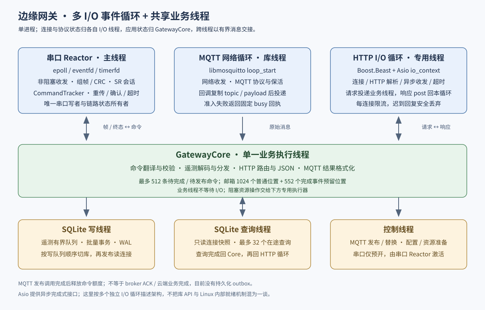

# embedded-edge-gateway

> 树莓派上的 C++17 边缘网关：把 STM32 传感节点的串口数据落进本地 SQLite 并上行 MQTT，同时把云端命令下发到节点——带 `seq`、ACK 配对与超时重发。

[](https://github.com/manbaaa-out/embedded-edge-gateway/actions/workflows/ci.yml)


```
   DHT11 ┐                           ┌─▶ SQLite      本地历史
  BH1750 ┘  STM32 ──UART 自定义帧──▶  ├─▶ MQTT        云端上行
                     ◀─────────────   └─▶ HTTP :8888  实时网页 + 曲线
                      命令 + ACK/重发
```

单进程、多 I/O 事件循环：串口 epoll、libmosquitto 网络循环、Boost.Beast/Asio HTTP 循环分别负责传输。
**三种入口共用 GatewayCore 业务线程；数据库查询、批量写入和资源控制分别在专用线程执行。**
串口协议状态只在串口 Reactor 访问，应用状态只在业务线程访问，跨线程通过有界消息队列交接。
独立管理 Reactor 接收信号，专门管理工作线程执行重载；默认稳定运行通常为 9 条线程，包含异步日志线程。

---

## 30 秒跑起来（不需要硬件）

```bash
sudo apt install -y build-essential cmake ninja-build libsqlite3-dev libmosquitto-dev libboost-dev libboost-system-dev \
                    mosquitto mosquitto-clients sqlite3 socat
cmake --preset dev && cmake --build --preset dev
./scripts/e2e_vserial.sh          # 自起自停：虚拟串口 + 网关 + 节点模拟器
```

`e2e_vserial.sh` 跑完上行落库、下行命令、故障注入、热加载全流程：

```
=== 全部通过：3/3 组（串口输出、SR 传输、多循环架构）===
```

想自己动手看，开三个终端：

```bash
./scripts/start_vserial.sh                                   # ① 虚拟串口对
./build/dev/gateway deploy/gateway.conf                      # ② 网关
./build/dev/tools/node-sim/node-sim /tmp/ttyV1 --period 2    # ③ 节点模拟器
```

数据立刻开始流动：

```console
$ mosquitto_sub -h localhost -t 'gateway/up/#' -v
gateway/up/temperature 23.1
gateway/up/humidity 50.1
gateway/up/illuminance 107
gateway/up/status_dht11 1
gateway/up/status_bh1750 1

$ curl -s 'http://localhost:8888/api/data?dev=temperature&n=3'
[{"device_id":"temperature","value":23.4,"ts":1786704025},
 {"device_id":"temperature","value":23.3,"ts":1786704023},
 {"device_id":"temperature","value":23.2,"ts":1786704021}]

$ sqlite3 /tmp/gateway.db 'SELECT device_id, value, ts FROM device_data ORDER BY ts DESC LIMIT 3;'
temperature|23.4|1786704025
humidity|50.4|1786704025
illuminance|128.0|1786704025
```

浏览器打开 <http://localhost:8888> 是内嵌的监控页——HTML/JS/CSS 在编译期嵌进二进制，
单文件部署、离线自包含、不依赖 CDN。

## 从云端下发一条命令

```console
$ mosquitto_sub -h localhost -t 'gateway/ack/#' -t 'gateway/resp/#' -v &

$ mosquitto_pub -h localhost -t gateway/cmd/query_th   -m ''
gateway/resp/0 ok,23.1,50.1                                     ← 节点现采后回的值

$ mosquitto_pub -h localhost -t gateway/cmd/set_period -m 5
gateway/ack/1 ok

$ mosquitto_pub -h localhost -t gateway/cmd/set_period -m 99999
gateway/ack/rejected set_period 超范围: 99999 (允许 1..65535 秒)   ← 当场挡下，不下发

$ mosquitto_pub -h localhost -t gateway/cmd/frobnicate -m ''
gateway/ack/rejected 未知命令: 'frobnicate'
```

**已接受命令产生明确终态并交给 MQTT 发布接口；这不等于 broker 或云端已经收到。**
目前没有持久化 outbox，断网或进程退出时不承诺结果可靠补传：

| 情形 | 回执 |
|---|---|
| 成功 | `gateway/ack/<seq> = ok`；查询类是 `gateway/resp/<seq> = ok,<数据>` |
| 节点拒绝 | `gateway/ack/<seq> = err,<结果码>` |
| 重试 3 次仍无应答 | `gateway/ack/<seq> = timeout` |
| 串口写失败 / 热加载终止旧会话 | `gateway/ack/<seq> = send_failed` / `session_aborted` |
| 命令准入或业务队列已满 | `gateway/ack/rejected = gateway_busy` |
| 参数非法 / 未知命令 | `gateway/ack/rejected = <原因>`（网关当场挡下） |

节点模拟器还能**主动造故障**——这些在真硬件上要靠拔线和运气：

```bash
node-sim /tmp/ttyV1 --drop-ack 0.5    # 一半应答丢失 → 看重发后成功
node-sim /tmp/ttyV1 --no-ack          # 从不应答     → 看 3 次重发后判失败
node-sim /tmp/ttyV1 --garbage 0.3     # 线路噪声     → 看收帧 FSM resync 不卡死
```

## 几个值得一看的设计决定

**I/O 和应用业务分开。** 串口 Reactor 只推进读写与 SR 状态；MQTT 网络回调只投递原始消息；
HTTP 使用 Boost.Beast 的 HTTP/1 解析/序列化和 Boost.Asio 异步收发，不再维护自写 HTTP FSM。
GatewayCore 统一完成命令翻译、遥测解码、HTTP 路由、JSON 与 MQTT 结果格式化。
HTTP 查询交给单独的只读执行线程，完成后回业务线程生成响应，再 post 回 HTTP 连接所属循环。

**串口只有一个写者。** 命令在 GatewayCore 产生，通过有界队列 + eventfd 交给串口 Reactor。
最多接收 512 条待完成/待发布命令；业务邮箱有 1024 个普通位置和 552 个完成预留位置。
命令额度直到管理工作线程执行终态发布调用后才释放；发送、重传与接收确认仍在同一线程推进。
主线程每轮最多接收 32 条命令；SR 发送窗口为 8，尚未得到执行结果的命令也最多 8 条（含首次排队）。
节点接收窗口同为 8，乱序缓存、按序同步执行。接收确认只停止该帧重传，执行结果才完成业务。
串口输出按帧排队，短写保留偏移，整帧交给内核后开始本轮 500 ms 接收确认计时。
未获接收确认的命令从首次排队起最多等待 4 秒，执行结果最多等待 10 秒；重试耗尽时终止旧会话，
新会话确认前不继续下发，避免后续命令越过永久缺口。序号 0…255 排空后换会话再复用。

**落库不阻塞采集。** 遥测经有界队列交给一条专属写线程：它阻塞取一条，再把此刻已排队的一并取走、
合进同一个事务——**不引入任何等待**。空闲时一批就是一帧，忙时批量自动变大，
所以不需要配「攒批窗口」那种在两种负载下都不对的参数。队列满时宁可丢新数据也不停 Reactor。

**管理事件与耗时重载分开。** `gateway-admin` 是独立管理 Reactor，以自己的 epoll/signalfd 接收
SIGHUP、SIGTERM、SIGINT；SIGHUP 只向 `gateway-manage` 管理工作线程提交重载任务。
TERM/INT 直接发布停机状态并写主 eventfd 唤醒串口 Reactor，不等待管理工作线程完成慢重载。
main 在创建任何线程前统一屏蔽这些信号，失败则中止启动；主串口 epoll 不再监听 signalfd。
配置读取、数据库准备、MQTT 创建/替换和正常发布由管理工作线程串行执行。
串口候选在后台仅 open，随后由串口 Reactor 应用 termios、
替换 fd 并重新建立 SR 会话。SQLite 写连接按队列顺序切换后才发布 HTTP 读连接。
析构先停止并 join 管理 Reactor，再关闭其他入口和排空消费者；管理工作线程排空后才销毁 MQTT。
配置快照先于资源应用发布，失败是部分降级而非事务回滚；工作线程中的同步 DNS/connect/loop_stop
仍可能等待，因此能及时发出停机通知不代表全部线程已退出，未承诺网络故障下的退出时间上界。
切库边界以写队列入队顺序为准；
资源应用失败后，以相同配置再次重载可能无差异可应用，不能视为自动重试。

**异步日志防的是正反馈。** 同步 `write` 到 journald 会阻塞，而 journald 变慢恰恰发生在故障风暴时。
双缓冲把前端代价压成一次锁内 memcpy，真正的写发生在锁外。

> 每条背后的推导、代码走读与踩过的坑，见下方[文档](#文档)。

## 协议：不是「同协议」，是同一份源码

```
AA 55 | LEN | TYPE | payload… | CRC_LO CRC_HI       CRC16-MODBUS
       └────── CRC16 覆盖 ─────┘                     LEN = 1 + len(payload)，含 TYPE
                                                    整帧 6–69 字节
```

| 方向 | TYPE | 含义 |
|---|---|---|
| 上行 | `0x01` `0x02` `0x03` `0x04` | 温湿度 / 光照 / 心跳 / 设备状态 |
| 应答 | `0x07` `0x08` `0x09` | 接收确认 / 执行结果 / 会话确认 |
| 下行 | `0x23` `0x24` `0x25` | 建立会话 / SR 命令 / 执行结果确认 |
| 命令内操作码 | `0x20` `0x21` `0x22` | 查光照 / 查温湿度 / 设采样周期 |

**这些数值只存在于一个地方**：[`protocol/include/edge_proto/edge_proto.h`](protocol/include/edge_proto/edge_proto.h)。
网关与 [STM32 固件](https://github.com/manbaaa-out/stm32-learning) 编译**同一份 C99 源码**，
不是各写一份再靠文档对齐。

这不是洁癖。此前两端各自手抄，结果 `0x22` 采样周期的单位在协议文档写 ms、网关写秒、固件写秒、
README 写秒——**四处三种说法，长期无人发觉**。现在：

- 共享源码——`protocol/` 纯 C99，无 malloc / stdio / 平台头，固件 vendored 后直接编译
- 两仓跑同一份[金标准向量](protocol/vectors/)
- `scripts/check_proto_sync.sh` 比对 SHA256，不一致即构建失败
- CI 用 `arm-none-eabi-gcc -mcpu=cortex-m3 -ffreestanding` 编译它，**可移植性由编译器证明**

**协议 2.0：SR 窗口与结果缓存分别管理。** STM32 和 node-sim 共用 `edge_sr.c`。
16 个固定槽保存待执行命令及未确认结果；执行结果保留最多 5 秒，结果 ACK 可提前释放，重放不续期。
即使结果缓存已释放，窗口左侧的旧序号也不能再执行；会话号隔离旧帧，防止旧设置覆盖新设置。
网关、模拟器与固件必须同步更新，旧裸命令不再执行。失败策略、边界和测试见 [SR 设计](docs/command-dedup.md)。

完整规约：[docs/protocol.md](docs/protocol.md)。

## 文档

| | 内容 |
|---|---|
| [网关与节点面经 · 两部分](docs/master-interview/index.html) | 第一部分为 120 道纯八股，第二部分为 54 道项目问答，逐题回指对应原理；附权威资料校对、源码快照和知识覆盖表。[八股 PDF](docs/master-interview/第一部分_纯八股.pdf) · [项目 PDF](docs/master-interview/第二部分_项目面经.pdf) · [离线包](docs/master-interview.zip) |
| [本轮架构验收](docs/multi-reactor-validation.md) | 构建、153 项回归（150 单元 + 3 端到端）、管理信号/过载/停机验证、文档检查与未验证边界 |
| [协议规约](docs/protocol.md) | 帧格式、TYPE 字典、结果码、时序契约、变更记录 |
| [总览 · 十一个视角](https://claude.ai/code/artifact/72329567-372c-4834-a9ad-26575b654266) | 约束 / 分层 / 线程 / 数据流 / 生命周期 / 失败与降级 / 已知边界 |
| [精读 A · 基础设施层](https://claude.ai/code/artifact/5a856ec7-d923-43b4-89d1-823ed50c209e) | EventLoop 与 channel、队列、异步日志、配置热加载、串口 |
| [精读 B · 协议与链路层](https://claude.ai/code/artifact/18d44c1e-994a-498c-97ba-685fc0d0f6a1) | CRC16、组帧与收帧 FSM、C↔C++ 接缝、在途命令表、MqttClient |
| [精读 C · 存储与 HTTP 层](https://claude.ai/code/artifact/c75b4c65-2022-4806-b90f-e0ffa50da5fe) | 历史版本说明（自写 Buffer/HTTP FSM 已由 Beast 替代），当前实现见总面经 |

总面经的离线网页不依赖 CDN，可以直接双击 HTML；也可以在仓库根目录启动本地服务：

```bash
python3 -m http.server 8765
# 浏览器打开 http://localhost:8765/docs/master-interview/index.html
```

架构总览（I/O 线程、业务线程与专用执行器的职责边界）：



## 接真实硬件

STM32 与树莓派都是 3.3V TTL，可直连（**切勿**接 RS232 或 5V，会烧片）。二选一：

- **USB-TTL 转接器**（最省事）：STM32 `TX→适配器 RX`、`RX→适配器 TX`、`GND↔GND`，设备名通常 `/dev/ttyUSB0`
- **树莓派板载 UART**：STM32 `TX→GPIO15 (pin10)`、`RX→GPIO14 (pin8)`、`GND↔GND`，设备名 `/dev/serial0`
  （需关闭串口登录控制台并启用 UART；下方安装脚本会自动处理，首次安装后需重启）

```bash
sudo usermod -aG dialout $USER     # 免 sudo 读写串口，需重新登录
./scripts/e2e_preflight.sh         # 检查环境并生成 /tmp/gateway.e2e.conf
./build/dev/gateway /tmp/gateway.e2e.conf
./scripts/e2e_verify.sh            # 另一个终端：验证上行落库 + 上行 MQTT + 下行 ACK 闭环
```

> 设备名 / 波特率非默认时：`SERIAL_DEV=/dev/serial0 SERIAL_BAUD=115200 ./scripts/e2e_preflight.sh`

## 构建、测试与部署

```bash
cmake --preset dev              # 另有 asan / tsan / release
cmake --build --preset dev

ctest --preset dev              # 全部单元测试，含真实 PTY 短写和 EPOLLOUT 续传
ctest --preset asan             # 同样的单测跑在 ASan + UBSan 下
ctest --preset e2e              # 串口/SR 回归与多循环隔离、热加载、停机、过载验证
./scripts/e2e_vserial.sh        # 3 组测试，各自启动独立 Broker 和 PTY
./scripts/check_proto_sync.sh   # 协议漂移守卫
python3 tests/e2e/serial_output.py build/dev/gateway  # 独立 Broker + PTY，验证分批与重发计时
```

协议编解码、在途命令表、业务解码、命令翻译、配置热加载都是**无 I/O 的纯逻辑**，
时间由调用方注入——所以「重试三次后判死」这种真机上要等 2 秒的场景，单测里注入假时钟瞬间跑完。

部署以 systemd 托管，配置在 `/etc/gateway.conf`。从开发机一条命令同步、在
ARM64 目标机编译并安装（`GW_REMOTE` 按实际地址填写）：

```bash
GW_REMOTE=pi@192.168.1.10 GW_SERIAL_DEV=/dev/serial0 \
  ./scripts/sync_build.sh --test --install
```

`--install` 会在目标机请求一次 `sudo`，安装低权限的动态 systemd 用户、持久化
数据库目录与 journal 策略，并在使用板载 UART 时关闭 `console=serial0`。若脚本提示需要重启：

```bash
ssh pi@192.168.1.10 'sudo reboot'
# 重连后检查
ssh pi@192.168.1.10 'systemctl status gateway --no-pager'
curl http://192.168.1.10:8888/
```

项目已经在树莓派本机时，也可直接执行：

```bash
cmake --preset release && cmake --build --preset release
sudo ./scripts/install_rpi.sh                 # 默认 /dev/serial0
# USB-TTL：sudo ./scripts/install_rpi.sh --serial /dev/ttyUSB0
sudo systemctl reload gateway              # 发 SIGHUP 热加载，无需重启
journalctl -u gateway -f
# 按启动周期查看持久日志
journalctl --list-boots
journalctl -u gateway -b -1
```

### 当前开发机作为 MQTT Broker

当前部署让开发机 `192.168.1.6` 提供 Broker，树莓派 `192.168.1.10` 的
`mqtt_host` 指向该地址。本机 Broker 由系统 Mosquitto 托管：

```bash
systemctl status mosquitto
sudo tail -f /var/log/mosquitto/mosquitto.log
```

WSL 的 Hyper-V 防火墙规则只允许树莓派访问本机 `1883/TCP`；需要重建规则时，
以管理员 PowerShell 运行 [scripts/allow_wsl_mqtt.ps1](scripts/allow_wsl_mqtt.ps1)。
Broker 配置见
[deploy/mosquitto-workstation.conf](deploy/mosquitto-workstation.conf)。网关尚未支持
MQTT 认证，因此这个监听器只适合可信局域网。

首次在开发机安装监听配置：

```bash
sudo install -m 0644 deploy/mosquitto-workstation.conf \
  /etc/mosquitto/conf.d/90-gateway-workstation.conf
sudo systemctl restart mosquitto
```

在开发机监听全部网关消息并下发命令：

```bash
mosquitto_sub -h 192.168.1.6 -t 'gateway/#' -v

mosquitto_pub -h 192.168.1.6 -t gateway/cmd/query_th -m ''
mosquitto_pub -h 192.168.1.6 -t gateway/cmd/query_light -m ''
mosquitto_pub -h 192.168.1.6 -t gateway/cmd/set_period -m '5'
```

## 配置

配置项按「改完是否需要重启」分三档，这个分法直接决定热加载对每一项做什么。
完整样例见 [deploy/gateway.conf](deploy/gateway.conf)。

| 档 | 键 | 默认 | 热加载行为 |
|---|---|---|---|
| **A** 改内存即生效 | `log_level` `idle_timeout` `report_n` | `1` `5` `10` | 换指针就完了，使用方每次现取 |
| **B** 重建对应资源 | `serial_path` `serial_baud` `mqtt_host` `db_path` `mqtt_keepalive` | `/dev/serial0` `115200` `localhost` `/var/lib/gateway/gateway.db` `60` | 按 diff 只重建变化的；失败保留旧资源并告警 |
| **C** 需重启进程 | `mqtt_port` `http_port` | `1883` `8888` | 压回启动值并告警 |

> `mqtt_keepalive` 属 B 档而非 A 档：它被写进 CONNECT 报文，改内存不生效，必须重连。

## 已知边界

写在前面比被人发现好。这些不是「还没来得及做」，是当前设计明确的取舍：

| 边界 | 现状 | 要突破需要什么 |
|---|---|---|
| 只支持单节点 | 协议帧里没有设备寻址字段 | v2.0 的协议头扩展，**不向后兼容** |
| 断网不补传 | 上行 QoS 0，断网期间的读数只在本地库里 | 一条「历史批量重发」的路径 |
| 数据无限增长 | 无分区 / 定期删除 / 降采样，约 6 MB/天 | 写线程里加一条周期性 `DELETE ... WHERE ts < ?` |
| 无 TLS / 无认证 | MQTT 明文；HTTP 绑 `0.0.0.0`（请求体已限 64 KB） | 上公网前必须补；临时方案是绑 `127.0.0.1` + SSH 转发 |
| 无指标导出 | 收帧 FSM 的统计只进日志，没有 `/metrics` | 链路质量目前靠翻日志看 |
| 去重保留期有限 | 节点 16 条 / 5 秒，网关最多 8 条在途；满缓存拒绝新执行 | 更高吞吐需扩大缓存或设计响应确认回收；跨重启去重需持久化请求身份 |
| 串口断开不自动重连 | 只记日志 | 设备热插拔后需人工 `SIGHUP` |

## 项目结构

```
protocol/              ★ 与 STM32 固件共享的 C99 协议核心 + 金标准向量
src/gateway/
  core/                日志 · 配置 · 并发原语（不含任何业务概念）
  protocol/            edge_proto 的薄 C++ 封装
  io/                  串口 termios · epoll Reactor · Beast/Asio HTTP（assets/ 编译期嵌入）
  storage/             SQLite：读写连接 / 只读连接 / WAL
  link/                与节点的链路：收发帧 · 在途命令表
  cloud/               MQTT 客户端 · 下行命令翻译
  pipeline/            遥测解码 · 写线程与攒批
  app/                 GatewayApp（装配 + 主循环）· main.cpp
tools/node-sim/        节点模拟器（响应命令 + 故障注入）
tests/ scripts/ deploy/ cmake/ docs/
```

依赖方向自下而上，由 `target_link_libraries` 钉死——越层 `#include` 直接编译失败，不靠自觉。

## 许可证

[MIT](LICENSE) © 2026 manbaaa-out
