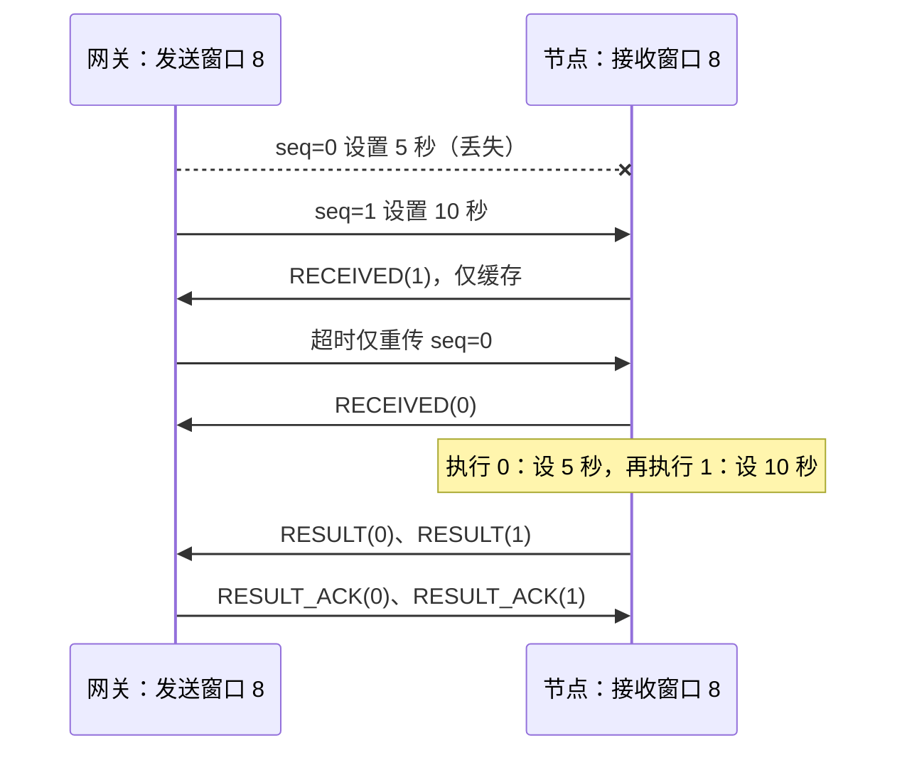

# SR 命令传输、按序执行与结果缓存

2026-09-13，协议 2.0。网关、node-sim 与 STM32 固件必须一起更新。帧头、LEN、CRC 和遥测
保持原格式；下行命令改为带会话的 SR 封装，旧版裸命令不会进入执行器。

## 窗口与时限

| 参数 | 默认值 | 含义 |
|---|---|---|
| `EDGE_SR_WINDOW_SIZE` | 8 帧 | 网关发送窗口、节点接收窗口的序号跨度 |
| 未得到执行结果的命令上限 | 8 条 | 包含首次输出排队，限制有序执行等待占用 |
| `EDGE_SR_RESULT_CAPACITY` | 16 槽 | 固定存储池，供待执行命令和未确认的执行结果共用 |
| `EDGE_SR_RESULT_TTL_MS` | 5000 ms | 从执行完成起保留结果；命中不续期，结果 ACK 可提前释放 |
| `EDGE_ACK_TIMEOUT_MS` | 500 ms | 数据接收确认、OPEN 握手及结果重传的间隔 |
| `EDGE_MAX_RETRY` | 3 次 | 首发之外的重传次数 |
| `EDGE_COMMAND_LIFETIME_MS` | 4000 ms | 未获接收确认的发送寿命，含首次排队；节点缺口等待上限 |
| `EDGE_SR_RESULT_TIMEOUT_MS` | 10000 ms | 网关从命令入发送窗口起等待执行结果的总上限 |

定义见 [edge_proto.h](../protocol/include/edge_proto/edge_proto.h)。500 ms 是确认/重传间隔，
不能再解释为整批命令的执行期限。接收确认后不重发命令本体，另等执行结果；10 秒结果时限
给前序补包、串行采样和结果补发留出时间。超过时限采用下面的会话终止策略。

## 选择重传与有序执行

[CommandTracker](../src/gateway/link/CommandTracker.h) 保存发送窗口的 `base`、`next` 及每帧
独立的接收确认、发送次数和计时状态。只能分配 `[base, base + 8)` 内的新序号；收到后续帧
的确认不会越过前面的缺口释放序号跨度。只重传未确认帧，确认连续到达才推进发送窗口左沿。

[edge_sr.c](../protocol/src/edge_sr.c) 是 STM32 和模拟器共用的无 I/O、无堆分配 C99 接收端。
节点只接收 `[base, base + 8)` 内的命令，保存完整操作码及参数后发送 `SR_RECEIVED`。
`base` 是下一个待执行序号：后来的命令只存入窗口，缺口补齐后同步执行连续命令，每条执行
返回后才执行下一条，再推进接收窗口。这是命令的按序交付点。



`SR_RECEIVED` 不向 MQTT 报成功。只有校验过会话、序号、操作码、结果码及数据长度的
`SR_RESULT` 才完成业务命令，沿用 `gateway/ack/<seq>` / `gateway/resp/<seq>` 的结果格式。
结果到达本身也证明接收成功，因此能恢复接收确认丢失。重复结果只补 `RESULT_ACK`，不会重复发布。

## 结果缓存与去重

执行器先把 `[rc][data...]` 存档再尝试发出结果，TX 队列满丢帧也不会再次执行。未确认结果
每 500 ms 独立重传，最多 3 次；重复命令也可以取回原结果。结果 ACK 释放存储槽，固定 TTL
回收始终未确认的结果，不因重放延长。

相同 `(session, seq)` 的缓存请求必须匹配操作码、长度和全部参数；冲突包丢弃，不改变原请求。
池满或序号在窗口右侧时不发送接收确认、不执行，由网关重试或终止会话。业务执行后产生的
`BAD_PARAM`、`UNSUPPORTED`、`BUSY` 仍是有序结果，保存并推进序号，不阻塞后续命令。

**结果缓存过期或被 ACK 释放后，旧序号仍在接收窗口左侧，不能重新执行。** 去重的顺序依据
是接收窗口与会话，不依赖缓存一直存在；缓存负责保存原查询值及补发结果。

## 无法恢复的缺口

1. 某条命令接收确认重试耗尽、发送总寿命到期、结果等待超时或本地写出失败时，网关终止
   当前会话全部尚未完成的命令。触发者报告 `timeout` / `send_failed`，其余报告 `session_aborted`。
2. 网关以更大的 64 位会话号发送 `SR_OPEN`。节点收到更高会话后清掉旧会话的待执行命令和
   结果缓存，接收左沿回到 0，再返回 `SR_OPEN_ACK`。相同有效会话的重复 OPEN 只重复确认。
3. 新 OPEN 被确认前，网关不发送新业务命令；未分配序号的 MQTT 命令留在原 FIFO。旧命令
   不会自动搬到新会话重新执行。节点独立在缺口等待 4 秒后关闭旧会话，同号 OPEN 不能复活它。
4. OPEN 本身也只有首发加 3 次重传，排队总寿命 4 秒；仍无法确认就进入失败状态，排队及新到
   命令报告 `gateway/ack/rejected: link_failed`。重启网关或成功重建串口才重新尝试握手。

所有 SR 数据和确认都携带会话号，旧会话迟到帧被忽略。网关和节点都不在同一会话内复用序号：
发完 0…255 并收齐执行结果后，先换更高会话再回到 0。节点维护本次启动期间的会话高水位，
拒绝更低会话；OPEN_ACK 带高水位供系统时钟回拨后的网关重新选择会话号，拒绝也消耗握手预算。

串口输出保留原有短写续传：未开始帧在写出前检查会话、发送身份及寿命；已写出前缀的帧必须
补齐以保全字节流。旧完成回调不能影响新会话。网关 200 ms 扫描、节点最多 100 ms 空闲唤醒，
所以实际重传时刻会有调度延迟，500 ms 不是严格的墙钟发送周期。

## 保证边界

保证同一有效会话按分配序号交付和串行执行，重复传输不重复执行；新会话确认后，旧会话
命令不能覆盖新设置。会话终止清掉的是**尚未执行**的命令，不能撤回已经执行的操作。
若执行结果丢失，`timeout` / `session_aborted` 表示网关未能确认结果，不能理解成“肯定未执行”。

节点使用 32 位 FreeRTOS 毫秒 tick（含 Tickless 补偿），无符号差值处理计数回绕。会话高水位、
窗口和结果存于 RAM；节点断电或重启会丢失这些状态，因此不提供跨节点重启的持久化 exactly-once。
这次没有新增命令类型、持久化存储或运维 API。

## 验证

```sh
cmake --preset dev
cmake --build --preset dev
ctest --preset dev
ctest --preset e2e
cmake --preset asan
cmake --build --preset asan
ctest --preset asan
./scripts/check_proto_sync.sh ../STM32Project/Protocol/edge_proto
cmake -S ../STM32Project/tests -B /tmp/node-command-tests
cmake --build /tmp/node-command-tests
ctest --test-dir /tmp/node-command-tests --output-on-failure
```

单元测试覆盖窗口边界、乱序/重复/冲突、选择重传、结果重传与 TTL、时钟回绕、序号换会话、
超期取消及握手失败。STM32 原生测试编译真实 `cmd_service.c`、`sensor_hub.c` 和帧编解码，
只替换 RTOS/硬件边界。端到端测试运行真实网关、node-sim、独立 MQTT Broker 和双 PTY，
注入缺帧及结果丢失，并验证 MQTT 只在执行完成后报告一次成功；另覆盖 300 条命令和串口背压。

2026-09-13 的 SR 迁移验证记录（不是本轮架构重构的验收计数）：网关/协议 127 项、STM32 原生 12 项、端到端 2 组（含多种故障场景）全部通过；
ASan/UBSan 下同样通过。网关 Debug/Release、STM32 Debug/Release 均零告警构建成功。
STM32 链接占用 RAM 14640 / 20480 B；Release FLASH 25924 / 65536 B，Debug FLASH 44104 B。
这些是交叉编译和主机测试结果，未烧录实机，不能替代硬件时序及任务栈高水位测试。

## 当前配置下的信道利用率

这里的利用率定义为 **UART 某一方向每秒实际发出的位数 / 115200 bit/s**，包含帧头、CRC、
起始位和停止位。它是线路占用率，不是业务有效负载效率。TX/RX 分别使用线路，应分别计算。
以下是源码默认配置的估算，没有读取正在运行的设备计数器；下行设周期命令可以改变运行值。

### 默认遥测上行

当前 [USART 配置](../../STM32Project/Core/Src/usart.c) 为 115200、8N1，每个字节占 10 个线路位。
[采样服务](../../STM32Project/App/sensor_hub.c) 默认周期为 **300 秒**，
[上报任务](../../STM32Project/App/report_task.c) 每秒另外发送一帧 6 字节心跳。
两传感器正常时，每轮采样发送：温湿度 11 B、光照 8 B、状态 7 B，共 26 B。

当前节点上报代码仍带温湿度的旧尾随字节，所以这里按实际 11 B 计算；共享协议规范的标准帧
为 10 B。本次 SR 改动保留了既有遥测上报格式，网关兼容该尾随字节。

```text
平均上行字节数 = 6 + 26 / 300 = 6.086667 B/s
上行占用率     = 6.086667 × 10 / 115200 × 100% ≈ 0.05284%
```

前提是无查询响应、传感器正常且无发送丢帧，忽略启动瞬间额外采样对长期均值的影响。
会话空闲且无下行命令时，命令方向占用为 0。若采样周期改为 1 秒，上行变为约 0.27778%；改为 2 秒，
约 0.16493%。一般公式为 `U_up = (6 + 26 / P + R_resp) × 10 / 115200`，
其中 P 是采样周期秒数，R_resp 是包含重放在内的每秒响应帧字节数。

SR 封装后，查询请求为 16 B，设置请求为 18 B；接收确认及结果确认各 15 B，执行结果为
17 B（设置）、19 B（光照）或 21 B（温湿度）。握手 OPEN/OPEN_ACK 为 14/23 B。
命令期间的占用须计入这些帧及重传；500 ms 是超时阈值，不能当作实测 RTT 代入窗口利用率公式。
结果确认可提前释放缓存，已取消 v1 的 `16/5=3.2 条/秒` 固定缓存吞吐限制。
