# 嵌入式软件开发面经总纲（自包含·含示例与配图）

> **作者**：刘金杰（哈尔滨工程大学 · 信息与通信工程）
> **用途**：2026 秋招 嵌入式软件开发 / C++ 后端 / Linux 系统编程 岗位的一份大而全、可独立阅读的面经。
> **配套项目**：① 多协议嵌入式 Linux 边缘网关（树莓派 4B，C++17）② STM32F103 + FreeRTOS 低功耗多传感器采集节点。
>
> **怎么用这份文档**：
> - 每个问题分三段——**解析**（这道题在考什么、面试官想听什么，可选）、**答案**（背诵主线 + 答出深度的点）、**示例**（代码 / 配图，可选）。
> - 配图为渲染好的 PNG（存于 `docs/img/`，由同名 `figNN.mmd` Mermaid 源码生成，改图见 `docs/img/render.sh`）；两张项目架构图为 `docs/architecture.png`（网关）、`docs/n6_node_architecture.png`（STM32 节点）。任何 Markdown 查看器 / PDF 导出都能直接看图。
> - 「项目挂钩」段落是**主动展示深度**的弹药：面试是主动抛深度得分，不是被追问才挤出来。

---

## 撰写进度（续写用：未完成的章节从这里看）

- [x] 第 1 章 C++ 语言核心
- [x] 第 2 章 操作系统
- [x] 第 3 章 计算机网络
- [x] 第 4 章 Linux 系统编程
- [x] 第 5 章 多线程并发
- [x] 第 6 章 嵌入式 C 与 MCU 基础
- [x] 第 7 章 STM32 外设
- [x] 第 8 章 FreeRTOS
- [x] 第 9 章 项目一 · 边缘网关深挖
- [x] 第 10 章 项目二 · STM32 采集节点深挖
- [x] 第 11 章 工程化与软技能
- [x] 第 12 章 八股快问快答（高频 50 问速记，考前突击）

> 文末有一个 HTML 注释形式的「下一章锚点」标记，续写时在该标记处追加下一章，并把上面对应行的 `[ ]` 改成 `[x]`。

---

## 目录

1. [C++ 语言核心](#第-1-章c-语言核心)
2. [操作系统](#第-2-章操作系统)
3. [计算机网络](#第-3-章计算机网络)
4. [Linux 系统编程](#第-4-章linux-系统编程)
5. [多线程并发](#第-5-章多线程并发)
6. [嵌入式 C 与 MCU 基础](#第-6-章嵌入式-c-与-mcu-基础)
7. [STM32 外设](#第-7-章stm32-外设)
8. [FreeRTOS](#第-8-章freertos)
9. [项目一 · 边缘网关深挖](#第-9-章项目一边缘网关深挖)
10. [项目二 · STM32 采集节点深挖](#第-10-章项目二stm32-采集节点深挖)
11. [工程化与软技能](#第-11-章工程化与软技能)
12. [八股快问快答（高频 50 问速记）](#第-12-章八股快问快答高频-50-问速记)

---

# 第 1 章·C++ 语言核心

> 嵌入式 / C++ 岗最高频的语言八股。核心是三件事：**RAII（资源即对象）、智能指针（所有权）、移动语义（避免拷贝）**——这三点贯穿你整个网关项目，要能随口举项目里的例子。

## 1.1 内存布局：一个 C++ 程序运行起来内存怎么分布？

**解析**：考你对「栈 / 堆 / 全局区 / 常量区 / 代码段」的理解，常引申到「局部变量为什么不能返回引用」「栈和堆的区别」。

**答案**：一个进程的虚拟地址空间从低到高大致是：
- **代码段（.text）**：机器指令，只读、可共享。
- **已初始化数据段（.data）**：初始化非 0 的全局/静态变量。
- **未初始化数据段（.bss）**：初始化为 0 或未初始化的全局/静态变量，**不占文件体积**，加载时清零。
- **堆（heap）**：`new`/`malloc` 分配，**从低地址向高地址增长**，手动管理（或智能指针）。
- **内存映射段**：动态库、`mmap` 文件、匿名映射。
- **栈（stack）**：函数局部变量、参数、返回地址，**从高地址向低地址增长**，由编译器自动分配释放，速度快但容量小（Linux 默认 8MB）。

**答出深度**：栈 vs 堆要点——栈分配只是移动栈指针（一条指令），**快**；堆要在空闲链表/分配器里找块、可能加锁、可能系统调用 `brk`/`mmap`，**慢且可能碎片化**。栈对象生命周期绑定作用域（这正是 RAII 的物理基础）；堆对象生命周期手动控制，所以才需要智能指针来「自动化」。

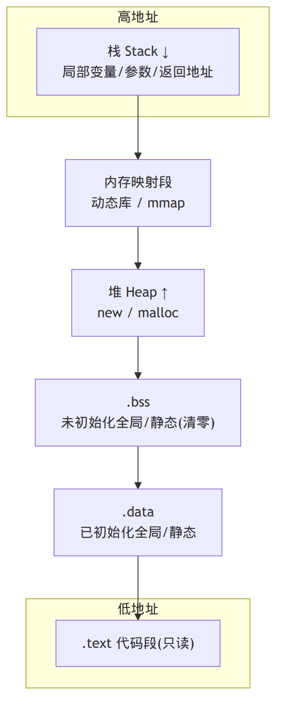

---

## 1.2 RAII 是什么？为什么说它是 C++ 资源管理的灵魂？

**解析**：RAII 是你简历里反复出现的词（串口、DB 连接、MQTT、线程池都靠它）。面试官会让你用一句话讲清楚，并举项目例子。

**答案**：RAII = **Resource Acquisition Is Initialization**，资源获取即初始化。把「资源的生命周期」绑定到「栈对象的生命周期」上：**构造函数里获取资源，析构函数里释放资源**。对象离开作用域时，编译器保证析构函数被调用，资源一定被释放——**即使中途抛异常**（栈展开 stack unwinding 会调用已构造对象的析构）。

**答出深度**：RAII 解决的根本问题是「**多出口函数的资源泄漏**」——一个函数有 return、break、异常多个出口，手动 `free`/`close` 几乎一定会在某条路径上漏掉。RAII 把释放交给编译器的确定性析构，从「靠程序员记得」变成「靠语言保证」。**项目例子**：我的 `SerialPort` 构造时 `open()` 串口、析构时 `close()`；SQLite 的 `sqlite3_stmt*` 用 `Statement` 类包起来，析构 `sqlite3_finalize`；这样整个网关「杜绝泄漏与重复释放」。

**示例**：
```cpp
// RAII 包装一个文件描述符：构造拿、析构还
class FdGuard {
public:
    explicit FdGuard(int fd) : fd_(fd) {}
    ~FdGuard() { if (fd_ >= 0) ::close(fd_); }   // 唯一释放点

    FdGuard(const FdGuard&) = delete;            // 禁拷贝(避免 double close)
    FdGuard& operator=(const FdGuard&) = delete;
    FdGuard(FdGuard&& o) noexcept : fd_(o.fd_) { o.fd_ = -1; } // 可移动

    int get() const noexcept { return fd_; }
private:
    int fd_ = -1;
};

void use() {
    FdGuard f(::open("/dev/ttyAMA0", O_RDWR));
    if (something_wrong()) return;   // 即便这里提前返回，f 析构也会 close
    // ... 抛异常也一样安全
}   // 作用域结束 → ~FdGuard() → close()
```

---

## 1.3 三种智能指针的区别？分别用在什么场景？

**解析**：必考。重点是 `unique_ptr` vs `shared_ptr` 的**所有权语义**，以及 `weak_ptr` 解决循环引用。

**答案**：
- **`unique_ptr`**：**独占所有权**，不可拷贝、只可移动。零开销（和裸指针一样大，没有引用计数）。**默认首选**——绝大多数「谁创建谁负责」的场景用它。
- **`shared_ptr`**：**共享所有权**，内部有**引用计数**（控制块），最后一个持有者析构时才释放对象。计数的增减是**原子操作**（线程安全），所以有开销。用于「对象被多方共享、生命周期不确定」。
- **`weak_ptr`**：**不持有所有权**的弱引用，不增加引用计数，用来**观察** `shared_ptr` 管理的对象。用 `lock()` 临时提升为 `shared_ptr`（对象还活着就成功，否则返回空）。主要用途：**打破 `shared_ptr` 循环引用**、缓存、观察者。

**答出深度**：选择标准是「**所有权**」——能用 `unique_ptr` 就别用 `shared_ptr`。`shared_ptr` 不是「更安全的指针」，它是「共享所有权」的语义工具，滥用会带来原子计数开销 + 隐藏的生命周期延长（对象啥时候死说不清）。**项目例子**：网关 `EventLoop` 里 `map<fd, shared_ptr<Channel>>` 用 shared_ptr，是因为延迟销毁阶段可能有多处临时引用；而 epoll 里只存裸指针（borrow，不参与所有权）。

**示例**：
```cpp
auto u = std::make_unique<Foo>();      // 独占
auto s = std::make_shared<Foo>();      // 共享，引用计数=1
auto s2 = s;                           // 计数=2
std::weak_ptr<Foo> w = s;              // 弱引用，计数仍=2
if (auto p = w.lock()) p->bar();       // 提升成功(对象还活着)
```

---

## 1.4 `shared_ptr` 的引用计数线程安全吗？`make_shared` 比 `new` 好在哪？

**解析**：高频深挖。考你是否真的理解控制块。

**答案**：
- **引用计数本身是线程安全的**（原子增减），所以**多线程拷贝/析构同一个 `shared_ptr` 是安全的**。
- 但**所指向的对象不是线程安全的**——多线程同时读写 `*ptr` 仍要自己加锁。
- 而且**同一个 `shared_ptr` 实例**被多线程同时读写（一个线程 reset、另一个拷贝）**不安全**，要么各持各的副本，要么加锁。

`make_shared` 的好处：
1. **一次分配**：把「对象本身」和「控制块（引用计数）」分配在**同一块内存**，只 new 一次；而 `shared_ptr<Foo>(new Foo)` 要分配两次（对象 + 控制块）。
2. **异常安全**：`f(shared_ptr<Foo>(new Foo), g())` 中如果 `g()` 在 new 之后、构造 shared_ptr 之前抛异常会泄漏；`make_shared` 没有这个裸指针裸露窗口。

**答出深度（陷阱）**：`make_shared` 一次分配也有副作用——对象内存和控制块**同生共死**。只要还有 `weak_ptr` 存活，控制块就不能释放，于是**对象那块内存也释放不掉**（虽然对象已析构）。大对象 + 长命 weak_ptr 场景要注意。

---

## 1.5 什么是循环引用？怎么用 `weak_ptr` 解决？

**解析**：`shared_ptr` 最经典的坑，常结合「双向链表 / 父子节点 / 观察者」来问。

**答案**：两个对象用 `shared_ptr` **互相持有**，引用计数永远 ≥ 1，谁都析构不了 → **内存泄漏**。解决：把其中一个方向（通常是「回指 / 父指针」）改成 `weak_ptr`，它不增加计数，环就断了。

**示例**：
```cpp
struct Node {
    std::shared_ptr<Node> next;   // 持有下一个
    std::weak_ptr<Node>   prev;   // 弱引用上一个 —— 关键！不能用 shared_ptr
};
// 若 prev 也是 shared_ptr，a->next=b; b->prev=a 后，a、b 引用计数都=2，
// 离开作用域后各自降到 1，互相卡住，永不释放。
```

---

## 1.6 左值 / 右值 / 移动语义讲一下？`std::move` 到底做了什么？

**解析**：C++11 核心。常接「`std::move` 真的移动了吗」「移动构造和拷贝构造区别」。

**答案**：
- **左值（lvalue）**：有名字、可取地址、能放在赋值号左边的表达式（如变量 `a`）。
- **右值（rvalue）**：临时对象、字面量、即将销毁的值（如 `a+b`、`Foo()`），不能取地址。
- **右值引用 `T&&`**：绑定到右值，让我们能识别「这是个临时的、马上要死的对象，可以放心偷它的资源」。
- **移动语义**：移动构造/移动赋值**接管**源对象的资源（如堆内存指针），把源对象置空，而不是深拷贝。**O(1) 偷指针** 取代 **O(n) 拷数据**。

**`std::move` 做了什么**：**什么都没移动**！它只是一个 `static_cast<T&&>`，把左值**强转成右值引用**，从而让重载决议选中移动构造/移动赋值。真正的「移动」发生在那些移动构造函数里。

**答出深度**：移动只对「管理堆资源的类型」有意义（`string`、`vector`、`unique_ptr`）；对 `int` 这种 POD，move 和拷贝没区别。还要点出 **`noexcept`**：移动构造要标 `noexcept`，否则 `vector` 扩容时为了强异常保证会**退回用拷贝**——这是很多人忽略的性能坑。

**示例**：
```cpp
std::vector<int> v1(1000000, 42);
std::vector<int> v2 = std::move(v1);  // O(1)：偷走 v1 的内部指针
// 此后 v1 处于「有效但未指定」状态(通常为空)，可以重新赋值，但别读它的内容

class Buffer {
    char* data_; size_t n_;
public:
    Buffer(Buffer&& o) noexcept       // 移动构造：偷指针 + 置空源
        : data_(o.data_), n_(o.n_) { o.data_ = nullptr; o.n_ = 0; }
};
```

---

## 1.7 完美转发 / 万能引用 是什么？

**解析**：偏进阶，写模板/工厂函数会用到（如 `make_unique` 内部）。能讲清楚是加分项。

**答案**：
- **万能引用（universal reference）**：在**模板类型推导**语境下的 `T&&`（如 `template<class T> void f(T&& x)`）。它既能绑左值也能绑右值——绑左值时 `T` 推成 `T&`，绑右值时推成 `T`。注意：只有「类型推导 + `&&`」才是万能引用，`vector<int>&&` 这种不是。
- **引用折叠**：`& + && = &`，`&& + && = &&`，这是万能引用能两头通吃的底层规则。
- **完美转发 `std::forward<T>(x)`**：在转发时**保持实参的左右值属性**——传进来是左值就转发为左值，是右值就转发为右值，避免丢失移动语义。

**示例**：
```cpp
template <class T, class... Args>
std::unique_ptr<T> my_make_unique(Args&&... args) {
    return std::unique_ptr<T>(new T(std::forward<Args>(args)...));
    //                                  ^ 完美转发：右值实参继续走移动构造
}
```

---

## 1.8 `vector` 的扩容机制？为什么不是每次 +1？`size` 和 `capacity` 区别？

**解析**：STL 必考，常接「迭代器失效」「`reserve` 的意义」。

**答案**：`vector` 内存连续。`size` 是当前元素个数，`capacity` 是已分配空间。当 `size == capacity` 再 `push_back`，触发扩容：**申请更大内存（GCC 是 2 倍，MSVC 是 1.5 倍）→ 把旧元素移动/拷贝过去 → 释放旧内存**。按倍数增长是为了让 N 次 `push_back` 的**均摊（amortized）复杂度为 O(1)**；若每次 +1，则总搬运是 O(n²)。

**答出深度**：
- **迭代器失效**：扩容后旧内存释放，**所有指向旧内存的迭代器/指针/引用全部失效**；即使没扩容，`insert`/`erase` 也会让插入点之后的迭代器失效。
- **1.5 vs 2 倍之争**：2 倍增长每次新容量都大于之前所有已释放空间之和，无法复用前面释放的内存块；1.5 倍更可能复用，对内存分配器更友好。
- 知道大小就 `reserve()` 预分配，避免反复扩容和搬运。移动构造标 `noexcept` 才能让扩容走移动而非拷贝（见 1.6）。

---

## 1.9 `map` 和 `unordered_map` 底层与区别？

**解析**：常接「什么时候用哪个」「哈希冲突怎么解决」。

**答案**：
- **`map`**：底层**红黑树**（自平衡 BST），元素**按 key 有序**，增删查都是 **O(log n)**，迭代器有序遍历。
- **`unordered_map`**：底层**哈希表**（数组 + 链表/桶），**无序**，平均 **O(1)**，最坏 O(n)（大量冲突时）。

选择：要**有序遍历 / 范围查询**用 `map`；只要**快速精确查找**用 `unordered_map`。

**答出深度**：
- 哈希冲突：标准库用**链地址法**（拉链），桶里挂链表；负载因子超阈值会 **rehash**（扩桶 + 重新散列），rehash 会让**指向元素的迭代器失效**（但 `unordered_map` 的引用/指针在 rehash 后仍有效，只是迭代器失效）。
- `unordered_map` 平均快但**内存占用大、缓存不友好**（节点分散）；小数据量时 `map` 甚至 `vector` 线性查找可能更快（缓存局部性好）。

---

## 1.10 虚函数、多态、虚函数表（vtable）是怎么实现的？

**解析**：C++ 面向对象必考，常接「虚析构为什么必要」「构造函数能是虚函数吗」「sizeof 含虚函数的类」。

**答案**：
- **多态**：基类指针/引用调用虚函数时，**运行时**根据对象**实际类型**决定调哪个函数（动态绑定）。
- **实现**：每个**含虚函数的类**有一张**虚函数表（vtable）**，存着该类各虚函数的地址；每个**对象**头部有一个**虚表指针（vptr）**指向所属类的 vtable。调用虚函数 = 通过 vptr 找到 vtable → 查表拿到函数地址 → 间接调用。所以虚调用比普通调用多一次间接寻址。
- 因此含虚函数的类 `sizeof` 会多一个指针大小（vptr，64 位上 8 字节）。

**答出深度**：
- **虚析构必须**：基类指针 delete 派生对象时，若基类析构非虚，**只调基类析构**→ 派生类资源泄漏。凡是会被继承、且用基类指针管理的类，析构函数声明 `virtual`。
- **构造函数不能是虚函数**：vptr 在构造期间才被设置，构造还没完成谈不上动态绑定。
- **构造/析构函数里调用虚函数不会多态**：此时对象类型是「当前正在构造/析构的那层」，调用的是当前类版本。
- `final` / `override`：`override` 让编译器检查你确实重写了基类虚函数（防签名写错变成隐藏）；`final` 禁止继续重写/继承，编译器可去虚化优化。

**示例**：
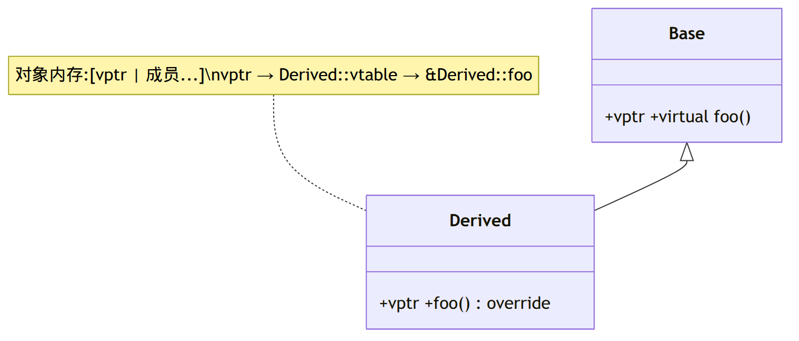

---

## 1.11 `const`、`static`、`inline`、`volatile`、`constexpr` 各是什么？

**解析**：关键字快问快答，嵌入式岗尤其爱问 `volatile` 和 `static`。

**答案**（速记）：
- **`const`**：只读约定。修饰变量=不可改；修饰成员函数=不修改成员（`const` 对象只能调 `const` 成员函数）；`const T*` vs `T* const`（指向常量 / 常量指针）。
- **`static`**：① 局部 static：生命周期延长到程序结束，只初始化一次（C++11 起线程安全，常用于单例）；② 文件作用域 static / 函数：**内部链接**，只在本编译单元可见；③ 类 static 成员：所有对象共享一份，类内声明类外定义。
- **`inline`**：建议编译器内联展开（现代编译器自己决定）；更重要的现代用途是**允许多个编译单元有同一定义**（头文件里定义函数/变量不报重定义），C++17 `inline` 变量。
- **`volatile`**：禁止编译器对该变量做「读写优化/缓存到寄存器」，每次都从内存读。**用于**：内存映射寄存器、被中断/信号修改的变量。**注意**：`volatile` ≠ 原子、≠ 线程同步！多线程用 `std::atomic`，别用 volatile（这是高频错误）。
- **`constexpr`**：编译期常量/编译期可求值的函数，能用于数组大小、模板参数等，把计算从运行期挪到编译期。

---

## 1.12 深拷贝 vs 浅拷贝？什么是「Rule of Three / Five / Zero」？

**解析**：考资源管理类的正确写法。

**答案**：
- **浅拷贝**：逐成员拷贝（默认拷贝构造），指针成员只拷指针值 → 两个对象指向同一块堆内存 → **double free / 悬空指针**。
- **深拷贝**：为指针成员重新分配内存并拷贝内容，各管各的。
- **Rule of Three**：若你需要自定义**析构函数、拷贝构造、拷贝赋值**三者之一，通常三者都要写（因为你在管理资源）。
- **Rule of Five**：C++11 加上**移动构造、移动赋值**，共五个。
- **Rule of Zero**：**最佳实践**——让类不直接管理资源，而是用 `unique_ptr`/`vector`/`string` 等 RAII 成员，于是五个特殊函数一个都不用写，编译器默认的就正确。**这是现代 C++ 推荐写法**。

**答出深度**：能说出「我项目里优先 Rule of Zero——成员都用智能指针/容器，所以大部分类零样板；只有真正包裹裸资源（fd、sqlite3*）的 RAII 包装类才写 Rule of Five，并且 `=delete` 拷贝、只留移动」，这非常加分。

---

## 1.13 `new`/`delete` 与 `malloc`/`free` 区别？

**答案**：
| | `new`/`delete` | `malloc`/`free` |
|---|---|---|
| 本质 | 运算符 | 库函数 |
| 构造/析构 | **会调用**构造/析构函数 | 不调用，只管内存 |
| 返回 | 类型化指针 | `void*`，要强转 |
| 失败 | 抛 `bad_alloc` 异常 | 返回 `NULL` |
| 大小 | 编译器自动算 | 手动 `sizeof` |

**答出深度**：`new` = `operator new`（分配，底层常调 malloc）+ 构造函数；`delete` = 析构函数 + `operator free`。二者不能混用（`new` 的对象用 `free` 不会析构、`malloc` 的内存用 `delete` 行为未定义）。数组要用 `new[]`/`delete[]`。当然现代 C++ 优先 `make_unique`/`make_shared`，几乎不直接写 `new`/`delete`。

---

> 📌 **第 1 章项目话术锦囊**：被问 C++ 特性时，主动把答案落到项目——「智能指针 → 我网关里 fd/串口/DB/MQTT/线程池全是 RAII + 智能指针管理，杜绝泄漏」「移动语义 → 解析出的 `Frame` 对象（含 `vector<uint8_t> payload`）在回调间传递用 move 避免拷贝」「Rule of Zero → 业务类零样板，只有裸资源包装类写 Rule of Five 并禁拷贝」。

---

# 第 2 章·操作系统

> 进程线程、虚拟内存、调度、死锁是「八股之王」。嵌入式 Linux 岗会把它和你的网关（单进程多线程）、STM32（无 MMU、裸机/RTOS）对比着问。

## 2.1 进程和线程的区别？

**解析**：最高频的开场题。要答出「资源 vs 调度」这条主线，并能引申到你项目的选型。

**答案**：
- **进程**是**资源分配**的基本单位：拥有独立的虚拟地址空间、文件描述符表、信号处理等。进程间内存隔离，一个崩了不影响另一个。
- **线程**是 **CPU 调度**的基本单位：同一进程内的线程**共享地址空间、全局变量、堆、fd**，各自只有独立的**栈、寄存器、程序计数器、errno**。
- **开销**：创建/切换进程要换页表、刷 TLB，重；线程切换不换地址空间，轻。
- **通信**：线程间共享内存直接通信（但要同步）；进程间要走 IPC（管道、共享内存、socket 等）。
- **可靠性**：进程隔离，一个线程崩溃（段错误）整个进程都挂。

**答出深度**：选型权衡——「**隔离性/稳定性优先选多进程**（如 Nginx master-worker、Chrome 每标签页一进程），**共享数据多/通信频繁选多线程**」。**项目例子**：我的网关是**单进程多线程**——主线程跑 Reactor 事件循环，线程池做 SQLite/MQTT 双写；选多线程是因为解码后的记录要在 I/O 线程和工作线程间高频流转，共享内存最直接，靠线程安全队列 + eventfd 同步。

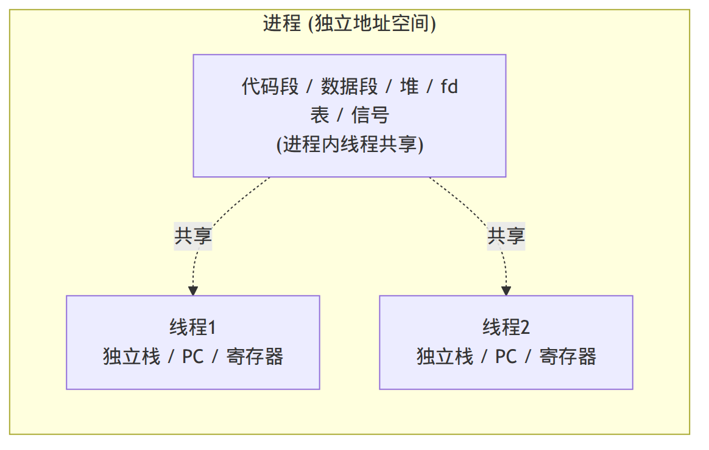

---

## 2.2 进程间通信（IPC）有哪些方式？

**解析**：列举 + 对比 + 选型，结合「为什么共享内存最快」。

**答案**：
- **管道 pipe**：半双工，只能父子等亲缘进程；**命名管道 FIFO** 可无亲缘。
- **消息队列**：内核维护的消息链表，带类型，可随机读。
- **共享内存 shared memory**：多个进程映射同一块物理内存，**最快**（数据不经内核拷贝），但**要自己加同步**（配合信号量）。
- **信号量 semaphore**：计数器，用于同步/互斥，本身不传数据。
- **信号 signal**：异步通知（如 SIGINT、SIGHUP），只能传「发生了某事件」。
- **Socket**：可跨主机，最通用（本机用 Unix domain socket 也很快）。

**答出深度**：「共享内存最快是因为**少了两次内核拷贝**——其它方式数据要 用户态→内核态→用户态 拷两遍，共享内存是同一块物理页直接读写，代价是没有内建同步」。**项目例子**：我用 **SIGHUP 信号**做配置热加载，用 **TCP socket** 做 HTTP 监控服务。

---

## 2.3 什么是虚拟内存？为什么要分页？

**解析**：内存管理核心，常深挖页表、TLB、缺页中断。

**答案**：**虚拟内存**给每个进程一个独立、连续的虚拟地址空间，由 **MMU + 页表** 把虚拟地址翻译成物理地址。好处：
1. **隔离**：进程间地址空间独立，互不踩踏，安全。
2. **不必连续/不必全部在内存**：物理内存可碎片化分配；暂时不用的页可换出到磁盘（swap），用到再换入。
3. **简化编程**：每个进程都以为自己独占完整地址空间。

**分页**：把虚拟和物理内存都切成固定大小的**页（page，通常 4KB）**，以页为单位映射和换入换出，避免外部碎片。虚拟地址 = 页号 + 页内偏移；页号经页表查到物理页框号。

**答出深度**：
- **多级页表**：64 位空间用单级页表会巨大，于是用 4/5 级页表，只为用到的区域分配下级表，**省页表内存**。
- **TLB**：缓存最近的「虚→物」映射，命中就不查页表；进程切换要刷 TLB（除非有 ASID）。
- **缺页中断（page fault）**：访问的页不在物理内存（被换出 / 未分配 / COW）→ 触发缺页 → 内核调入/分配页 → 重新执行该指令。

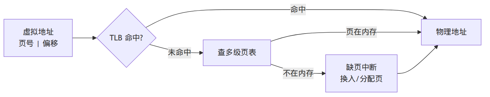

---

## 2.4 进程的状态有哪些？调度算法了解哪些？

**答案**：
- **状态**：创建 → **就绪（Ready）** ⇄ **运行（Running）** → 终止；运行中等待资源进入**阻塞/等待（Blocked）**，资源就绪后回到就绪。Linux 还有可中断睡眠 `S`、不可中断睡眠 `D`、僵尸 `Z`、停止 `T`。
- **调度算法**：FCFS、SJF（短作业优先，可能饿死长作业）、**时间片轮转 RR**、**优先级调度**、**多级反馈队列 MLFQ**。Linux 现在用 **CFS（完全公平调度）**：红黑树按 `vruntime`（虚拟运行时间）排序，总挑 vruntime 最小的跑，实现「公平」。

**答出深度**：**僵尸进程**（子进程退出但父没 `wait` 回收，残留 PCB）vs **孤儿进程**（父先退出，子被 init/systemd 收养）。实时系统（FreeRTOS）用**抢占式固定优先级**调度，和 Linux 的公平调度哲学不同——正好对比你的两个项目。

---

## 2.5 用户态和内核态？为什么要区分？系统调用怎么发生？

**答案**：
- **定义（先讲本质）**：用户态和内核态是 **CPU 的两种运行模式（特权级别）**，区分的是「此刻 CPU 在执行谁的代码、拥有多大权限」。**内核态**是 CPU 运行操作系统内核代码时所处的**高特权模式**；**用户态**是 CPU 运行普通应用程序代码时所处的**低特权、受限模式**。同一颗 CPU 在这两种模式间来回切换。硬件上靠特权级实现（x86 的 ring0~ring3、ARM 的 EL0~EL3）。
- **两种模式的权限差异**：
  - **内核态**：可执行特权指令、访问全部内存和硬件。
  - **用户态**：受限，不能执行特权指令、不能直接碰硬件/任意内存。
- **为什么要分**：**保护**——防止用户程序搞崩系统或互相破坏。
- **系统调用怎么发生**：用户程序要做特权操作（读文件、发网络包）时，通过**软中断/特殊指令（如 `syscall`）陷入内核**，CPU 从用户态切到内核态执行对应内核函数，完成后切回用户态。这就是**用户态↔内核态切换**，有开销。

**答出深度**：能点出「**减少用户/内核态切换**是常见优化方向」——**零拷贝**（`sendfile` 避免数据在内核/用户间来回拷）、**批处理**（一次 `epoll_wait` 返回多个就绪 fd 而非逐个 syscall）。这能自然连接到你网关用 epoll 的动机。

---

## 2.6 上下文切换是什么？开销在哪？

**答案**：调度器把 CPU 从一个执行流切到另一个，需**保存当前寄存器/PC/栈指针到 PCB/TCB，再恢复目标的**。
- **线程切换**（同进程）：只换寄存器和栈，**不换地址空间**，TLB 不必全刷，较轻。
- **进程切换**：还要切页表 → **TLB 大量失效**，之后访存变慢，重。
- **隐性开销**：切换后 CPU **缓存（L1/L2）冷掉**，命中率下降。

**答出深度**：这正是「**单线程 Reactor**」的卖点——所有 I/O 事件在一个线程串行处理，**没有线程切换、没有锁竞争、缓存友好**；重活才丢线程池，把切换开销控制在「只有需要并行的写库才付」。

---

## 2.7 死锁的四个必要条件？怎么预防/避免？

**解析**：必考，最好结合「你项目里怎么避免死锁」。

**答案**：四个**必要**条件（同时满足才可能死锁）：
1. **互斥**：资源同一时间只能被一个线程占用。
2. **持有并等待**：持有资源的同时又请求别的资源。
3. **不可剥夺**：资源只能由持有者主动释放。
4. **循环等待**：存在线程互相等待的环。

**破解**（破坏任一条件）：
- 破坏「持有并等待」：一次性申请所有资源。
- 破坏「不可剥夺」：申请不到就释放已持有的，回退重来（`try_lock`）。
- 破坏「循环等待」：**给所有锁定义全局顺序，所有线程按同一顺序加锁**（最常用最实用）。
- **避免**：银行家算法（理论为主）。

**答出深度**：实战防死锁三招——**① 锁顺序统一；② 用 `std::scoped_lock` 一次锁多个（内部防死锁）；③ 减少锁范围、最好无锁**。**项目例子**：我的网关**主循环干脆不用锁**——单线程串行处理 I/O，跨线程下行命令通过线程安全队列 + eventfd 转成「loop 内任务」，从架构上消除了串口锁竞争（单一写者模式），根本不给死锁机会。

---

## 2.8 写时复制（COW）是什么？

**答案**：**Copy-On-Write**：`fork()` 后父子进程**共享同一份物理页**（标记只读），谁都不拷贝；直到**某一方要写**某页时，才真正复制那一页给它单独用。好处：`fork` 很快、省内存（尤其 `fork` 后马上 `exec`，根本不用拷贝整个地址空间）。

**答出深度**：COW 解释了「为什么 fork 一个占几 GB 的进程却几乎瞬间完成」。早期某些 `std::string` 用 COW，C++11 后因多线程问题基本弃用。

---

## 2.9 CPU 缓存、缓存行、伪共享（false sharing）是什么？

**解析**：偏底层/性能，多线程岗加分项，体现你懂硬件。

**答案**：
- CPU 与内存间有多级缓存（L1/L2/L3），以**缓存行（cache line，通常 64 字节）**为单位加载。
- **伪共享**：两个线程分别频繁修改两个**逻辑无关、但物理上位于同一缓存行**的变量。由于缓存一致性协议（MESI），一方的写让另一方核上的整条缓存行失效，反复在核间「弹来弹去」，性能暴跌。
- **解决**：把高频被不同线程写的变量**对齐到独立缓存行**（`alignas(64)` 或填充字节）。

**示例**：
```cpp
struct alignas(64) PaddedCounter {  // 对齐到缓存行，避免与邻居伪共享
    std::atomic<long> value{0};
    char pad[64 - sizeof(std::atomic<long>)];
};
PaddedCounter counters[NUM_THREADS];  // 每线程一个，互不干扰缓存行
```

**答出深度**：缓存局部性（局部性原理）解释了「为什么连续内存的 `vector` 遍历比链表/`map` 快」「为什么 Reactor 单线程不切换更缓存友好」——能把它和第 1、6 章串起来。

---

> 📌 **第 2 章项目话术锦囊**：OS 题往项目落——「进程 vs 线程 → 网关选单进程多线程，理由是共享内存通信频繁」「死锁 → 单一写者 + 队列 + eventfd 从架构上消灭锁」「用户/内核态切换 → 这是用 epoll 批量就绪、ET 减少唤醒的动机」「调度 → Linux 公平调度 vs FreeRTOS 抢占式优先级，正好对比两个项目」。

---

# 第 3 章·计算机网络

> 你的网关跑 TCP/HTTP/MQTT，又自定义了串口二进制协议，网络题能大量挂项目。TCP 三次握手/四次挥手/可靠传输/拥塞控制是绝对核心，**粘包半包**更是直接对应你的 `Buffer` 和帧协议。

## 3.1 TCP/IP 四层模型？和 OSI 七层怎么对应？

**答案**：
- **OSI 七层**：物理、数据链路、网络、传输、会话、表示、应用。
- **TCP/IP 四层**：**应用层**（HTTP/MQTT/DNS）、**传输层**（TCP/UDP）、**网络层**（IP/ICMP）、**网络接口层**（以太网/ARP）。
- 数据**封装**：应用数据逐层加头部——应用层报文 → 加 TCP 头成「段 segment」→ 加 IP 头成「包 packet」→ 加帧头帧尾成「帧 frame」→ 物理比特流。接收端逐层解封装。

**答出深度**：能点出「每一层只关心自己的头部，对上层透明」——这正是分层的意义，也是你**自定义串口协议**的设计思路（你的 `0xAA 0x55 | LEN | TYPE | PAYLOAD | CRC` 就是一个「链路帧」格式，TYPE 字段相当于「上层协议复用」）。

---

## 3.2 TCP 三次握手过程？为什么是三次不是两次？

**解析**：必考中的必考。要能画时序、讲清「为什么三次」。

**答案**：建立连接，双方各自确认「我能发、你能收」「你能发、我能收」：
1. **SYN**：客户端发 `SYN=1, seq=x`，进入 `SYN_SENT`。
2. **SYN+ACK**：服务端回 `SYN=1, ACK=1, seq=y, ack=x+1`，进入 `SYN_RCVD`。
3. **ACK**：客户端回 `ACK=1, ack=y+1`，双方进入 `ESTABLISHED`。

**为什么三次（核心）**：要让**双方都确认对方的收发能力**。
- 两次握手不够：服务端无法确认「客户端能收到自己的包」，也无法防**历史重复连接**——一个旧的、延迟到达的 SYN 会让服务端误建连接并一直等。
- 第三次 ACK 让服务端确认客户端确实在线、且同步了双方的初始序列号（ISN）。

**答出深度**：
- **为什么要随机 ISN**：防止历史报文/旧连接的数据被新连接误收（序列号可区分），也增加安全性。
- **SYN 洪泛攻击**：伪造大量 SYN 不回 ACK，占满半连接队列 → 用 **SYN Cookie** 防御（不立即分配资源，把状态编码进序列号）。

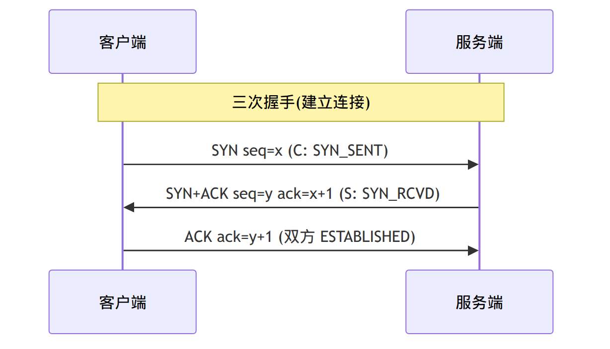

---

## 3.3 TCP 四次挥手过程？为什么是四次？TIME_WAIT 为什么要等 2MSL？

**解析**：仅次于三次握手的高频题。重点 TIME_WAIT。

**答案**：关闭连接（全双工，两个方向各关一次）：
1. **FIN**：主动方发 `FIN`，进入 `FIN_WAIT_1`（我没数据要发了）。
2. **ACK**：被动方回 `ACK`，进入 `CLOSE_WAIT`；主动方进入 `FIN_WAIT_2`。
3. **FIN**：被动方数据也发完了，发 `FIN`，进入 `LAST_ACK`。
4. **ACK**：主动方回 `ACK`，进入 **`TIME_WAIT`**；被动方收到后 `CLOSED`。主动方等 **2MSL** 后才 `CLOSED`。

**为什么四次**：因为 TCP 是**全双工**，收到对方 FIN 只代表「对方不发了」，自己可能**还有数据要发**，所以 ACK 和自己的 FIN 不能合并（不像握手时 SYN+ACK 能合并）。

**TIME_WAIT 等 2MSL 的两个原因**：
1. **保证最后那个 ACK 能到达对端**：如果 ACK 丢了，对端会重发 FIN，主动方还在 TIME_WAIT 就能重发 ACK；否则对端会一直 LAST_ACK。
2. **让本连接的旧报文在网络中自然消亡**：等 2 个最大报文生存时间（MSL），确保旧数据包都过期，不会串到用同样四元组的新连接里。

**答出深度**：
- **大量 TIME_WAIT 的危害与解决**：高并发短连接的主动关闭方会堆积大量 TIME_WAIT，占端口。解决：开 `SO_REUSEADDR`、`tcp_tw_reuse`，或改用**长连接**。
- **CLOSE_WAIT 堆积**：通常是**程序 bug**——收到对方 FIN 后应用层忘了 `close()`，停在 CLOSE_WAIT。排查方向是代码漏关 fd。

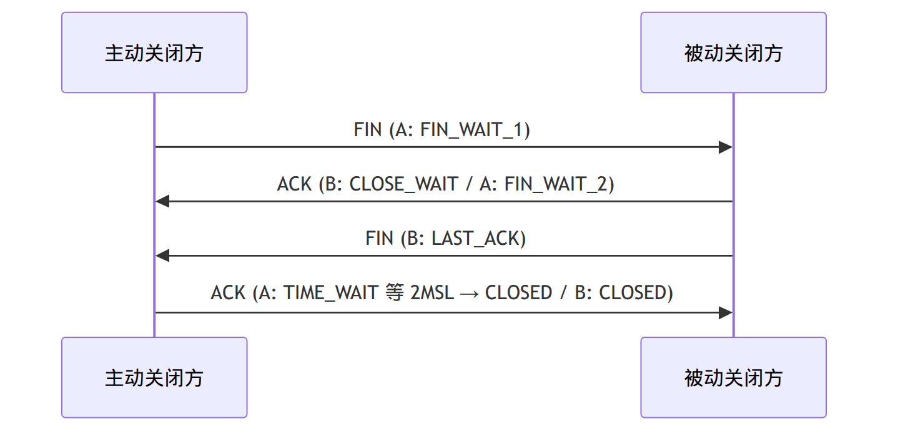

---

## 3.4 TCP 怎么保证可靠传输？

**解析**：综合大题，把多个机制串起来答。

**答案**：靠一组机制协同：
1. **序列号 + 确认应答（ACK）**：每个字节有序号，接收方 ACK 告知「已收到到哪」，发送方据此知道哪些到了。
2. **超时重传**：发出去一段时间没收到 ACK 就重传；超时时间（RTO）根据 RTT 动态估算。
3. **快速重传**：收到 **3 个重复 ACK** 就立即重传（不等超时），更快。
4. **滑动窗口**：批量发送、累计确认，不用「一发一确认」，提高吞吐。
5. **流量控制**：接收方通过窗口大小告诉发送方「我还能收多少」，防止压垮接收方。
6. **拥塞控制**：根据网络状况调节发送速率，防止压垮网络。
7. **校验和**：检测数据是否损坏。

**答出深度**：要分清**流量控制（针对接收方能力）** 和**拥塞控制（针对网络能力）** 是两回事——实际发送窗口 = `min(接收窗口 rwnd, 拥塞窗口 cwnd)`。

---

## 3.5 拥塞控制的四个阶段？

**答案**：
1. **慢启动**：`cwnd` 从 1 开始，每收到一个 ACK 翻倍（指数增长），快速探测可用带宽。
2. **拥塞避免**：`cwnd` 达到慢启动阈值 `ssthresh` 后改为**线性增长**（每 RTT +1），谨慎试探。
3. **快重传**：收到 3 个重复 ACK，判定丢包，立即重传。
4. **快恢复**：把 `ssthresh` 设为 `cwnd/2`，`cwnd` 也降到 `ssthresh`（而非回到 1），然后进入拥塞避免——比超时后从头慢启动温和。

**答出深度**：超时（更严重）会把 `cwnd` 直接打回 1 重新慢启动；而 3 个重复 ACK（网络还能传，只是丢了个别包）走快恢复，不至于太激进。现代 Linux 默认拥塞算法是 **CUBIC**，数据中心常用 **BBR**（基于带宽时延而非丢包）。

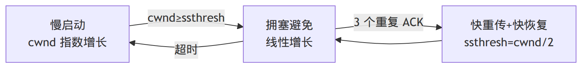

---

## 3.6 TCP 和 UDP 的区别？各用在什么场景？

**答案**：
| | TCP | UDP |
|---|---|---|
| 连接 | 面向连接(握手) | 无连接 |
| 可靠性 | 可靠(确认/重传/有序) | 不可靠(尽力而为) |
| 传输 | 字节流 | 数据报(保留边界) |
| 速度/开销 | 慢、头部 20B+ | 快、头部 8B |
| 拥塞/流量控制 | 有 | 无 |
| 场景 | 文件/网页/MQTT/SSH | 直播/游戏/DNS/视频通话 |

**答出深度**：**「TCP 是字节流、没有边界」** 是引出**粘包半包**的关键（下一题）；UDP「保留消息边界」所以不会粘包，但要自己处理丢包乱序。你的 MQTT 走 TCP（要可靠），所以传感数据不会丢。

---

## 3.7 什么是粘包/半包？怎么解决？（直接对应你的项目）

**解析**：这道题你能讲到飞起——你的 HTTP `Buffer` 和串口帧协议都在解决它。

**答案**：TCP 是**面向字节流**的，**没有消息边界**。发送方两次 `send` 的数据，接收方可能一次 `recv` 全收到（**粘包**），也可能一条消息分多次才收齐（**半包/拆包**）。根因：发送端 Nagle 算法合并小包、接收端缓冲区一次取多/取少、MSS 分段等。

**三种解决方案**：
1. **固定长度**：每条消息定长，简单但浪费。
2. **特殊分隔符**：如 HTTP 用 `\r\n\r\n` 分隔头部；问题是数据里若含分隔符要转义。
3. **长度字段（最常用）**：消息头里放一个**长度字段**，先读头知道 body 多长，再精确读那么多字节。

**答出深度（项目）**：我**两处都处理了**——
- **串口二进制协议**：用「**帧头 `0xAA 0x55` + 长度字段 LEN + CRC 校验**」，配 **8 状态解析状态机逐字节驱动**，天然处理半包（没收齐就停在当前状态等下一个字节）和粘包（一帧结束自动开始下一帧），还能**错误重同步**（CRC 错就回到找帧头状态）。
- **HTTP 服务**：手写**接收缓冲区 `Buffer`** 做重组，用**四状态请求解析状态机**——`recv` 到的数据先进 Buffer，解析器从 Buffer 里尝试解析完整请求，不完整就保留等下次，支持**管线化**（一个 Buffer 里连续解析多个请求）。

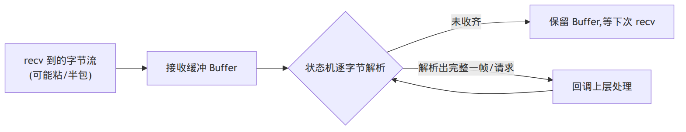

---

## 3.8 HTTP 请求的结构？常见状态码？GET 和 POST 区别？

**答案**：
- **请求结构**：请求行（`GET /path HTTP/1.1`）+ 请求头（`Host`、`Content-Length`…）+ 空行（`\r\n\r\n`）+ 请求体。
- **状态码**：`1xx` 信息；`2xx` 成功（200 OK）；`3xx` 重定向（301 永久、302 临时、304 未改）；`4xx` 客户端错（400 请求错、401 未认证、403 禁止、404 找不到）；`5xx` 服务端错（500 内部错、502 网关错、503 不可用）。
- **GET vs POST**：GET 参数在 URL、可缓存可收藏、幂等、长度受限；POST 参数在 body、不可缓存、非幂等、可传大数据。

**答出深度**：本质上 GET/POST 都是 TCP 上发文本，区别更多是**语义约定**而非技术强制。安全角度：GET 参数在 URL 会被日志记录，敏感数据该用 POST + HTTPS。

---

## 3.9 HTTP 长连接（Keep-Alive）？HTTP/1.1 与 2 区别？

**答案**：
- **短连接**：每个请求都新建一次 TCP 连接，用完即关，握手挥手开销大。
- **长连接（Keep-Alive）**：HTTP/1.1 默认开启，一个 TCP 连接复用于多个请求，省握手。靠 `Connection: keep-alive`。
- **管线化（pipelining）**：1.1 允许不等响应就连发多个请求，但响应仍要按序返回（队头阻塞）。
- **HTTP/2**：二进制分帧、**多路复用**（一个连接上多个流并行，解决队头阻塞）、头部压缩（HPACK）、服务端推送。

**答出深度（项目）**：我的 HTTP 监控服务**支持管线化**（Buffer 里连续解析多个请求），并用 **timerfd 回收空闲连接**——长连接不能无限留着占 fd，给每个连接记 `last_active`，timerfd 周期扫描把超时空闲连接踢掉。这是「长连接 + 空闲超时」的标准做法。

---

## 3.10 从浏览器输入 URL 到页面显示，发生了什么？（综合题）

**答案**（主线）：
1. **DNS 解析**：域名 → IP（先查缓存：浏览器→系统→路由器→ISP；没有则递归查询）。
2. **建立 TCP 连接**：和服务器三次握手（HTTPS 还要 TLS 握手）。
3. **发送 HTTP 请求**。
4. **服务器处理并响应**。
5. **浏览器渲染**：解析 HTML 构建 DOM、CSS 构建 CSSOM、合并成渲染树、布局、绘制。
6. **断开或复用连接**（Keep-Alive）。

**答出深度**：这题考的是「知识网络的完整性」——能把 DNS（UDP）、TCP 握手、HTTP、TLS 串起来即可，不必每步深挖。面试官常从某一步切入深问（如「DNS 用 TCP 还是 UDP」→ 一般 UDP，超过 512 字节或区域传送用 TCP）。

---

> 📌 **第 3 章项目话术锦囊**：网络题几乎都能落项目——「粘包半包 → 我串口协议用帧头+长度+CRC+8 状态机，HTTP 用 Buffer+四状态机」「TIME_WAIT/CLOSE_WAIT → 我用 timerfd 回收空闲连接、注意 close 漏关」「TCP 可靠 → 我自定义协议在应用层也做了序列号+ACK+超时重传，相当于在串口上重造了 TCP 的可靠性」。

---

# 第 4 章·Linux 系统编程

> 这是你网关的「主场」——epoll、ET/LT、非阻塞 IO、信号、eventfd/timerfd。面试官会往死里深挖 epoll，所以这章要练到能主动讲透。

## 4.1 文件描述符（fd）是什么？「一切皆文件」怎么理解？

**答案**：fd 是一个**非负整数**，是进程访问 I/O 资源的句柄。内核为每个进程维护一张**文件描述符表**，fd 是这张表的索引，表项指向「打开文件表项」，再指向 inode。0/1/2 分别是 stdin/stdout/stderr。

**「一切皆文件」**：Linux 把普通文件、设备、管道、socket、甚至**定时器（timerfd）、信号（signalfd）、事件（eventfd）** 都抽象成 fd，用统一的 `read`/`write`/`close` 操作。**这是 epoll 能统一调度的根基**——任何能变成 fd 的东西都能被 epoll 监听。

**答出深度（项目核心抽象）**：我的网关把这点用到极致——`Channel` 抽象封装「一个 fd + 关心的事件 + 回调」，于是 **socket、串口、timerfd、signalfd、eventfd 全做成 Channel**，被同一个 epoll 循环统一调度。这个抽象在项目里**复用了 5 次**，是「找对一个抽象，后面所有 fd 都套它」。

---

## 4.2 五种 I/O 模型？（阻塞 / 非阻塞 / I/O 复用 / 信号驱动 / 异步）

**解析**：理解 epoll 定位的前提。重点讲清「同步 vs 异步」「阻塞 vs 非阻塞」。

**答案**：一次 I/O 分两阶段——**① 等数据就绪**（数据到内核缓冲区）**② 把数据从内核拷到用户**。
1. **阻塞 I/O**：两个阶段都阻塞，最简单，但一个线程只能等一个 fd。
2. **非阻塞 I/O**：阶段①不阻塞（没数据立刻返回 `EAGAIN`），但要**轮询**，浪费 CPU。
3. **I/O 多路复用（select/poll/epoll）**：用一个 syscall 同时等**多个** fd，哪个就绪通知哪个；阶段②仍是阻塞拷贝。**这是 Reactor 的基础**。
4. **信号驱动 I/O**：fd 就绪时发信号通知，用得少。
5. **异步 I/O（AIO）**：两个阶段都交给内核，完成后通知，应用全程不阻塞。

**答出深度**：前四种都是**同步 I/O**（阶段②的数据拷贝要应用自己等着完成）；只有 AIO 是**真异步**。epoll 不是异步 I/O，它是「同步非阻塞 + 多路复用」。Reactor（epoll）vs Proactor（AIO）的区别也在这——Reactor 通知「可以读了」，Proactor 通知「已经读好了」。

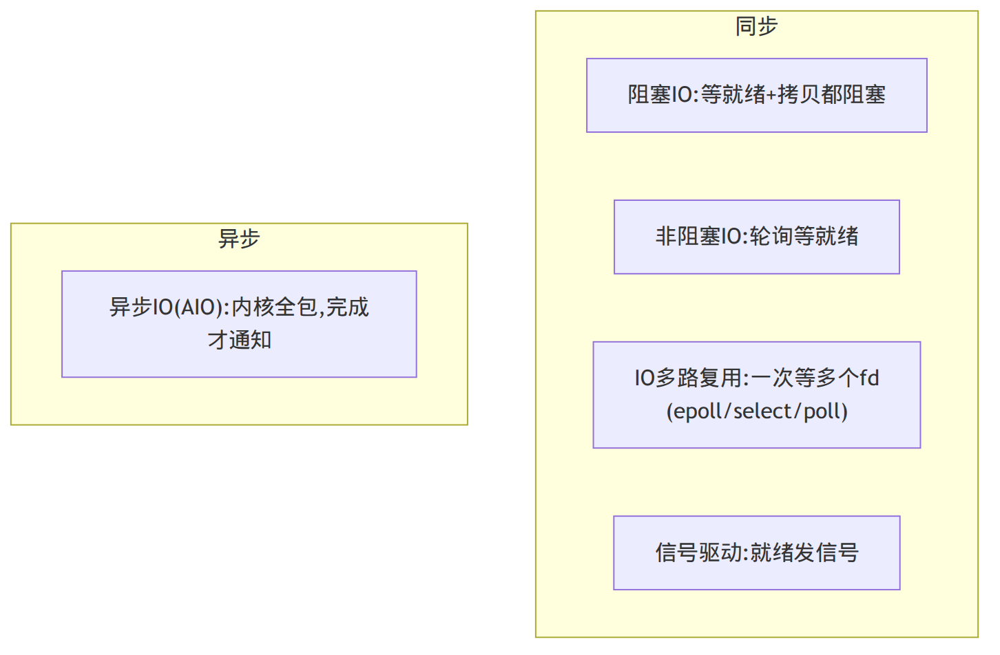

---

## 4.3 select / poll / epoll 的区别？epoll 为什么高效？（最高频）

**解析**：网络后端/嵌入式 Linux 第一深挖题。要答出三个层面的差异。

**答案**：
| | select | poll | epoll |
|---|---|---|---|
| fd 上限 | 有(FD_SETSIZE≈1024) | 无(数组) | 无 |
| 每次调用拷贝 | 全量 fd 集合拷到内核 | 全量拷 | 只在 `epoll_ctl` 注册一次 |
| 找就绪 fd | 遍历全部 O(n) | 遍历全部 O(n) | 只返回就绪的 O(就绪数) |
| 触发模式 | 只 LT | 只 LT | LT + ET |

**epoll 高效的根本两点**：
1. **内核帮你记住关心哪些 fd**：`epoll_ctl` 注册一次，之后 `epoll_wait` 不用每次把整个 fd 集合传进内核（select/poll 每次都全量拷贝）。
2. **只返回就绪的 fd**：内核用**回调**机制（fd 就绪时把它挂到就绪链表），`epoll_wait` 直接拿就绪链表，不用遍历所有 fd。

**答出深度**：epoll 内部是 **红黑树（管理所有注册的 fd，增删查 O(log n)）+ 就绪链表（rdllist，存已就绪的 fd）**。优势在 **C10K：连接多但同时活跃少**；如果几乎所有 fd 都活跃，epoll 相对 poll 优势就不明显了——**按场景说，别无脑吹 epoll**。

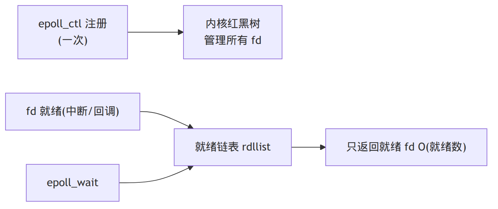

---

## 4.4 epoll 的 ET 和 LT 区别？ET 为什么必须配非阻塞 + 读到 EAGAIN？

**解析**：epoll 第二深挖题，也是最容易写错的实战点。

**答案**：
- **LT（水平触发，默认）**：只要 fd 还有数据可读，`epoll_wait` 就**反复通知**。没读完下次还提醒，**容错性好**。
- **ET（边沿触发）**：只在 fd 状态**从无到有变化**那一刻通知**一次**。这次不读完，不会再提醒。

**ET 的正确用法（关键）**：ET 模式下必须**一次把数据读干净**——**循环 `read` 直到返回 `EAGAIN`**（内核缓冲区空了）。否则没读完的数据会「卡住」，因为没有新边沿来触发。所以 **ET 必须配非阻塞 fd**：阻塞 fd 在读到没数据时会**卡死在 read 上**，整个事件循环就僵了。

**答出深度（措辞陷阱）**：别说「ET 比 LT 快所以更好」。ET 减少了 `epoll_wait` 唤醒次数，但**编程更难、易漏读**。muduo 默认用 LT 就因为它简单安全。选 ET 是为减少唤醒，要承担「必须读到 EAGAIN」的复杂度。**项目里我串口读用 ET + 非阻塞 + 循环读到 EAGAIN**。

**示例**：
```cpp
// ET 模式下读 fd：必须循环读到 EAGAIN
void readFromFd(int fd, std::vector<uint8_t>& out) {
    uint8_t buf[4096];
    while (true) {
        ssize_t n = ::read(fd, buf, sizeof buf);
        if (n > 0) {
            out.insert(out.end(), buf, buf + n);
        } else if (n == 0) {
            // 对端关闭(EOF)
            break;
        } else { // n < 0
            if (errno == EINTR) continue;            // 被信号打断，重试
            if (errno == EAGAIN || errno == EWOULDBLOCK) break; // 读空了，正常退出
            // 其它错误，处理关闭
            break;
        }
    }
}
```

---

## 4.5 写数据时内核缓冲区满了怎么办？（EPOLLOUT 按需开关）

**解析**：双向 I/O 的写半边，体现你处理过「写不完」的真实场景。

**答案**：`write` 也可能因为内核发送缓冲区满而**写不完**（返回值 < 想写的字节数，或 `EAGAIN`）。处理：
1. 每个连接维护一个**发送缓冲 `out_buf`**。
2. 一次写不完的剩余部分**留在 `out_buf`**，并**注册 `EPOLLOUT` 事件**。
3. 当 fd 可写时 epoll 通知，接着写 `out_buf` 里剩下的。
4. **`out_buf` 写空后立刻取消 `EPOLLOUT`**——否则「可写」会一直触发，CPU 空转。

**答出深度**：这就是「**EPOLLOUT 按需开关**」的标准写法——平时不监听可写（fd 几乎总是可写，监听了会一直触发），**只在有数据没发完时才临时打开**。这是我 HTTP 服务和下行命令发送都用的套路。

---

## 4.6 fork / exec / wait 的作用？fork 返回值？

**答案**：
- **`fork()`**：创建子进程，子进程是父进程的**副本**（COW，见 2.8）。**返回两次**：父进程里返回子进程 PID（>0），子进程里返回 0，失败返回 -1。
- **`exec` 系列**：用一个新程序**替换**当前进程的地址空间（代码/数据全换），但 PID 不变。`fork` + `exec` 是「创建新进程跑新程序」的标准组合。
- **`wait`/`waitpid`**：父进程回收子进程退出状态，避免**僵尸进程**。

**示例**：
```c
pid_t pid = fork();
if (pid < 0)        { perror("fork"); }
else if (pid == 0)  { execlp("ls", "ls", "-l", NULL); _exit(127); } // 子进程
else                { int st; waitpid(pid, &st, 0); }               // 父进程回收
```

---

## 4.7 信号是什么？信号处理函数里能做什么？什么是 async-signal-safe？

**解析**：你用 SIGHUP 做热加载，必考「信号处理函数为什么不能乱写」。

**答案**：信号是**异步**事件通知（如 `SIGINT` Ctrl+C、`SIGSEGV` 段错误、`SIGHUP` 挂起/重载、`SIGCHLD` 子进程退出）。可以**捕获并自定义处理**（除了 `SIGKILL`/`SIGSTOP`）。

**信号处理函数的限制**：它**异步打断**主流程在任意位置执行，所以：
- 只能调用 **async-signal-safe（异步信号安全）** 的函数（如 `write`、`_exit`），**不能调用 `printf`/`malloc`/非可重入函数**——若主流程正好在 `malloc` 中途被打断，处理函数又调 `malloc` 会破坏堆。
- 不能加锁（可能死锁——主流程持锁时被打断，处理函数又要同一把锁）。

**标准安全做法**：处理函数里**只设置一个 `volatile sig_atomic_t` 标志位**，或往一个 fd 写一字节（self-pipe / signalfd），**真正的处理放回主循环**做。

**答出深度（项目）**：我做 **SIGHUP 配置热加载**正是这个套路——`signalfd` 把信号变成 fd 事件，纳入 epoll 统一调度，主循环收到后在自己线程里**安全地重新读配置**，完全避开了在信号处理函数里干重活的雷区。这是「把异步信号转成同步 fd 事件」的经典手法。


---

## 4.8 eventfd / timerfd / signalfd 各是什么？为什么要把它们做成 fd？

**答案**：
- **eventfd**：一个轻量的「事件计数器」fd，常用于**线程/进程间通知唤醒**——写它让它变可读，从而唤醒在 epoll 上等待的线程。
- **timerfd**：定时器 fd，到期变可读，让定时融入 epoll。
- **signalfd**：把信号变成 fd 的可读事件。

**为什么都做成 fd**：因为这样它们**全都能被同一个 epoll 监听**，事件循环不用为「定时、信号、跨线程通知」各搞一套机制——统一成「fd 可读」。这是「一切皆 fd」+ Reactor 的威力。

**答出深度（项目核心）**：我的网关主循环统一调度四类事件源，全靠这个：
- **串口收发** → socket/串口 fd
- **命令超时重发** → timerfd
- **配置热加载** → signalfd
- **跨线程下行命令** → **eventfd**（别的线程把命令塞进线程安全队列，然后写 eventfd 唤醒主循环，主循环醒来在自己线程里取队列执行——这就是「单一写者：把跨线程调用转成 loop 内任务」）。

---

## 4.9 阻塞和非阻塞、同步和异步的区别？

**答案**：两组**正交**的概念：
- **阻塞/非阻塞**：调用在「数据没就绪」时是否**挂起等待**。阻塞=挂起；非阻塞=立刻返回 EAGAIN。
- **同步/异步**：「数据拷贝（真正的 I/O 完成）」是**调用方自己做**还是**内核做完通知你**。同步=自己等着完成；异步=内核完成后回调你。

**答出深度**：epoll 是「**同步非阻塞**」——非阻塞（不挂起在单个 fd），但仍是同步（就绪后还要自己 read 把数据拷出来）。真正的异步是 AIO/io_uring。这四个词别混，面试常故意绕。

---

## 4.10 零拷贝（zero-copy）是什么？

**答案**：**定义**——零拷贝（zero-copy）指**在数据传输过程中，避免（或减少）CPU 把数据在内核态缓冲区与用户态缓冲区之间反复拷贝的一类技术**，让数据尽量只在内核内部流转、不绕道用户空间。
为什么需要它：普通「读文件发网络」要经历 **4 次拷贝**（磁盘→内核页缓存→用户缓冲→内核 socket 缓冲→网卡）和多次用户/内核态切换。零拷贝就是去掉中间这些多余的拷贝：
- **`sendfile`**：数据直接在内核内部从文件页缓存送到 socket，不经用户态。
- **`mmap`**：把文件映射到用户地址空间，省一次拷贝。
- **`splice`**：在两个 fd 间通过管道传数据，不进用户态。

**答出深度**：零拷贝的收益是「**减少数据拷贝 + 减少用户/内核态切换**」，Kafka、Nginx 发静态文件都用 `sendfile`。我项目里 HTTP 网页资源是**编译期内嵌进二进制**，本身就避免了运行时读文件，属于另一种「省 I/O」的思路。

---

> 📌 **第 4 章项目话术锦囊**：这章每题都能挂项目——「epoll/ET → 串口读 ET+非阻塞+读到 EAGAIN」「EPOLLOUT 按需开关 → HTTP/下行命令写半包」「signalfd → SIGHUP 热加载」「eventfd → 跨线程下行命令唤醒主循环（单一写者）」「timerfd → 命令超时重发 + 空闲连接回收」「一切皆 fd → Channel 抽象复用 5 次」。把这些主动抛出来，就是 M7 那份卡说的「主动 surface 设计深度」。

---

# 第 5 章·多线程并发

> 你简历明确写「掌握互斥锁、条件变量、线程池」，项目里有 `ThreadSafeQueue` 和 `ThreadPool`。这章要能从「锁 → 条件变量 → 生产者消费者 → 线程池 → 无锁」一条线讲到底。

## 5.1 互斥锁怎么用？`lock_guard`、`unique_lock`、`scoped_lock` 区别？

**答案**：互斥锁（`std::mutex`）保证临界区同一时刻只有一个线程进入。C++ 用 **RAII 锁包装器** 避免忘记解锁/异常漏解锁：
- **`lock_guard`**：最简单，构造即加锁、析构即解锁，**不能手动解锁、不能转移**。开销最小，首选。
- **`unique_lock`**：更灵活——可**延迟加锁**（`std::defer_lock`）、**手动 lock/unlock**、可移动、可配合**条件变量**（条件变量要求能在等待时解锁，所以必须用 `unique_lock`）。开销略大。
- **`scoped_lock`**（C++17）：可**一次锁住多个互斥量**且内部用死锁避免算法，替代以前的 `std::lock`。

**示例**：
```cpp
std::mutex m;
{
    std::lock_guard<std::mutex> lk(m);   // 加锁
    // 临界区...
}                                        // 析构自动解锁

std::scoped_lock lk2(m1, m2);            // 一次锁两把，内部防死锁
```

**答出深度**：条件变量为什么必须配 `unique_lock` 而非 `lock_guard`——因为 `wait()` 内部要**先解锁、挂起、被唤醒后再加锁**，需要锁能被中途解开，`lock_guard` 做不到。

---

## 5.2 条件变量怎么用？为什么 `wait` 要放在 `while` 循环里（虚假唤醒）？

**解析**：生产者消费者的核心，必考虚假唤醒。

**答案**：条件变量（`std::condition_variable`）让线程**等待某个条件成立**，避免忙等轮询。配合互斥锁用：
- 等待方：`cv.wait(lock, predicate)`——原子地「解锁 + 挂起」，被唤醒后重新加锁并检查谓词。
- 通知方：改变条件后 `cv.notify_one()` / `notify_all()`。

**为什么用 `while`（而非 `if`）检查条件**：
1. **虚假唤醒（spurious wakeup）**：操作系统可能在没有 `notify` 的情况下唤醒等待线程，必须重新检查条件。
2. **唤醒后条件可能又被别人改了**：`notify` 唤醒到真正抢到锁之间，可能别的线程先抢到锁把资源拿走了（如多个消费者抢一个产品）。
用 `while` 循环检查条件可同时解决这两点。`cv.wait(lock, pred)` 这个带谓词的重载内部就是 `while(!pred()) wait(lock);`。

**示例**：
```cpp
std::queue<int> q;
std::mutex m;
std::condition_variable cv;

void producer(int x) {
    { std::lock_guard<std::mutex> lk(m); q.push(x); }
    cv.notify_one();
}
void consumer() {
    std::unique_lock<std::mutex> lk(m);
    cv.wait(lk, [&]{ return !q.empty(); });  // 等价于 while(q.empty()) cv.wait(lk);
    int x = q.front(); q.pop();
}
```

---

## 5.3 设计一个线程安全队列（你项目里就有）

**解析**：直接对应你的 `ThreadSafeQueue`。能现场写出来 + 讲清设计点。

**答案 + 示例**：核心是「互斥锁保护队列 + 条件变量阻塞等待 + 支持优雅关闭」。
```cpp
template <class T>
class ThreadSafeQueue {
public:
    void push(T value) {
        { std::lock_guard<std::mutex> lk(mtx_); q_.push(std::move(value)); }
        cv_.notify_one();               // 锁外通知，减少「被唤醒又立刻阻塞」
    }
    // 阻塞弹出；队列关闭且空时返回 false，让消费者线程能退出
    bool wait_pop(T& out) {
        std::unique_lock<std::mutex> lk(mtx_);
        cv_.wait(lk, [&]{ return !q_.empty() || closed_; });
        if (q_.empty()) return false;   // closed_ 且空 → 退出信号
        out = std::move(q_.front()); q_.pop();
        return true;
    }
    void close() {                      // 优雅关闭：唤醒所有等待者
        { std::lock_guard<std::mutex> lk(mtx_); closed_ = true; }
        cv_.notify_all();
    }
private:
    std::queue<T> q_;
    std::mutex mtx_;
    std::condition_variable cv_;
    bool closed_ = false;
};
```

**答出深度（项目踩坑）**：
- **优雅关闭**最关键——析构/退出时若有消费者还卡在 `wait`，会永远不退出。所以加 `closed_` 标志，`close()` 时 `notify_all` 唤醒所有线程，让它们看到「关闭且空」后返回 false 自行退出。
- **notify 放锁外**：先解锁再 notify，避免被唤醒的线程立刻又因为锁被占而阻塞。
- 还可做**有界队列**（容量满时 push 阻塞），用第二个条件变量 `not_full_`，实现反压。

---

## 5.4 设计一个线程池（你项目里就有）

**解析**：对应你的 `ThreadPool`，做 SQLite/MQTT 双写。讲清「为什么要线程池」+ 结构。

**答案**：线程池 = **固定 N 个工作线程 + 一个任务队列**。预先创建线程，任务提交到队列，空闲线程取任务执行。**好处**：避免频繁创建/销毁线程的开销，控制并发度，削峰。

结构：
1. 构造时创建 N 个线程，每个线程循环：从任务队列 `wait_pop` 取任务并执行。
2. `submit(task)`：把任务（`std::function<void()>`）push 进队列。
3. 想拿返回值：用 `std::packaged_task` + `std::future`。
4. 析构：`close` 队列 + `join` 所有线程，优雅退出。

**示例**（带返回值）：
```cpp
class ThreadPool {
public:
    explicit ThreadPool(size_t n) {
        for (size_t i = 0; i < n; ++i)
            workers_.emplace_back([this]{
                std::function<void()> task;
                while (queue_.wait_pop(task)) task();   // 队列关闭则退出
            });
    }
    template <class F, class... Args>
    auto submit(F&& f, Args&&... args) -> std::future<std::invoke_result_t<F, Args...>> {
        using R = std::invoke_result_t<F, Args...>;
        auto task = std::make_shared<std::packaged_task<R()>>(
            std::bind(std::forward<F>(f), std::forward<Args>(args)...));
        std::future<R> fut = task->get_future();
        queue_.push([task]{ (*task)(); });
        return fut;
    }
    ~ThreadPool() { queue_.close(); for (auto& w : workers_) w.join(); }
private:
    std::vector<std::thread> workers_;
    ThreadSafeQueue<std::function<void()>> queue_;
};
```

**答出深度（项目）**：我用线程池把「解码后的记录」并行写入**本地 SQLite + 上行 MQTT**，让 I/O 主线程保持轻快（重活外包）。配合 **SQLite WAL 模式**，让实时查询不阻塞落库。线程池大小要按「CPU 密集 → 核数」「I/O 密集 → 更多」来定，我这是 I/O 密集型。

---

## 5.5 原子操作和 CAS 是什么？`atomic` 和 `volatile` 区别？

**答案**：
- **原子操作**：不可被打断的操作，`std::atomic<T>` 保证读、写、读改写（`fetch_add`、`compare_exchange`）的原子性，无需加锁。
- **CAS（Compare-And-Swap）**：`compare_exchange_strong(expected, desired)`——「如果当前值等于 expected 就改成 desired」，是无锁数据结构的基石。失败就重试（自旋）。
- **`atomic` vs `volatile`**：`volatile` 只保证「每次从内存读、不被优化掉」，**不保证原子性、不保证多线程内存可见性/顺序**；`std::atomic` 才提供原子性 + 内存序保证。**多线程同步用 atomic，绝不能用 volatile**（高频错误点）。`volatile` 的正确场景是硬件寄存器、信号处理（嵌入式里常见）。

**示例**：
```cpp
std::atomic<int> cnt{0};
cnt.fetch_add(1, std::memory_order_relaxed);  // 原子自增

// CAS 自旋：无锁更新
int old = cnt.load();
while (!cnt.compare_exchange_weak(old, old + 1)) { /* old 被自动刷新，重试 */ }
```

---

## 5.6 内存序（memory order）/ 内存模型简单讲讲？

**解析**：进阶题，多线程岗高分项。能讲清 acquire/release 就够。

**答案**：编译器和 CPU 会**重排指令**以优化，单线程不受影响，但多线程下可能导致一个线程看到的写入顺序和另一个线程不一致。内存序就是约束这种重排：
- **`relaxed`**：只保证本操作原子，不约束顺序。用于纯计数器。
- **`acquire`（读）/ `release`（写）**：配对使用——`release` 写之前的所有写，对「`acquire` 读到该值」的线程**可见**。这是实现「发布-订阅」（如自旋锁、无锁队列）的关键。
- **`seq_cst`（顺序一致，默认）**：最强，所有线程看到统一的全局顺序，最易理解但最慢。

**答出深度**：典型用法是「标志位发布数据」——线程 A 写好数据后用 `release` 置标志，线程 B 用 `acquire` 读标志为真后，能保证看到 A 写好的数据。默认 `seq_cst` 最安全，性能敏感再降级到 acquire/release。

---

## 5.7 自旋锁 vs 互斥锁？什么时候用自旋锁？

**答案**：
- **互斥锁**：抢不到锁就**让出 CPU、线程睡眠**，被唤醒有上下文切换开销。适合**临界区长、竞争久**。
- **自旋锁**：抢不到就**忙等（循环 CAS）**，不睡眠。省了上下文切换，但**白白占着 CPU**。适合**临界区极短、锁很快释放**、且**不能睡眠的场景（如中断上下文）**。

**答出深度**：自旋锁在**单核上没意义**（自旋时持锁线程根本没机会跑）。内核里中断处理不能睡眠，所以用自旋锁。用户态高竞争长临界区用自旋会烧 CPU。实际常用**自适应**：先自旋几次抢不到再睡。

---

## 5.8 什么是无锁（lock-free）编程？读写锁？乐观锁悲观锁？

**答案**：
- **无锁编程**：不用互斥锁，靠原子操作（CAS）实现并发数据结构（无锁队列/栈）。优点：无锁竞争、无死锁、无优先级翻转；缺点：**极难写对**（ABA 问题、内存回收难），要靠 CAS 自旋。
- **读写锁（`shared_mutex`）**：读共享、写独占。**读多写少**场景比互斥锁好（多个读线程可并发）。注意写饥饿问题。
- **乐观锁 vs 悲观锁**：悲观锁假设冲突常发生，先加锁（互斥锁就是）；乐观锁假设冲突少，不加锁，提交时检查有没有被改（CAS、数据库版本号），冲突了再重试。

**答出深度（ABA 问题）**：CAS 的经典坑——值从 A 变成 B 又变回 A，CAS 以为「没变」其实变过了。解决：加版本号/标记（`atomic` 带 tag、`compare_exchange` 配版本计数）。

---

## 5.9 线程同步方式总结 + `thread_local`

**答案**：
- **同步方式**：互斥锁、条件变量、读写锁、自旋锁、信号量（`counting_semaphore` C++20）、原子操作、屏障（`latch`/`barrier` C++20）。
- **`thread_local`**：线程局部存储，每个线程有自己独立的一份变量副本，互不干扰——可用于「每线程一个缓冲区/随机数引擎」，避免共享和加锁。

**答出深度**：能讲「能不共享就不共享」——最好的并发是**没有共享状态**（如 Reactor 单线程、每线程独立数据、`thread_local`）。共享了才需要同步，同步就有开销和 bug。这正是你网关「主循环单线程无锁 + 跨线程用队列传递」的设计哲学。

---

> 📌 **第 5 章项目话术锦囊**：「线程安全队列 + 优雅关闭 → 我的 ThreadSafeQueue 用 closed_ 标志 + notify_all 让消费者退出」「线程池 + future → 双写 SQLite/MQTT」「能不共享就不共享 → 主循环单线程无锁，跨线程下行命令走队列 + eventfd」「volatile≠原子 → 多线程用 atomic，volatile 留给我 STM32 的硬件寄存器」。

---

# 第 6 章·嵌入式 C 与 MCU 基础

> 这章是嵌入式岗的「硬核基本功」——`volatile`、位操作、大小端、内存对齐、中断、启动流程。很多能直接挂你的 STM32 节点。

## 6.1 `volatile` 关键字深入：三大使用场景？

**解析**：嵌入式第一高频。要答出三个场景，并和「原子/线程同步」划清界限。

**答案**：`volatile` 告诉编译器「这个变量随时可能被**当前代码流之外**改变，每次访问都必须真正从内存读/写，不许缓存到寄存器、不许优化掉」。三大场景：
1. **内存映射的硬件寄存器**：外设寄存器的值由硬件改变（如状态寄存器的标志位），不加 volatile 编译器可能认为「值没变」而读旧的缓存值。
2. **中断服务程序（ISR）与主程序共享的变量**：ISR 异步修改的标志位，主循环里 `while(!flag);` 若 flag 不是 volatile，编译器可能把它优化成死循环（认为 flag 不会变）。
3. **多线程共享变量**（仅保证「每次读内存」，**不保证原子和同步**，多线程同步要用原子/锁）。

**示例**：
```c
volatile uint8_t rx_flag = 0;    // ISR 里置 1，主循环等它
void USART1_IRQHandler(void) { rx_flag = 1; }   // 中断里改
int main(void) {
    while (!rx_flag) { /* 等中断 */ }   // 没有 volatile 会被优化成死循环
    rx_flag = 0;
}
// 硬件寄存器典型写法
#define GPIOA_ODR  (*(volatile uint32_t*)0x4001080C)
```

**答出深度（陷阱）**：`volatile` **不保证原子性**。32 位 MCU 上对 32 位变量的读写是原子的，但对 64 位变量、或「读-改-写」（`flag++`）不是原子的——中断和主程序都改同一变量时，要么关中断保护，要么用原子操作。**volatile 解决「可见性/不被优化」，不解决「原子性」**。

---

## 6.2 位操作：置位、清位、取反、判断某位？（嵌入式天天用）

**答案**：操作寄存器某几位而不影响其它位：
```c
#define BIT(n)   (1u << (n))
reg |=  BIT(3);            // 置位:第 3 位置 1
reg &= ~BIT(3);           // 清位:第 3 位清 0
reg ^=  BIT(3);           // 取反:第 3 位翻转
if (reg & BIT(3)) {...}   // 判断:第 3 位是否为 1

// 多位操作:先清掉再写入(避免残留)
reg &= ~(0x3u << 4);      // 清掉 [5:4]
reg |=  (0x2u << 4);      // 写入 [5:4] = 10
```

**答出深度**：常考「不用临时变量交换两数」`a^=b; b^=a; a^=b;`（实战别用，可读性差且 a==b 同地址会清零）；「判断 2 的幂」`n>0 && (n&(n-1))==0`；「统计 1 的个数」`while(n){n&=n-1;cnt++;}`（每次消掉最低位的 1）。

---

## 6.3 大端和小端是什么？怎么判断？什么时候要关心？

**答案**：
- **大端（Big-Endian）**：高位字节存低地址（符合人类阅读，网络字节序）。
- **小端（Little-Endian）**：低位字节存低地址（x86、ARM 默认）。
- 对 `0x12345678`：大端存 `12 34 56 78`，小端存 `78 56 34 12`。

**判断方法**：
```c
int is_little_endian(void) {
    uint16_t x = 0x0001;
    return *(uint8_t*)&x == 0x01;   // 小端时低地址是 0x01
}
// 或用 union
union { uint16_t v; uint8_t b[2]; } u = {0x0001};
// u.b[0]==1 → 小端
```

**什么时候关心**：① **网络传输/跨设备协议**——网络字节序是大端，收发要 `htons/ntohs` 转换；② **你的串口协议**——网关（树莓派 ARM 小端）和 STM32（小端）之间多字节字段要约定字节序，否则解析错位。

**答出深度（项目）**：我自定义二进制协议时，多字节字段（如 CRC16、序列号）**显式按字节收发**（`crc_lo`、`crc_hi` 分开），不直接 memcpy 一个整数，这样**不依赖两端的端序**，避免大小端踩坑——这是协议设计的好习惯。

---

## 6.4 内存对齐是什么？为什么要对齐？`struct` 大小怎么算？

**解析**：必考，常给一个 struct 让你算 `sizeof`。

**答案**：**定义**——内存对齐指**数据在内存中的存放地址被要求是某个数（对齐边界，通常等于该数据类型的大小）的整数倍**，比如 4 字节的 `int` 一般要放在能被 4 整除的地址上。
- **为什么要对齐**：CPU 按对齐地址访问效率最高（一次总线访问就能取到一个数据）；不对齐可能要两次访问再拼接，甚至某些架构（如部分 ARM）直接触发**硬件异常**。
- **结构体大小怎么算**：为满足对齐，编译器会在成员间**插入填充字节（padding）**，使每个成员的地址是其自身对齐数的整数倍，且整个结构体大小是**最大成员对齐数的整数倍**。

**示例**：
```c
struct A {
    char  a;     // 偏移 0,占 1
    // 填充 3 字节
    int   b;     // 偏移 4,占 4(要 4 字节对齐)
    char  c;     // 偏移 8,占 1
    // 填充 3 字节(结构体总大小要是 4 的倍数)
};               // sizeof(A) == 12

struct B {       // 调整成员顺序可省空间
    int   b;     // 0
    char  a;     // 4
    char  c;     // 5
    // 填充 2
};               // sizeof(B) == 8
```

**答出深度**：
- **成员顺序影响大小**——大的放前面、小的聚在一起可减少 padding（嵌入式省 RAM 很实在）。
- **`#pragma pack(1)`** 或 `__attribute__((packed))` 可取消对齐——**协议结构体常用**（让 struct 内存布局和帧字节严格一致，方便强转解析），但代价是可能的非对齐访问惩罚。
- 你的串口帧若用 struct 映射，就得 `packed`，否则 padding 会让字节错位。

---

## 6.5 单片机的中断机制？中断处理流程？中断里不能做什么？

**解析**：嵌入式核心，常接 NVIC 优先级、中断延迟、中断里能不能用 printf/delay。

**答案**：
- **中断**：事件打断 CPU 当前执行，跳去执行对应的**中断服务程序（ISR）**，完成后返回断点。ARM 统称**异常（exception）**，来源不只硬件，分三类：
  - **硬件中断（IRQ）**：定时器溢出、串口收到字节、GPIO 边沿——狭义"中断"指这类，异步。
  - **软件触发**：`svc` 指令触发 **SVCall**（OS 系统调用入口）；写寄存器挂起 **PendSV**（**FreeRTOS 上下文切换就在这里做**）；写 NVIC 的 ISPR/STIR 还能软件挂起任意 IRQ。
  - **Fault**：执行出错触发——非法访存、除零、未对齐 → **HardFault** / BusFault / UsageFault。
- **流程**：中断源置挂起标志 → CPU 保存现场（PC、寄存器自动压栈，Cortex-M 硬件自动压 8 个寄存器）→ 查**中断向量表**找到 ISR 地址 → 执行 ISR → 恢复现场返回。
- **NVIC**（Cortex-M 的嵌套向量中断控制器）：支持**优先级**（抢占优先级 + 子优先级），高优先级可抢占低优先级（中断嵌套）。

**中断里不能/不该做**：
1. **不要做耗时操作**（长延时、复杂计算）——会阻塞其它中断、拖慢系统实时性。原则：**ISR 尽量短，只置标志/读数据，复杂处理丢给主循环或任务**。
2. **不要用阻塞调用 / `HAL_Delay`**（基于 SysTick，可能在中断里死等）。
3. **不要调用不可重入函数 / 非中断安全的 RTOS API**（FreeRTOS 里中断只能用 `FromISR` 后缀的 API）。
4. **共享变量加 `volatile`**，必要时关中断保护「读-改-写」。

**答出深度（项目）**：我的 STM32 节点 **UART 接收用 DMA + 空闲中断**——ISR 里**只做「通知有一帧到了」**（释放信号量/置标志），真正的解析放到任务里。这正是「ISR 短、重活后移」的实践，也避免了在中断里逐字节处理的低效。

---

## 6.6 单片机从上电到 `main` 发生了什么？（启动流程）

**解析**：体现你懂底层，不只是会调 HAL 库。

**答案**：

```text
上电/复位
  → 硬件:锁存 BOOT 引脚、RCC 恢复默认值(SYSCLK = HSI 8MHz)
  → CPU 从 0x00000000 取初始 SP,从 0x00000004 取 Reset_Handler 地址
  → Reset_Handler:
       bl SystemInit          (在 .data 拷贝之前!)
       拷贝 .data,清零 .bss
       bl __libc_init_array   (C++ 全局构造 / 属性构造函数)
       bl main                (调用,而非"之后")
```

- **拷贝 `.data`**：把已初始化全局变量的初值从 Flash 拷到 RAM；**清零 `.bss`**：未初始化全局变量清 0。
- **`SystemInit` 在 `.data` 拷贝之前调用**（见 startup_stm32f103xb.s），所以它不能依赖任何带初值的全局变量。
- `main` 是被 `bl` **调用**的，若返回会落入启动文件的死循环（LoopForever）。

**答出深度**：能解释「为什么全局变量有初值」——因为启动代码把初值从 Flash 搬到了 RAM；「为什么大数组别初始化成非 0」——会占 Flash（.data）且拖慢启动拷贝，初始化为 0 的进 .bss 不占 Flash。中断向量表在 Flash 起始，可重映射。

---

## 6.7 `const` / `static` / 宏 vs `inline` 在嵌入式里的考量？

**答案**：
- **`const` 全局变量**：放在 **Flash（只读区）**，省 RAM——嵌入式里把查找表、字符串常量声明 const 很重要。
- **`static`**：① 函数内 static 变量放 RAM 且只初始化一次（保留状态）；② 文件级 static 限制作用域，避免符号冲突、利于编译器优化（内联、去除未用函数）。
- **宏 vs `inline`**：宏是文本替换，**无类型检查、有副作用风险**（`#define SQ(x) x*x` → `SQ(a+b)` 出错）；`inline` 函数有类型检查、可调试。嵌入式优先 `inline`/`static inline`，少用函数宏。`constexpr`（C++）更好。

**答出深度**：嵌入式资源紧张，关键词选择直接影响 Flash/RAM 占用：常量进 Flash（const）、状态进 RAM（static）、热点小函数内联（inline）减少调用开销但增大代码体积，要权衡。

---

## 6.8 RAM 和 Flash（ROM）的区别？程序各段放哪？

**答案**：
- **Flash（ROM）**：非易失，存**程序代码（.text）、常量、.data 的初值**，容量大但写慢。
- **RAM（SRAM）**：易失，掉电丢失，存**运行时的变量（.data、.bss）、堆、栈**，读写快但容量小。

| 段 | 存放位置 | 内容 |
|---|---|---|
| `.text` | Flash | 代码、`const` |
| `.data` | 初值在 Flash，运行时在 RAM | 已初始化全局/静态 |
| `.bss` | RAM | 未初始化全局/静态(清零) |
| heap/stack | RAM | 动态分配 / 局部变量 |

**答出深度**：嵌入式调试常看 `.map` 文件确认 RAM/Flash 占用；栈和堆在 RAM 里相向增长，**栈溢出**会冲掉别的数据——这在 RTOS 里尤其要注意每个任务的栈大小（见第 8 章）。

---

## 6.9 函数指针和回调？在嵌入式里怎么用？

**答案**：函数指针存函数地址，可作参数传递实现**回调**。嵌入式典型用途：**中断回调表、状态机动作表、HAL 库回调**（如 `HAL_UART_RxCpltCallback`）、命令分发表。

**示例**：
```c
typedef void (*cmd_handler_t)(const uint8_t* payload, uint8_t len);
typedef struct { uint8_t type; cmd_handler_t handler; } cmd_entry_t;

cmd_entry_t table[] = {
    {0x01, handle_set_period},
    {0x02, handle_reboot},
};
void dispatch(uint8_t type, const uint8_t* p, uint8_t len) {
    for (size_t i = 0; i < sizeof(table)/sizeof(table[0]); ++i)
        if (table[i].type == type) { table[i].handler(p, len); return; }
}
```

**答出深度**：用「函数指针表」代替一长串 `if/else` 或 `switch`，是命令分发、状态机的常见手法，扩展性好。我网关的 `FrameParser` 用 `std::function` 回调把「解析出帧」和「上层处理」解耦，同理。

---

> 📌 **第 6 章项目话术锦囊**：「volatile → 我 STM32 的 ISR 标志位、硬件寄存器都用它，但读-改-写靠关中断保护」「字节序 → 协议字段按字节分开收发，不依赖端序」「中断里只置标志重活后移 → DMA+空闲中断只通知，解析放任务」「函数指针表 → 命令分发」。

---

# 第 7 章·STM32 外设

> 你的 STM32F103 节点用到了 GPIO、定时器、IWDG 看门狗、UART（DMA+空闲中断）、I2C（BH1750）、单总线（DHT11）、DMA、低功耗。这章把每个外设的「八股 + 你的具体用法」打通。

## 7.1 STM32 GPIO 的八种工作模式？推挽和开漏的区别？

**解析**：嵌入式开场必考。重点开漏 vs 推挽、什么时候用开漏。

**答案**：八种模式 = 4 输入 + 4 输出：
- **输入**：浮空输入、上拉输入、下拉输入、模拟输入。
- **输出**：推挽输出、开漏输出、复用推挽、复用开漏（复用 = 接到外设如 USART/I2C）。

**推挽 vs 开漏**：
- **推挽（Push-Pull）**：内部上下两个管子，能**主动输出高电平和低电平**，驱动能力强。用于一般 GPIO 输出（点灯、控制）。
- **开漏（Open-Drain）**：只能**主动拉低**，输出高时是「高阻」，靠**外部上拉电阻**拉到高。用于：① **I2C 总线**（多设备线与、防冲突）；② **电平转换**（上拉到不同电压）；③ 单总线。

**答出深度（项目）**：我的 **DHT11 用开漏输出 + 外部上拉**——因为单总线是「主从分时双向」，开漏让主机和 DHT11 都能拉低、释放时靠上拉回高，避免两边同时驱动冲突。代码里 `GPIO_MODE_OUTPUT_OD` + `GPIO_NOPULL`（模块自带上拉）。

---

## 7.2 EXTI 外部中断怎么配置？和轮询读 GPIO 比有什么好处？

**答案**：EXTI 把 GPIO 引脚的**边沿变化**（上升/下降/双边沿）连到 NVIC 触发中断。配置：选引脚 → 选触发边沿 → 设 NVIC 优先级 → 写 `EXTIx_IRQHandler` → 在 `HAL_GPIO_EXTI_Callback` 里处理。

**vs 轮询**：轮询要 CPU 不停读引脚，浪费 CPU 且可能漏掉快速脉冲；中断是事件来了才打断 CPU，**实时、省 CPU、可低功耗**（CPU 可睡眠等中断唤醒）。

**答出深度**：注意中断里**只置标志/读值，重活后移**（见 6.5）；按键还要**软件消抖**（中断里启动一个定时器，几十 ms 后再确认电平）。

---

## 7.3 定时器有哪些类型？能做什么？PWM 原理？

**答案**：STM32 定时器分**基本定时器**（只能定时、触发 DAC）、**通用定时器**（定时、PWM、输入捕获、输出比较）、**高级定时器**（多带死区/刹车，用于电机)。
- **定时**：计数器从 0 数到 ARR（自动重装值）溢出，触发中断/事件。定时周期 = (PSC+1)(ARR+1)/时钟频率。
- **PWM**：计数器和比较值 CCR 比较——计数 < CCR 输出一种电平，≥ CCR 输出另一种，**改 CCR 就改占空比**，改 ARR 改频率。用于调光、调速、舵机。
- **输入捕获**：捕获外部信号边沿时刻，测频率/脉宽。

**答出深度**：能算定时周期是加分项。比如 72MHz、PSC=7199、ARR=9999 → (7200×10000)/72e6 = 1s。FreeRTOS 的时基（SysTick）也是一种定时器。

---

## 7.4 独立看门狗 IWDG 和窗口看门狗 WWDG 的区别？（你项目用了 IWDG）

**解析**：你简历的「看门狗保活」核心，必深挖。

**答案**：
- **IWDG（独立看门狗）**：用**独立的 LSI 时钟**（~40kHz），独立于主时钟，**主时钟挂了它照样工作**，可靠性高。是个递减计数器，到 0 就**复位芯片**；程序要周期性「喂狗」（重装计数值）。只能设超时下限，**不能太早喂**没限制。
- **WWDG（窗口看门狗）**：用主时钟（APB），有一个「窗口」——**喂太早（在窗口上限之前）也会复位**，喂太晚也复位，必须在窗口内喂。用于检测程序「跑飞导致喂狗节奏异常」。

**答出深度（项目实测细节）**：我用 **IWDG**，`Prescaler=64, Reload=1250`，超时 ≈ (64×1250)/40000 ≈ **2 秒**——2 秒内不喂狗就复位。

设计亮点是**「事件组全员报到喂狗」**——不是主循环单独喂，而是三个任务各自打卡、集齐才喂：

| 任务（优先级） | 打卡位 | 职责 |
|---|---|---|
| `vCmdTask`（3，最高） | `WDG_BIT_CMD` | 收串口帧：从 DMA 环形缓冲取字节喂给帧解析器，处理网关下发的命令 |
| `vTxTask`（2） | `WDG_BIT_TX` | 发送任务：从 `xTxQueue` 取待发帧，`HAL_UART_Transmit` 发出去 |
| `vSampleReportTask`（1，最低） | `WDG_BIT_SAMPLE` | 采样上报：周期采集传感器数据，组帧后投进 `xTxQueue` |

三个任务都用 `xQueueReceive` / `xStreamBufferReceive` 等待时设了 **800ms 超时**，保证「没事干也要醒来打卡」而不是永久阻塞。每轮结束各自 `xEventGroupSetBits` 置自己的位，由 `vSampleReportTask` 在打卡后检查事件组是否**三位集齐**：齐了才 `HAL_IWDG_Refresh` 喂狗并清零重新收集；没齐就放任 IWDG 倒计时。**任一任务僵死（没打卡）就集不齐 → 喂不上 → 2 秒后复位。**

**这解决了「单任务卡死但主循环还在喂狗的假活」**——普通做法在主循环喂狗，子任务死了也照样喂，看门狗形同虚设；这里把喂狗权拆给每个任务，缺一不可。

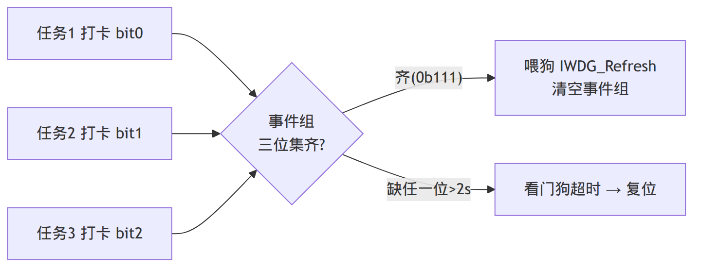

---

## 7.5 UART 通信？帧格式？接收方式（轮询/中断/DMA）怎么选？

**解析**：你 UART 用 DMA + 空闲中断，必深挖这套组合。

**答案**：
- **UART** 异步串行，无时钟线，靠双方约定**波特率**同步。**帧格式**：起始位(1) + 数据位(8) + 校验位(可选) + 停止位(1)，即常见 `8N1`。
- **三种接收方式**：
  1. **轮询**：CPU 死等 `HAL_UART_Receive`，简单但阻塞、浪费 CPU。
  2. **中断**：每收到一个字节触发一次中断。不阻塞，但**字节多时中断太频繁**，占 CPU。
  3. **DMA**：硬件直接把数据搬到内存，**全程不打扰 CPU**，收一批才通知一次。适合高速/大数据。

**DMA + 空闲中断（IDLE）的妙处**：UART 收不定长帧的最佳方案——DMA 自动收数据进缓冲，当**总线空闲（一帧结束后没有新数据）** 触发 **IDLE 中断**，此时一帧刚好收完，一次性处理整帧。**解决了「不定长数据不知道何时收完」的问题**。

**答出深度（项目）**：我的节点 **UART 接收用 DMA + 空闲中断逐帧唤醒**——DMA 搬数据零 CPU 占用，IDLE 中断在一帧结束时**释放信号量唤醒命令解析任务**，任务再走协议状态机解码。这就是「ISR 只通知、解析后移」+「DMA 省 CPU」+「亚毫秒唤醒不影响实时」的组合。


---

## 7.6 I2C 协议？为什么用开漏？起始/停止/应答怎么回事？（你 BH1750 用 I2C）

**答案**：
- **I2C** 是**两线（SCL 时钟 + SDA 数据）同步半双工**总线，一主多从，靠**7 位地址**寻址。
- **开漏 + 上拉**：所有设备 SDA/SCL 都接开漏，实现「线与」——任一设备拉低则总线为低，避免多设备同时驱动冲突。
- **时序**：**起始 S**（SCL 高时 SDA 由高变低）→ 发地址 + 读写位 → 从机 **ACK**（拉低 SDA）→ 数据字节 + 每字节后 ACK → **停止 P**（SCL 高时 SDA 由低变高）。

**答出深度（项目踩坑）**：我读 BH1750 的流程：发 `POWER_ON` → 发 `CONT_HIGH_RES`（连续高分辨率测量）命令 → 等测量 → 读 2 字节原始值 → **光照值 = raw / 1.2 lux**（数据手册的换算系数）。还做了 **I2C 总线恢复**——如果某次从机把 SDA 拉死（总线卡死），手动 bit-bang 切 GPIO 模式、**狂发时钟脉冲把从机的状态机冲回空闲**，再重新初始化 I2C。这是 I2C 实战里很常见但容易忽略的健壮性处理。

---

## 7.7 单总线（1-Wire）协议？DHT11 时序讲一下？（你项目用了）

**答案**：单总线只用**一根数据线**双向通信（开漏 + 上拉），主从分时。DHT11 读取时序：
1. **主机起始**：拉低数据线 **≥18ms**，再释放（拉高 20~40us）等待 DHT11 响应。
2. **DHT11 响应**：拉低 **80us** + 拉高 **80us**。
3. **传 40 位数据**（5 字节：湿度整数/小数 + 温度整数/小数 + 校验和），高位先出。每位以 **50us 低电平开始**，然后高电平：**高约 26~28us 表示 0，高约 70us 表示 1**。
4. **读位技巧**：检测到高电平后**延时 40us 再读**——此时 0 已掉回低、1 还是高，据此判 0/1。
5. **校验**：前 4 字节之和的低 8 位 == 第 5 字节。

**答出深度（项目）**：单总线**时序极严格（微秒级）**，所以读取的临界段我用 **`taskENTER_CRITICAL()` 关调度 + DWT 精确微秒延时（`delay_us`）**——否则 FreeRTOS 任务切换或中断会打断时序导致读错。读完立刻退出临界区。这是「时序敏感操作要保护、但临界区尽量短」的体现。

---

## 7.8 DMA 是什么？为什么能省 CPU？有哪些模式？

**答案**：**DMA（直接存储器访问）** 是一个独立硬件，在外设和内存（或内存和内存）之间**直接搬数据，不经过 CPU**。CPU 配置好「源、目的、长度」后就撒手，DMA 搬完触发中断通知。
- **省 CPU**：传数据时 CPU 可干别的/睡觉，只在传完被中断一次。
- **模式**：普通模式（搬完即停）/ **循环模式**（搬完自动从头开始，用于 ADC 连续采样、UART 连续收）；外设到内存 / 内存到外设 / 内存到内存。

**答出深度**：DMA 和 CPU 会**争用总线**（总线仲裁），但绝大多数嵌入式场景 DMA 收益远大于这点争用。注意 **DMA 缓冲区的 cache 一致性**（有 D-Cache 的 MCU 上要 invalidate/clean，F1 没 cache 不用管）。我 UART 接收用 DMA + IDLE，是「不定长帧 + 省 CPU」的最优解。

---

## 7.9 STM32 的低功耗模式？（你项目用了 tickless 睡眠）

**解析**：你简历「tickless 空闲睡眠降功耗」的考点。

**答案**：STM32 三种低功耗模式（功耗递减、唤醒变慢）：
| 模式 | 关掉什么 | 唤醒源 | 唤醒速度 |
|---|---|---|---|
| **Sleep** | 只停 CPU 时钟,外设/RAM 都在 | 任意中断 | 最快(几个周期) |
| **Stop** | 停大部分时钟,保留 RAM/寄存器 | EXTI/RTC | 较慢(us级) |
| **Standby** | 几乎全关,只留备份域 | 唤醒引脚/RTC/复位 | 最慢(重启) |

**答出深度（项目）**：我用 **FreeRTOS tickless idle**——系统空闲时**关掉周期性的 SysTick 滴答中断**，让 CPU 进 **Sleep 模式**睡眠（降空闲功耗），而不是空转。关键点：**串口可亚毫秒级唤醒**（一来数据就被中断唤醒），所以**不影响下行命令的实时响应**。这是「省功耗但不牺牲实时性」的平衡——tickless 的好处正是「没事就睡、有事秒醒」。

**为什么是 Sleep，不是更省电的 Stop/Standby**：
- **Stop 模式会停掉主时钟（HSE/PLL）**，唤醒后必须软件重新配置系统时钟（`SystemClock_Config()`）才能继续跑，PLL 重新锁定需要时间——跟「串口一来数据要亚毫秒级醒」这个实时性要求直接冲突，而且外设时钟也断了，USART/DMA/TIM4 这些外设状态未必能无缝续上。
- **Standby 模式几乎断电重启**，RAM 内容全部丢失——唤醒后 FreeRTOS 的任务状态、事件组、`g_last_seq` 幂等记录、采样计时这些全部清零，等价于一次复位，跟「传感器周期采集不能断」的需求矛盾。
- **Sleep 模式只关 CPU 核心时钟，外设时钟、RAM、寄存器全部保留**，任意中断（串口 RXNE/IDLE、DMA 完成、TIM4 tick）都能立刻把 CPU 拉回来继续跑，不需要重新配置任何时钟或外设——这正好匹配 tickless idle「只想省空闲功耗、不想牺牲响应速度」的目标。这也是 FreeRTOS 官方 Cortex-M 移植的 tickless 实现本身就固定用 `WFI` 进 Sleep（而不是 Stop/Standby）的原因，见 [FreeRTOSConfig.h:9](../STM32Project/N6_freertos/Core/Inc/FreeRTOSConfig.h#L9) 的注释。

---

> 📌 **第 7 章项目话术锦囊**：每个外设都配一句项目落地——「开漏 → DHT11 单总线 / I2C」「IWDG 2 秒 + 事件组全员喂狗 → 杜绝假活」「UART DMA+IDLE → 不定长帧、省 CPU、亚毫秒唤醒」「单总线微秒时序 → taskENTER_CRITICAL + DWT delay_us 保护」「tickless Sleep → 降功耗但串口秒醒」。

---

# 第 8 章·FreeRTOS

> 你的节点移植了原生 FreeRTOS，划分了 3 个抢占式任务，用了队列/流缓冲/互斥量/事件组/信号量。这章把 RTOS 八股和你的具体设计对照讲。

## 8.1 FreeRTOS 的任务调度是怎样的？抢占式 vs 协作式？

**答案**：FreeRTOS 默认 **抢占式 + 同优先级时间片轮转**：
- **抢占式**：高优先级任务一旦就绪，**立即抢占**正在运行的低优先级任务。保证高优先级任务的实时性。
- **同优先级时间片轮转**：相同优先级的任务按 SysTick 滴答轮流跑。
- **协作式**：任务只在主动让出（`taskYIELD`/阻塞）时才切换，实时性差，基本不用。
- **数字越大优先级越高**（和 Linux nice 相反，易记错）。

**答出深度（项目）**：我的三个任务优先级是按**实时性需求**分的——`vCmdTask`（命令解析，**优先级 3 最高**，要快速响应下行命令）> `vTxTask`（串口发送，**2**）> `vSampleReportTask`（周期采样上报，**1 最低**，采样不急）。这样下行命令到来能抢占采样任务，**保证命令实时响应**。

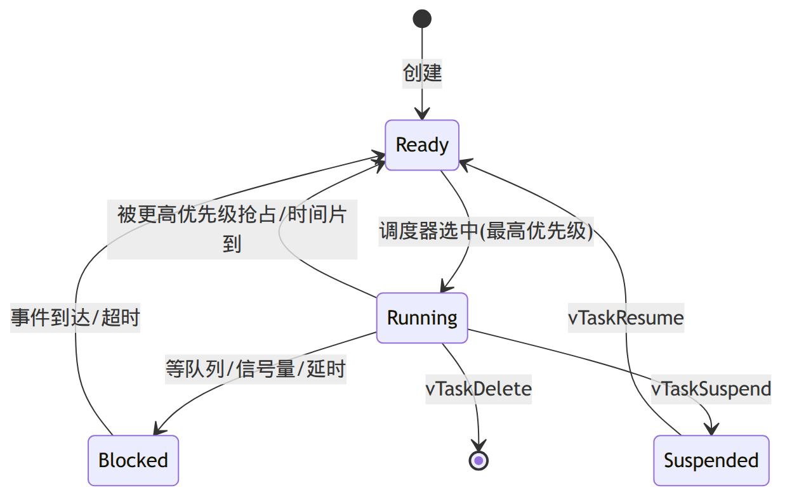

---

## 8.2 任务间通信和同步有哪些方式？分别用在哪？

**答案**：
- **队列 Queue**：任务间**传数据**（拷贝传递），FreeRTOS 通信的基础，满了发送阻塞、空了接收阻塞。
- **二值信号量 Binary Semaphore**：**同步/通知**（如 ISR 通知任务「事件来了」），只有 0/1。
- **计数信号量 Counting Semaphore**：管理一组资源、计数事件。
- **互斥量 Mutex**：**互斥**访问共享资源，带**优先级继承**（防优先级翻转），不能在 ISR 用。
- **事件组 Event Group**：**多事件标志位**，可等待「多个条件的与/或」（如「等 A 和 B 都发生」）。
- **任务通知 Task Notification**：轻量级，直接通知某个任务，比信号量/队列省 RAM 更快（适合一对一）。
- **流缓冲/消息缓冲 Stream/Message Buffer**：单生产者单消费者的**字节流/不定长消息**传递，适合 UART 数据流。

**答出深度（项目）**：我**全用上了**——命令解析和发送任务间用**队列**传数据；UART 的 IDLE 中断用**信号量**通知解析任务；共享资源（如串口）用**互斥量**保护；喂狗用**事件组**（三任务打卡集齐才喂）；UART 接收的不定长字节用**流缓冲**。能说出「为什么这个场景用这个原语」是关键。

---

## 8.3 什么是优先级翻转？优先级继承怎么解决？（互斥量必考）

**解析**：RTOS 经典难题，最好结合火星探路者的故事。

**答案**：**优先级翻转**：低优先级任务 L 持有一把互斥锁，高优先级任务 H 要这把锁被阻塞；此时**中等优先级任务 M**就绪并抢占了 L（M 不需要锁），导致 L 迟迟不能运行释放锁，**H 被 M 间接卡住**——高优先级反而等中优先级，「翻转」了。

**优先级继承（Priority Inheritance）解决**：当 H 因为锁阻塞在 L 上时，**临时把 L 的优先级提升到和 H 一样高**，让 L 不被 M 抢占，尽快跑完释放锁；L 释放锁后恢复原优先级。FreeRTOS 的 **Mutex 自带优先级继承**，而**二值信号量没有**——所以保护共享资源要用 Mutex 不用信号量。

**答出深度**：1997 年火星探路者就栽在优先级翻转上（看门狗反复复位），靠远程打开优先级继承修复。这个故事讲出来很加分。另一种方案是**优先级天花板**（持锁就升到预设最高）。

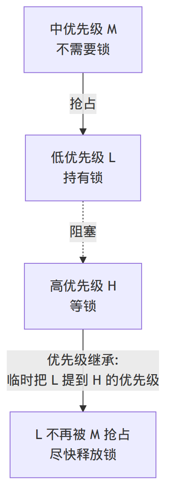

---

## 8.4 `vTaskDelay` 和 `vTaskDelayUntil` 区别？

**答案**：
- **`vTaskDelay(n)`**：相对延时——从**调用那一刻**起延时 n 个 tick。但任务实际执行有耗时，导致**周期会漂移**（周期 = 执行时间 + n）。
- **`vTaskDelayUntil(&last, n)`**（新版 `xTaskDelayUntil`）：绝对延时——延到「上次唤醒时间 + n」，**周期固定不漂移**，适合**严格周期任务**（如固定周期采样）。

**答出深度（项目）**：我的周期采样上报任务用 **`vTaskDelayUntil`** 保证采样周期稳定（默认 5 分钟一次），避免每次循环的采样/发送耗时累积导致周期越拖越长。

---

## 8.5 FreeRTOS 怎么检测栈溢出？任务栈怎么定？

**答案**：每个任务有**独立的栈**，创建时指定大小。栈溢出（局部变量/调用太深超出栈）会冲掉别的任务的栈或控制块，是 RTOS 最难查的 bug 之一。FreeRTOS 提供：
- **`configCHECK_FOR_STACK_OVERFLOW`**（方法1：切换时查栈指针越界；方法2：在栈末尾填魔数，切换时检查魔数有没有被覆盖）触发 `vApplicationStackOverflowHook` 回调。
- **`uxTaskGetStackHighWaterMark`**：查任务历史最小剩余栈，用来**调栈大小**（留余量但别太浪费 RAM）。

**答出深度（项目）**：我创建任务时按需给栈——命令/采样任务 `configMINIMAL_STACK_SIZE * 3`（解析、传感器读取要更多栈），发送任务 `* 2`。开发期用 high water mark 验证没溢出又不浪费。

---

## 8.6 临界区怎么保护？`taskENTER_CRITICAL` 和关中断？

**答案**：
- **`taskENTER_CRITICAL()/EXIT`**：进出临界区，内部**关掉低于某优先级的中断**（屏蔽调度），保证临界区不被打断。**必须极短**——关中断期间系统对所有中断无响应，影响实时性。
- **`vTaskSuspendAll()`**：只挂起调度器（不关中断），适合「不希望被任务切换打断但允许中断」的场景。
- ISR 里用 `taskENTER_CRITICAL_FROM_ISR`。

**答出深度（项目）**：我读 DHT11 单总线的微秒级时序段用 `taskENTER_CRITICAL()`——因为时序极严，任务切换或滴答中断插进来会读错；但**临界区只包时序敏感的那几十微秒**，读完立刻退出，不影响整体实时。这是「临界区要短」的实践。

---

## 8.7 Tickless idle 是什么？怎么省功耗？

**答案**：正常 FreeRTOS 每个 tick（如 1ms）都有一次 SysTick 中断唤醒 CPU 查看要不要调度，**即使没事干也在周期性醒来**，空闲功耗高。**Tickless idle**：当所有任务都阻塞、系统将长时间空闲时，**关掉周期 tick 中断**，让 CPU 进低功耗 Sleep，并设一个「到下一个任务该唤醒的时间」的定时器；醒来后**补偿修正 tick 计数**。这样空闲时 CPU 真正睡着，大幅降功耗。

**答出深度（项目）**：我启用 tickless，节点空闲时进 Sleep；**串口数据一来就被中断亚毫秒级唤醒**，不影响下行命令实时响应。这是低功耗采集节点的核心设计——「没事就深睡、有事秒醒」。

---

## 8.8 FreeRTOS 的内存管理（heap_1~heap_5）？

**答案**：FreeRTOS 提供 5 种堆实现：
- **heap_1**：只分配不释放，最简单最安全（确定性强，适合创建后不删的系统）。
- **heap_2**：可释放但不合并相邻空闲块，会碎片化（已不推荐）。
- **heap_3**：包装标准 `malloc/free`，线程安全。
- **heap_4**：**可释放 + 合并相邻空闲块**，减少碎片，**最常用**。
- **heap_5**：像 heap_4 但支持**多块不连续内存**（如片内 + 外部 SRAM）。

**答出深度**：嵌入式优先用 **静态创建**（`xTaskCreateStatic`，编译期定内存，无碎片、确定性强）或 heap_4。我用动态创建（`xTaskCreate`）+ heap_4，开发期方便；产品级追求确定性可换静态创建。

---

## 8.9 FreeRTOS 里 ISR 调用 API 要注意什么？

**答案**：
1. **只能用带 `FromISR` 后缀的 API**（如 `xQueueSendFromISR`、`xSemaphoreGiveFromISR`）——普通 API 可能阻塞，ISR 里不能阻塞。
2. **`pxHigherPriorityTaskWoken`**：FromISR API 会告诉你「是否唤醒了更高优先级任务」，ISR 结尾用 `portYIELD_FROM_ISR()` **触发一次立即调度**，让被唤醒的高优先级任务尽快运行（否则要等下一个 tick）。
3. ISR 优先级要 ≤ `configMAX_SYSCALL_INTERRUPT_PRIORITY`（否则不能调 RTOS API）。

**示例**：
```c
void USART1_IRQHandler(void) {
    if (__HAL_UART_GET_FLAG(&huart1, UART_FLAG_IDLE)) {
        __HAL_UART_CLEAR_IDLEFLAG(&huart1);
        BaseType_t woken = pdFALSE;
        xSemaphoreGiveFromISR(rx_sem, &woken);   // 通知解析任务
        portYIELD_FROM_ISR(woken);               // 必要时立即切到高优先级任务
    }
}
```

**答出深度（项目）**：我 UART IDLE 中断里就是 `xSemaphoreGiveFromISR` + `portYIELD_FROM_ISR`——保证一帧收完后**立刻**切到命令解析任务处理，把唤醒延迟压到最低（亚毫秒级）。

---

> 📌 **第 8 章项目话术锦囊**：「三任务按实时性分优先级(Cmd3>Tx2>Sample1) → 命令能抢占采样」「事件组全员喂狗 → 防假活」「Mutex 优先级继承 → 防优先级翻转」「DelayUntil → 固定采样周期」「临界区只包时序段 → 单总线」「tickless → 深睡秒醒」「FromISR+YIELD → 亚毫秒唤醒」。

---

# 第 9 章·项目一 · 边缘网关深挖

> **多协议嵌入式 Linux 边缘网关**（树莓派 4B，C++17）。这是你的主力项目，面试至少 30 分钟围着它转。本章按「面试官真实追问顺序」组织，每题都给「主动讲深」的弹药。


> 上图（`docs/architecture.png`）：单进程内 **上行采集链**（STM32→串口→解析→线程池双写 SQLite/MQTT）与 **下行控制链**（云端命令→跨线程队列→主循环→串口下发→回执），中间是 epoll 驱动的单线程 Reactor，旁挂 HTTP 监控服务。

## 9.1 先用一分钟介绍下这个项目（电梯演讲）

**答案**：这是一个跑在树莓派上的 C++17 嵌入式 Linux 边缘网关，**单进程同时支撑上行采集和下行控制两条链路**：
- **上行**：STM32 经串口采集的传感数据，**双写**到本地 SQLite（持久化）和云端 MQTT（上云）。
- **下行**：云端命令经串口下发到设备并回执（ACK）。
- 内嵌一个 **epoll 驱动的 HTTP 监控服务**，以 **systemd 服务**形态部署，支持**配置热加载**。

**核心技术亮点四句话**：① **单线程 Reactor 事件循环**统一调度串口收发/命令超时重发/配置热加载/跨线程下行四类事件，无锁；② **自定义二进制协议 + 8 状态解析状态机**，带序列号 + ACK + 超时幂等重发，可靠双向通信；③ **单一写者 + 线程池双写**，串口不加锁、SQLite 用 WAL 不阻塞查询；④ 全程 **RAII + 智能指针** 管理资源，**双缓冲异步日志**、**SIGHUP 热加载**、**systemd** 托管。

**答出深度**：强调「单进程同时跑两条链路 + 一个事件循环统管」——这是架构层面的设计感，比堆 API 更打动面试官。

---

## 9.2 为什么用单线程 Reactor？不怕一个线程处理不过来吗？

**解析**：架构选型的灵魂题，要讲清「为什么不是多线程一连接一线程」。

**答案**：
- **Reactor 单线程**把所有 I/O 事件（串口、定时器、信号、跨线程通知）在**一个线程里串行处理**，所以**回调之间天然无需加锁**——这是它比「一连接一线程」省锁、省线程切换的根本。
- **处理不过来怎么办**：I/O 线程保持轻快——只做「收发 + 解析 + 分发」这些快操作；**重活（写 SQLite、发 MQTT）丢给线程池并行做**。I/O 和计算分离，单线程足够扛住串口这种中低速场景。
- 网关场景是**串口中低速 + 少量 HTTP 连接**，根本不需要多 I/O 线程；强行多线程反而引入锁竞争和复杂度。

**答出深度**：能点出「Reactor 的精髓是单线程串行消除锁，重活外包线程池」+「one loop per thread 可水平扩展但我这场景一个 loop 够了」，并主动说「如果要扩展到海量连接，就主从 Reactor + 多 loop」。

---

## 9.3（高频深挖）你的 Channel 抽象和所有权怎么设计的？

**解析**：这是 M7 mock 被点「没主动讲深」的点，必须主动抛。

**答案**：**Channel = 一个 fd + 它关心的事件 + 事件回调**，打包成一个对象。EventLoop 不和裸 fd 打交道，而和 Channel 打交道——epoll 就绪后通过 `epoll_event.data.ptr` 直接拿到 Channel 指针调回调。**这个抽象在 socket / 串口 / timerfd / signalfd / eventfd 上复用了 5 次**。

**所有权设计（主动讲）**：**map 持 shared_ptr（owner），epoll 存裸指针（borrow）**：
- EventLoop 里 `map<fd, shared_ptr<Channel>>` **拥有**生命周期。
- `epoll_event.data.ptr` 存**裸指针**，只是借用，不参与生命周期。
- **为什么这么分**：epoll 是内核结构塞不进 shared_ptr；而且「谁拥有」必须单一明确（map），epoll 只是用一下。这是 **owner 持 shared_ptr、user 持 raw ptr** 的所有权模型。

---

## 9.4（最硬的一题）回调执行到一半把 Channel 删了会怎样？UAF 怎么防？

**解析**：这道题答出延迟销毁、并讲清「不是 shared_ptr 的功劳」，直接拉满。

**答案**：
- **问题（UAF 风险）**：EventLoop 一轮拿到一批就绪 Channel 正在遍历调回调。如果某个回调内部触发「删除某 Channel」（如连接关闭），而那个 Channel 还在这批就绪列表里没处理——直接从 map 删掉释放对象，后面再访问它的裸指针就是 **Use-After-Free**。
- **解法——延迟销毁（delayed destruction）**：回调里要删 Channel 时**不立即 delete**，而是放进一个 `dying_` 待销毁 vector；等**这一轮就绪事件全部处理完**，再统一清空 `dying_` 真正销毁。这样遍历期间对象一定活着。

**答出深度（措辞陷阱，必须讲对）**：防 UAF 的功劳**不是 shared_ptr**。shared_ptr 防的是「别处还引用着不会被释放」；这里的问题是「遍历当前批次时对象被移除」，真正解决它的是**延迟到批次结束再销毁**这个机制。这两个要分清——这是精确性，面试官最爱抠。

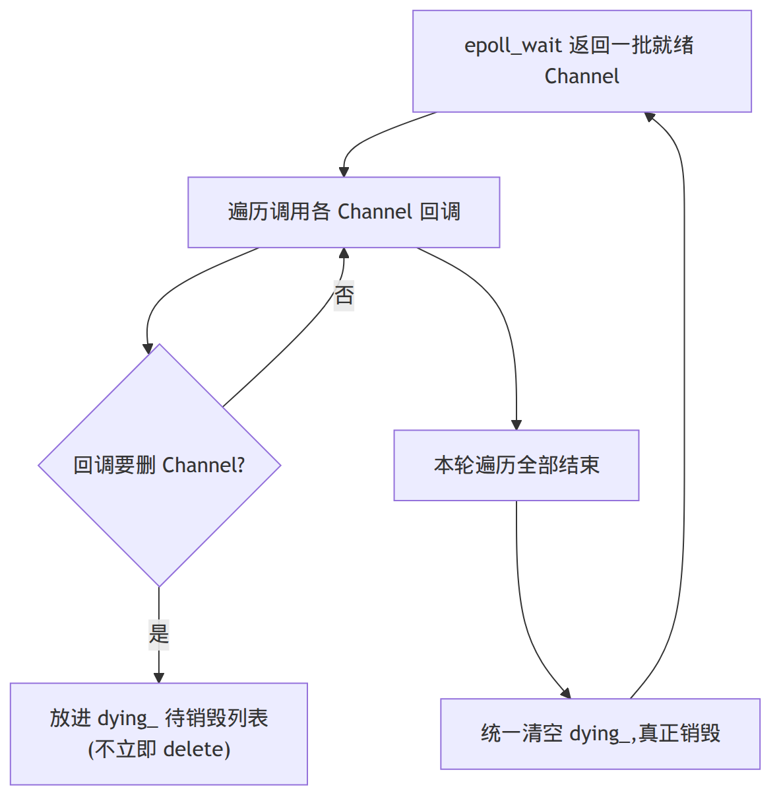

---

## 9.5 自定义串口协议讲一下？8 状态机怎么处理半包和错误？

**解析**：你简历的「8 状态解析状态机 + 错误重同步」，是协议设计能力的展示。

**答案**：**帧格式**：`帧头 0xAA 0x55 | 长度 LEN | 类型 TYPE | 负载 PAYLOAD(1~64B) | CRC16 低 | CRC16 高`。**8 个状态**逐字节驱动：
`WAIT_HEADER1 → WAIT_HEADER2 → WAIT_LEN → WAIT_TYPE → READ_PAYLOAD → WAIT_CRC_LO → WAIT_CRC_HI → DELIVER`。

- **逐字节驱动**：每来一个字节喂给状态机推进一步，天然处理**半包**（没收齐就停在当前状态等下一个字节）和**粘包**（一帧 DELIVER 后自动回到 WAIT_HEADER1 接着解析下一帧）。
- **错误重同步**：任一步出错（帧头不对、长度越界、CRC 校验失败）就**回到 WAIT_HEADER1 重新找帧头**，不会因为一个坏字节卡死或错位整条流。
- **CRC16 校验**：覆盖 LEN+TYPE+PAYLOAD，检测传输错误。

**示例**（状态机骨架，对应 `FrameParser::feed`）：
```cpp
void FrameParser::feed(uint8_t b) {
    switch (state_) {
    case State::WAIT_HEADER1: if (b == HEADER1) state_ = State::WAIT_HEADER2; break;
    case State::WAIT_HEADER2: state_ = (b == HEADER2) ? State::WAIT_LEN
                                                      : State::WAIT_HEADER1; break; // 错就重同步
    case State::WAIT_LEN:
        if (b < LEN_MIN || b > LEN_MAX) { state_ = State::WAIT_HEADER1; break; }   // 长度非法→重同步
        len_ = b; crc_.reset(); crc_.update(b); state_ = State::WAIT_TYPE; break;
    case State::WAIT_TYPE: type_ = b; crc_.update(b); bytes_received_ = 0;
        payload_buffer_.clear(); state_ = State::READ_PAYLOAD; break;
    case State::READ_PAYLOAD:
        payload_buffer_.push_back(b); crc_.update(b);
        if (++bytes_received_ == len_) state_ = State::WAIT_CRC_LO; break;
    case State::WAIT_CRC_LO: crc_lo_ = b; state_ = State::WAIT_CRC_HI; break;
    case State::WAIT_CRC_HI:
        crc_hi_ = b;
        if (((crc_hi_ << 8) | crc_lo_) == crc_.value()) handleDeliver();           // 校验通过
        state_ = State::WAIT_HEADER1; break;                                        // 无论对错都回起点
    default: state_ = State::WAIT_HEADER1; break;
    }
}
```

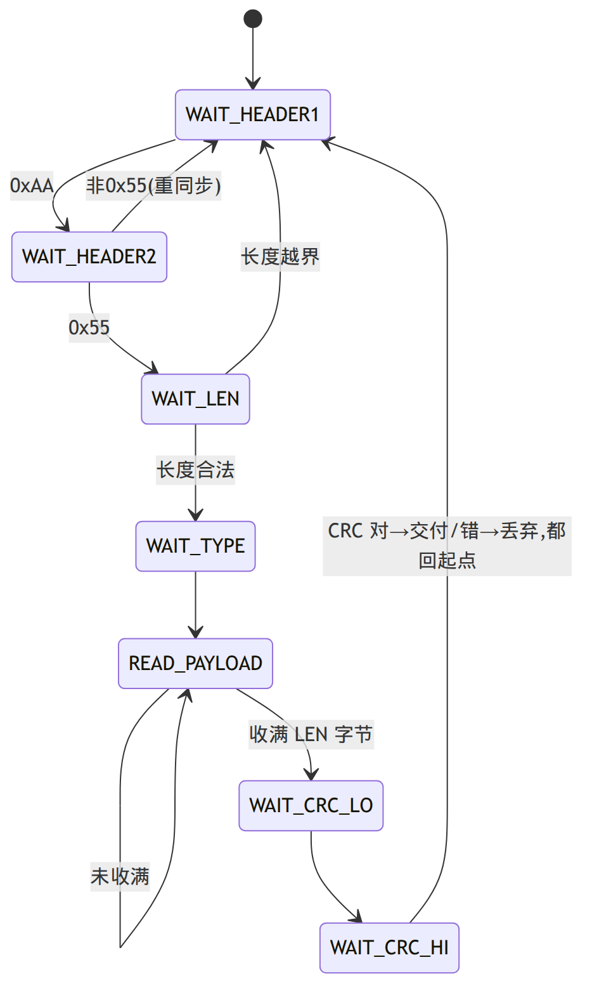

---

## 9.6 怎么保证下行命令可靠送达？序列号 + ACK + 超时重发讲讲

**解析**：体现你「在应用层重造可靠传输」的能力。

**答案**：串口本身不可靠（无重传），所以我在**应用层**做可靠性：
1. **每条上行数据和下行命令都带序列号 seq**。
2. **ACK 配对**：接收方处理后回一个带相同 seq 的 ACK。
3. **超时重发**：发送方发出命令后启动一个 **timerfd 定时器**，超时没收到对应 seq 的 ACK 就**重发**。
4. **幂等**：**按同一序列号重发**，接收方用 seq 去重——即使 ACK 丢了导致重复下发，设备也只执行一次，不会重复动作。

**答出深度**：这本质是「在串口这条裸链路上重造了 TCP 的可靠性（确认 + 重传 + 去重）」。关键是**幂等**——重发用同 seq，配合接收端去重，避免「命令执行两次」。和第 3 章 TCP 可靠传输能呼应起来讲。

---

## 9.7 单一写者模式：串口为什么不用加锁？跨线程命令怎么进来？

**解析**：M7 的核心设计之一，和 eventfd 强相关。

**答案**：
- **单一写者**：**串口写只由主线程（EventLoop 线程）执行**，所以串口**根本不需要加锁**——没有多线程同时写。
- **跨线程下行命令怎么办**：别的线程（如处理云端命令的线程）要下发命令时，**不直接碰串口**，而是把命令**放进一个线程安全队列**，然后**写 eventfd 唤醒主循环**；主循环醒来后在**自己线程里**从队列取命令、写串口。
- 这样**所有串口写仍只发生在主线程**，把「跨线程调用」转成了「loop 内任务」，无锁、无竞争。

**答出深度**：这是「**把跨线程调用转成 loop 内任务**」的标准 Reactor 手法（muduo 的 `runInLoop`/`queueInLoop` 同理）。它从架构上消除了串口锁，也顺带消除了死锁可能。

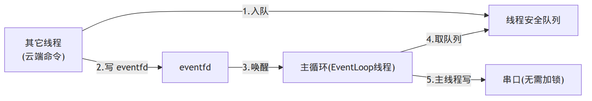

---

## 9.8 线程池双写 SQLite 和 MQTT，WAL 模式解决什么？

**答案**：
- 解码出的记录交给**线程池并行写入**本地 SQLite + 上行 MQTT，让主 I/O 线程不被慢 I/O 拖住。
- **SQLite WAL（Write-Ahead Logging）模式**：写操作先追加到 WAL 日志文件，**读操作可以并发进行不被写阻塞**。所以**实时查询（HTTP 监控读数据）不阻塞落库（写入）**，读写并发。默认的回滚日志模式下读写互斥，WAL 才能让监控页面随时查而不卡写入。

**答出深度**：能讲「WAL 让读写不互斥」+「SQLite 语句用 RAII 包装（`sqlite3_stmt*` 析构 finalize）」+「预编译语句复用，绑参数」。线程池大小按 I/O 密集型给（多于核数）。

---

## 9.9 HTTP 监控服务：半包怎么重组？四状态机？空闲连接怎么回收？

**答案**：
- **半包重组**：手写**接收缓冲区 Buffer**——`recv` 到的数据先进 Buffer，解析器从 Buffer 尝试解析完整请求，不完整就保留等下次 recv（解决 TCP 半包，见第 3 章）。
- **四状态请求解析状态机**：`REQUEST_LINE → HEADERS → BODY → COMPLETE`，**支持管线化**（一个 Buffer 里连续解析多个请求）。
- **空闲连接回收**：基于 **timerfd** 周期触发，给每个连接记 `last_active`，扫描把「当前时间 - last_active > 超时」的连接关掉；listen fd、timer fd 自身豁免。扫描用**两阶段**（先收集过期 fd 到临时 vector，遍历结束后再删）避免迭代器失效。
- **网页资源编译期内嵌进二进制**，实现单文件离线部署（不依赖外部文件）。

**答出深度**：「两阶段删除防迭代器失效」这个套路在 HTTP、超时重试、Channel 销毁里**反复复用**——能讲出「同一个模式在多处复用」体现工程抽象力。

---

## 9.10 配置热加载怎么做的？为什么用 SIGHUP？

**答案**：用 **SIGHUP 信号**触发配置重载——运维改完配置文件，`kill -HUP <pid>` 即可，**不用重启服务**（重启会断开所有连接、丢状态）。实现：用 **signalfd 把 SIGHUP 变成 fd 可读事件**纳入 epoll，主循环收到后在**自己线程里安全地重新读配置文件、更新运行参数**——完全避开「在信号处理函数里干重活」的雷区（见第 4 章 4.7）。

**答出深度**：SIGHUP 是 Unix 守护进程「重载配置」的惯例信号（nginx/sshd 都用它）。关键是**signalfd 化**——把异步信号转成同步 fd 事件，和事件循环无缝融合，避免可重入问题。

---

## 9.11 RAII 在项目里管理了哪些资源？systemd 怎么托管？

**答案**：
- **RAII + 智能指针统一管理**：串口、数据库连接与语句、MQTT 客户端、线程池、事件循环——构造获取、析构释放，**杜绝泄漏与重复释放**（见第 1 章）。
- **双缓冲异步日志**：前台线程写「前台缓冲」，后台线程定时/写满时交换缓冲并落盘，**日志不阻塞业务线程**。
- **systemd 托管**：写 `.service` 单元，`WantedBy` 开机自启；`Restart=on-failure` **崩溃自动重启**；用 `journalctl` 看日志。**CMake 模块化构建**。

**答出深度**：双缓冲异步日志的精髓是「**业务线程只管把日志塞进内存缓冲（快），磁盘 I/O 在后台线程做（慢）**」，用两块缓冲交换避免锁竞争——这和线程池「重活外包」是同一思想。

---

## 9.12 这个项目最大的难点 / 你最有成就感的设计是什么？（行为题）

**答案模板**（挑 1~2 个讲）：
- **难点 1：UAF 与生命周期管理**。事件循环里 Channel 的所有权和「遍历时删除」的 UAF 是最烧脑的——我最终用「map 持有 + epoll 借用 + 延迟销毁」三招解决，并想清楚了「防 UAF 不是 shared_ptr 的功劳而是延迟销毁」这个精确边界。
- **难点 2：把四类异构事件源统一进一个事件循环**。串口、定时、信号、跨线程通知本来机制各异，我用「一切皆 fd + Channel 抽象」把它们统一成 epoll 事件，一个循环全管——这个抽象复用 5 次，是我最有成就感的设计。
- **难点 3：可靠双向通信**。在不可靠的串口上用「序列号 + ACK + 超时幂等重发」重造可靠性，还要保证幂等不重复执行。

**答出深度**：行为题要讲「遇到什么问题 → 怎么分析 → 怎么解决 → 学到什么」，落到**具体技术决策的权衡**，别空谈。

---

## 9.13 深水区追问补充（面试官往死里问时的弹药）

> 这些是「答完主线后面试官继续深挖」的二级问题，能答上来直接区分档次。

**Q1：`epoll_wait` 的 `maxevents` 设多大？如果返回的事件数刚好等于 `maxevents` 说明什么？**
答：`maxevents` 是一次最多取回的就绪事件数（我设几十到几百）。如果**返回数 == maxevents**，说明就绪事件可能没取完，**下一次 `epoll_wait` 会立刻返回剩下的**（LT 不会丢，ET 也因为 fd 仍处理中而保留）。所以不必怕取不完，循环下一轮即可；设太大浪费栈/拷贝，太小增加 syscall 次数，按连接规模权衡。

**Q2：ET 模式下你循环 read，如果对端一直发数据，会不会饿死其它连接？**
答：会——单个 fd 数据无限多时，一直读这一个会**饿死别的 fd**。解法：**每个 fd 单次最多读 N 字节/N 次就让出**，把没读完的留到下一轮 `epoll_wait`（ET 下要小心：让出前必须确认内核还有数据，否则没有新边沿。muduo 用 LT 规避此问题）。这是「公平性 vs ET 复杂度」的真实权衡。

**Q3：别的线程调用你的 `runInLoop(cb)`，怎么保证线程安全？**
答：`runInLoop` 先判断 **`isInLoopThread()`**——如果调用者就是 loop 线程，**直接执行** cb；否则走 **`queueInLoop`**：把 cb 加进一个互斥锁保护的 `pendingFunctors_` 队列，再**写 eventfd 唤醒** loop。loop 每轮处理完 I/O 事件后，**swap 出整个 functor 队列**（缩小临界区）在本线程逐个执行。这样所有 cb 最终都在 loop 线程跑。

**Q4：timerfd 到期后你不 read 会怎样？read 出来的是什么？**
答：timerfd 到期后变**持续可读**，LT 下 `epoll_wait` 会**反复触发**造成空转。必须 **`read` 出一个 `uint64_t`**——它是「自上次读以来的到期次数」（错过多次会累计），读了才清除可读状态。我空闲连接扫描的 timerfd 每次都 read 掉。

**Q5：线程池写完库，结果/日志要回主线程吗？怎么回？**
答：工作线程**不直接碰主线程的 I/O 结构**（否则又要加锁）。如果要把结果送回（如写失败要在监控里标记），就用 **`loop->queueInLoop(回调)`** 把后续动作塞回主循环执行——和跨线程下行命令同一个机制。**「谁的数据谁的线程碰」**。

**Q6：WAL 模式下多个线程能同时写 SQLite 吗？**
答：**不能**——WAL 允许「**多读 + 单写并发**」，即读不阻塞写、写不阻塞读，但**同一时刻仍只能有一个写者**。所以我**写库要么用单连接串行、要么加写锁**；WAL 的价值是让 HTTP 监控的**读**永远不被落库的**写**卡住，而不是让多写并行。说反了是常见错误。

**Q7：下行命令序列号用一个字节，会回绕（wrap around）吗？**
答：会，`uint8` 到 255 后回到 0。只要**在途未确认的命令数远小于序列号空间**（我同一时刻在途命令很少），回绕就不会造成 seq 混淆——用「滑动窗口」判断新旧即可。这和 TCP 序列号回绕处理是同一思路（第 3 章）。

**Q8：进程收到 SIGTERM 怎么优雅退出？**
答：信号 → signalfd → 主循环收到后走**优雅关闭流程**：① 停止 accept 新连接；② 处理完在途请求/发完在途命令；③ `close` 队列让线程池 join 退出；④ **flush 异步日志**（双缓冲剩余的刷盘）；⑤ 析构触发 RAII 释放所有资源。绝不在信号处理函数里干这些（见 4.7）。

---

> 📌 **第 9 章总结**：这章的题要练到**不等追问就主动抛深度**——Channel 所有权、UAF 延迟销毁、单一写者 eventfd、协议幂等重发、WAL 读写并发、signalfd 热加载。这正是 M7 mock 反馈的「主动 surface 设计深度」得分点。

---

# 第 10 章·项目二 · STM32 采集节点深挖

> **STM32F103 + 原生 FreeRTOS 低功耗多传感器采集节点**。和网关是「一对」——节点采集上报、网关汇聚。面试官会重点问你的**任务划分、看门狗保活、DMA 接收、低功耗**。

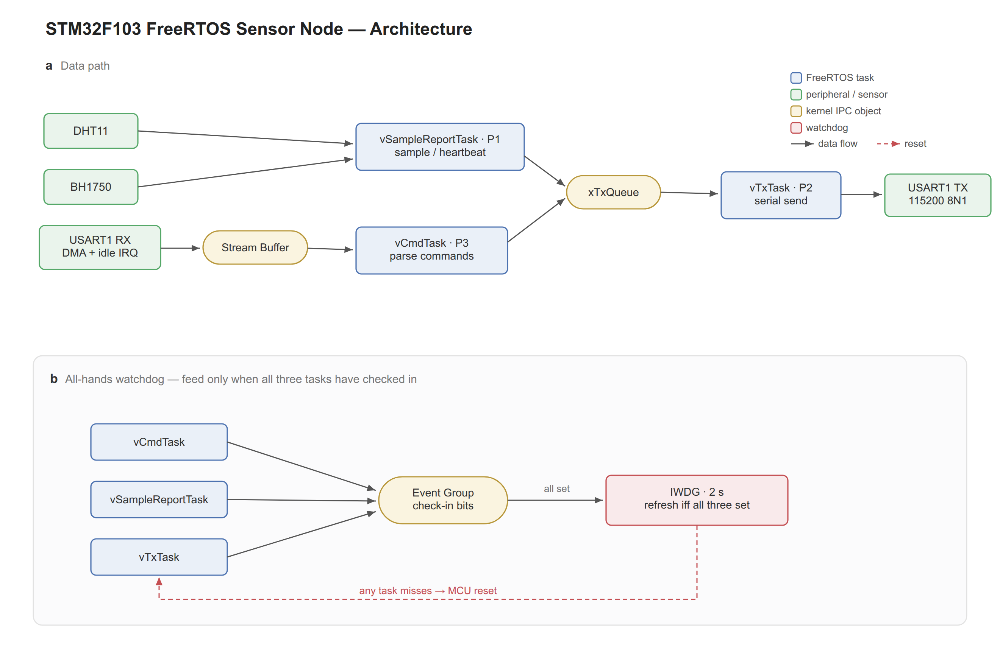

> 上图（`docs/n6_node_architecture.png`）：三个抢占式任务（命令解析 / 采样上报 / 串口发送）通过队列、流缓冲、互斥量协作；UART 用 DMA+空闲中断收，传感器经 I2C/单总线读；事件组全员报到喂独立看门狗；tickless 空闲睡眠降功耗。

## 10.1 一分钟介绍这个项目

**答案**：基于 STM32F103 和**原生 FreeRTOS**（不是 CubeMX 默认的 CMSIS-RTOS 封装，是直接用原生 API）的多传感器采集节点：
- **周期采集**温湿度（DHT11，单总线）和光照（BH1750，I2C），经**自定义二进制协议封帧**，通过**串口与边缘网关双向通信**（上报数据 + 响应下行命令）。
- 划分**三个抢占式任务**：命令解析、采样上报、串口发送，用队列/流缓冲/互斥量通信。
- **UART 用 DMA + 空闲中断**逐帧唤醒。
- **tickless 空闲睡眠**降低空闲功耗；**独立看门狗 IWDG + 事件组全员喂狗**保障长期稳定。

**答出深度**：强调「和网关用**同一套二进制协议**，完成了**实体端到端联调**」——有完整链路（MCU 采集→串口→网关解析→双写云端/数据库；云端命令→网关→串口→MCU 执行回执），不是孤立的单片机 demo。

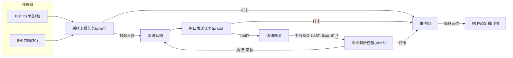

## 10.2 三个任务怎么划分？优先级为什么这么定？

**答案**：按**功能解耦 + 实时性**划分：
| 任务 | 优先级 | 职责 |
|---|---|---|
| `vCmdTask` 命令解析 | **3（最高）** | 收下行命令、走协议状态机解码、执行、回执 |
| `vTxTask` 串口发送 | **2** | 从发送队列取帧，统一经串口发出 |
| `vSampleReportTask` 采样上报 | **1（最低）** | 周期读传感器、封帧、入发送队列 |

**为什么这么定**：
- **命令解析最高**——下行命令要**实时响应**，必须能抢占正在采样的任务。
- **发送居中**——保证数据能及时发出，但不该抢占命令处理。
- **采样最低**——采样周期长（默认 5 分钟），不急，让位给实时任务。

**答出深度**：把「**串口发送收口到单一发送任务**」是关键设计——多个任务（采样、命令回执）都要发串口，如果各发各的会**竞争串口**；统一经一个发送队列 + 一个发送任务，**串口是单一写者**，无需对串口加锁。这和网关的「单一写者」是同一思想，跨两个项目复用，能讲出来很加分。

## 10.3 传感器驱动怎么写的？DHT11 和 BH1750 难点在哪？

**答案**：
- **BH1750（I2C 光照）**：发 `POWER_ON` → 发 `CONT_HIGH_RES`（连续高分辨率）→ 读 2 字节原始值 → **lux = raw / 1.2**。难点是 **I2C 总线卡死恢复**——若从机把 SDA 拉死，我手动切 GPIO bit-bang **狂发时钟脉冲把从机状态机冲回空闲**再重初始化。
- **DHT11（单总线温湿度）**：严格的**微秒级时序**——主机拉低 ≥18ms 起始、DHT11 响应 80us 低+80us 高、40 位数据每位「50us 低 + 高电平长短表 0/1」。难点是**时序保护**：读取临界段用 `taskENTER_CRITICAL()` 关调度 + **DWT 精确微秒延时**，避免被任务切换/中断打断时序导致读错；读完立刻退出临界区。

**答出深度**：能讲「为什么 DHT11 要关临界区而 BH1750 不用」——DHT11 是软件 bit-bang 时序，对延时极敏感；BH1750 走硬件 I2C 外设，时序由硬件保证，不怕被打断。这种「按外设特性区别对待」体现你真的理解，而不是套模板。

## 10.4 UART 接收为什么用 DMA + 空闲中断？比中断接收好在哪？

**答案**：（详见第 7 章 7.5）下行命令是**不定长帧**，普通中断接收每字节一次中断、CPU 占用高且不知道何时收完。**DMA + 空闲中断**：
- DMA 自动把串口数据搬进缓冲区，**全程不打扰 CPU**。
- 一帧结束总线空闲触发 **IDLE 中断**，此时一帧刚好收完。
- ISR 里**只 `xSemaphoreGiveFromISR` 释放信号量 + `portYIELD_FROM_ISR`** 唤醒命令解析任务，**亚毫秒级**切过去解码。

**答出深度**：这是「**ISR 短、重活后移**」+「**DMA 省 CPU**」+「**亚毫秒唤醒不牺牲实时**」三合一，正好对应 tickless 低功耗——平时睡，命令一来 DMA 收 + IDLE 唤醒，秒醒响应。

## 10.5（核心亮点）事件组「全员报到」喂狗是什么？解决了什么？

**解析**：这是你简历最亮的设计，一定要讲透「假活」问题。

**答案**：
- **普通做法的问题（假活）**：很多人在**主循环或单个任务里喂狗**。但如果**某个子任务卡死了**（死循环、阻塞），喂狗的那个任务还活着，**照样喂狗**，看门狗永远不会复位——系统看起来「活着」，实际有任务僵死，**这是假活，看门狗形同虚设**。
- **我的设计（全员报到）**：用一个**事件组**，**三个任务每轮各自打卡**（置事件组的一个 bit：bit0/bit1/bit2）；一个监督逻辑**只有检测到三位都置上（0b111）才喂一次狗**，喂完清空事件组进入下一轮。
- **效果**：**任一任务僵死（没打卡）→ 事件组永远集不齐 → 喂不上狗 → 看门狗（IWDG ~2 秒）超时复位**。杜绝了「子任务卡死的假活」。

**示例**（喂狗逻辑骨架）：
```c
#define ALL_TASKS_BITS  (BIT0 | BIT1 | BIT2)   // 三任务各占一位
// 各任务每轮循环里打卡:
xEventGroupSetBits(xCheckInGroup, BIT0);       // 采样任务
// xEventGroupSetBits(xCheckInGroup, BIT1);    // 发送任务
// xEventGroupSetBits(xCheckInGroup, BIT2);    // 命令任务

// 监督逻辑(可放最高优先级任务或单独任务):等三位集齐才喂
EventBits_t bits = xEventGroupWaitBits(
    xCheckInGroup, ALL_TASKS_BITS,
    pdTRUE,    // 取走后清零(进入下一轮)
    pdTRUE,    // 要求全部置位(逻辑与)
    pdMS_TO_TICKS(1500));   // 超时<看门狗2s,等不齐就不喂→等着复位
if ((bits & ALL_TASKS_BITS) == ALL_TASKS_BITS) {
    HAL_IWDG_Refresh(&hiwdg);   // 集齐才喂狗
}
```

**答出深度**：这道题讲清「假活」概念 + 「全员报到 = 逻辑与喂狗」就赢了。可以引申：超时阈值要 **< 看门狗周期**（我等 1.5s，看门狗 2s），留出余量；各任务打卡频率要 > 喂狗检查频率，否则正常也喂不上。这是一个**有真实工程思考**的设计，不是教科书抄来的。

## 10.6 MCU 端协议编解码怎么和网关对齐的？端到端联调踩过什么坑？

**答案**：
- **同一套协议**：MCU 端实现与网关**同套二进制协议**的编解码（帧头 `0xAA 0x55` + LEN + TYPE + PAYLOAD + CRC16），封帧上报、解帧执行下行命令，**两端 CRC 算法、字节序、帧格式严格一致**。
- **端到端联调**：完成「MCU 采集 → 串口 → 网关解析 → 双写」和「网关下发 → MCU 执行 → 回执」的实体联调。

**踩过的坑（真实，能讲细节最加分）**：
1. **串口要 `stty raw`**：Linux 端串口默认是「规范模式」会处理特殊字符（如把 `0x0A` 当换行、回显），**二进制协议必须设 raw 模式**关掉这些处理，否则字节被篡改导致 CRC 错。
2. **字节序**：多字节字段（CRC、序列号）两端按字节分开收发，不靠 memcpy 整数，避免大小端不一致。
3. **采样周期**：默认 5 分钟一次，联调时嫌慢，做成**可下行命令配置周期**。

**答出深度**：`stty raw` 这个坑非常真实——很多人二进制串口调不通就栽在规范模式上。能说出「我排查发现是终端规范模式吃掉/改写了某些字节，改成 raw 才通」，证明你真的动手联调过、会用工具排查。

## 10.7 低功耗具体怎么做的？会不会影响命令实时性？

**答案**：启用 **FreeRTOS tickless 空闲睡眠**——所有任务阻塞、系统空闲时关掉周期 SysTick、CPU 进 Sleep 低功耗模式，不空转。**不影响实时性**：**串口数据一来就被 UART 中断亚毫秒级唤醒**，命令照样秒级响应。核心是「**没事就睡、有事秒醒**」——采集节点大部分时间在等下一个采样周期（5 分钟）或等命令，睡眠占比极高，省电明显。

**答出深度**：能讲「低功耗和实时性的平衡点在于**唤醒源够快**」——Sleep 模式外设时钟还在，串口中断能立刻唤醒（亚毫秒），所以深睡不牺牲响应。如果用 Stop/Standby 更省电但唤醒慢、要重配时钟，就要权衡。

## 10.8 这个项目的难点 / 亮点？（行为题）

**答案模板**：
- **亮点 1：事件组全员喂狗防假活**——发现并解决了「单点喂狗掩盖子任务僵死」这个真实可靠性陷阱。
- **亮点 2：DHT11 微秒时序在 RTOS 下的保护**——用临界区 + DWT 精确延时让软件时序在抢占式系统里也能稳定，且临界区极短不伤实时。
- **难点：端到端联调**——两端协议字节级对齐、串口 raw 模式、DMA+IDLE 调通，跨「MCU + Linux」两个世界，靠逻辑分析仪/串口抓包逐字节比对解决。

**答出深度**：把「单片机项目」讲出「系统可靠性思维」（看门狗防假活）和「跨端工程联调能力」，就脱离了「点灯级 demo」，这正是面试官想看的。

---

## 10.9 深水区追问补充（硬核细节，区分「真做过」和「背简历」）

> 这些细节背不出来，只有真上手调过板子才答得上——也正因如此，答对极加分。

**Q1：喂狗的监督逻辑自己卡死了怎么办？**
答：那正是**期望行为**——监督逻辑卡死 → 喂不上狗 → 看门狗超时复位，系统重启自愈。关键是把**监督逻辑放在足够高的优先级**（或并入最高优先级任务），保证它不会因为被低优先级任务饿死而「假超时」。看门狗的设计哲学就是「**宁可错杀（复位），不可放过（假活）**」。

**Q2：STM32F103 是 Cortex-M3，没有硬件 FPU，温湿度浮点怎么处理？**
答：F103 无硬件浮点，用 `float` 会调**软件浮点库，又慢又占 Flash**。所以我**在 MCU 端传定点/整数**（如温度 ×10 存成整数 `253` 表示 25.3℃），**浮点换算放到网关（树莓派，有 FPU）侧**做。这是「把算力留给有算力的一端」的嵌入式常识。BH1750 的 `raw/1.2` 也可挪到网关算。

**Q3：UART 的 DMA 用循环模式还是普通模式？缓冲区多大？怎么知道收了多少字节？**
答：用**普通模式 + IDLE 空闲中断**接收不定长帧。缓冲区设 ≥ 最大帧长（我帧 ≤ 64+几字节，开几十~128 字节余量）。**收了多少字节 = 缓冲区大小 - DMA 的 NDTR 剩余计数寄存器**——IDLE 中断里读 `__HAL_DMA_GET_COUNTER` 算出本帧实际长度，再停 DMA / 重启接收。

**Q4：STM32F1 的硬件 I2C 有著名的死锁 bug，你踩到了吗？怎么处理的？**
答：踩到了——F1 硬件 I2C 状态机在某些时序/干扰下会**卡死把 SDA 拉低不放**，后续通信全失败。我的处理：检测到总线异常时，**把 SCL/SDA 切成 GPIO，手动 bit-bang 发 9 个时钟脉冲**把从机状态机冲回空闲、再补一个 STOP，然后**重新初始化 I2C 外设**。这就是 7.6 提到的「I2C 总线恢复」。更激进的方案是干脆软件模拟 I2C，避开硬件 bug。

**Q5：读 DHT11 关临界区那几十微秒到几毫秒，高优先级命令会被延迟，能接受吗？**
答：DHT11 整帧时序约 4~5ms（含 18ms 起始拉低，但拉低段可不关中断），真正**逐位的临界区只包关键的几十~几百微秒**。命令延迟这点时间在「下行命令秒级响应」的需求下完全可接受。如果某场景不能接受，可改用**定时器输入捕获硬件测量电平时长**，彻底不关中断——这是用硬件换实时性的进阶做法。

**Q6：看门狗复位后，下次启动怎么知道「上次是被狗咬复位的」？**
答：读 **RCC 复位标志位**（`__HAL_RCC_GET_FLAG(RCC_FLAG_IWDGRST)`）——上电后判断是不是 IWDG 复位，是的话可以**上报一条「异常复位」事件给网关**、点个错误灯、或记到 Flash 里统计复位次数。读完 `__HAL_RCC_CLEAR_RESET_FLAGS` 清掉。这体现你考虑了**故障可观测性**，不只是「复位就完事」。

**Q7：采样、命令回执都要发串口，发送队列满了怎么办？**
答：发送队列满说明**下游（串口/网关）消费不过来**。我用**带超时的阻塞入队**（`xQueueSend` 给一个 timeout）：短时拥塞就等一下，超时还满就**丢弃最旧的非关键数据**（采样可丢，命令回执优先保留）并记一次告警。设计上要分清「可丢的周期数据」和「不可丢的命令回执」。

**Q8：任务栈大小怎么定的？怎么验证没溢出又不浪费？**
答：先按经验给（解析/采样任务 `configMINIMAL_STACK_SIZE*3`、发送 `*2`），跑一段时间后用 **`uxTaskGetStackHighWaterMark`** 读每个任务的「历史最小剩余栈」，留 30%~50% 余量后定稿。开 `configCHECK_FOR_STACK_OVERFLOW=2`（填魔数检测）兜底。这是「实测驱动」而非拍脑袋。

---

> 📌 **第 10 章总结**：节点项目的差异化亮点是**可靠性设计（事件组喂狗防假活）+ 低功耗（tickless 秒醒）+ 真实联调（同协议、stty raw 坑）**。和网关共享「单一写者」「同套协议」「ISR 短重活后移」，能跨两个项目讲出统一的设计哲学。

---

# 第 11 章·工程化与软技能

> 简历明确写「熟练 Git、CMake，能用 GDB、Valgrind 调试」。这章覆盖工具八股 + 调试方法论 + 自我介绍/反问话术，最后一道防线。

## 11.1 Git：常用操作 + merge vs rebase + 冲突解决

**答案**：
- **基本流**：`git add` 暂存 → `git commit` 提交 → `git push` 推送；`git pull` = `fetch` + `merge`。
- **merge vs rebase**：
  - `merge`：把两个分支合并，**保留分支历史**，产生一个合并提交，历史是「真实但有分叉」。
  - `rebase`：把当前分支的提交**逐个重放**到目标分支顶端，历史**线性整洁**，但**改写了提交（commit hash 变）**。
  - **原则**：**公共分支（已 push）别 rebase**（会改写历史坑队友），本地私有分支整理用 rebase 让历史干净。
- **冲突解决**：合并冲突时手动编辑 `<<<<<<< / ======= / >>>>>>>` 标记的区域，留下正确内容，`git add` 后继续。
- **撤销**：`git reset`（移动 HEAD，改历史，`--soft`留改动/`--hard`丢改动）、`git revert`（生成反向提交，不改历史，**公共分支用它**）、`git checkout/restore`（撤工作区改动）。

**答出深度**：能讲「`reset` vs `revert` 的选择标准 = 是否已 push」「`rebase -i` 可压缩/重排提交」「`git stash` 临时存改动」「`cherry-pick` 摘单个提交」。我项目用分支开发 + PR 流程。

## 11.2 CMake：项目怎么组织的？

**答案**：CMake 用 `CMakeLists.txt` 描述构建，跨平台生成 Makefile/Ninja。核心概念是 **target（目标）**：
```cmake
cmake_minimum_required(VERSION 3.16)
project(edge_gateway CXX)
set(CMAKE_CXX_STANDARD 17)
add_compile_options(-Wall -Wextra -Wpedantic)   # 0 warning 要求

add_library(protocol STATIC src/protocol/FrameParser.cpp src/protocol/CRC16.cpp)
target_include_directories(protocol PUBLIC include)

add_executable(gateway src/main.cpp)
target_link_libraries(gateway PRIVATE protocol pthread sqlite3)
```

**答出深度**：能讲「**现代 CMake 以 target 为中心**——用 `target_link_libraries`/`target_include_directories` 而非全局 `include_directories`，依赖随 target 传递（PUBLIC/PRIVATE/INTERFACE）」「模块化：每个子目录一个 CMakeLists，用 `add_subdirectory`」。我项目按 `net/protocol/db/mqtt/...` 模块化构建。

## 11.3 GDB：怎么调试段错误 / core dump？

**答案**：
- **常用命令**：`break`(b) 断点、`run`(r) 运行、`next`(n) 单步跳过、`step`(s) 单步进入、`continue`(c) 继续、`print`(p) 看变量、`backtrace`(bt) 看调用栈、`watch` 监视变量、`info locals` 看局部变量。
- **调段错误**：`gdb ./program` → `run` → 崩溃后 `bt` 看崩在哪个函数哪一行 → `p` 看相关指针/变量。
- **core dump**：`ulimit -c unlimited` 开启，崩溃生成 core 文件，`gdb ./program core` 事后分析，`bt` 直接定位崩溃栈。

**答出深度**：能讲「段错误常见原因：空指针解引用、数组越界、栈溢出、UAF、double free」+「多线程用 `info threads`/`thread N` 切线程看各自栈」。结合项目：「我用 core dump + bt 定位过 UAF 类问题」。

## 11.4 Valgrind：怎么定位内存问题？

**答案**：
- **memcheck**（默认）：检测**内存泄漏、越界读写、使用未初始化内存、double free**。`valgrind --leak-check=full ./program`，报告每处泄漏的分配调用栈。
- **helgrind / DRD**：检测**数据竞争、死锁**（多线程）。
- **massif**：堆内存分析（看谁占内存）。

**答出深度**：能讲「Valgrind 通过在虚拟 CPU 上插桩跟踪每次内存访问，所以**慢 10~50 倍**，开发期排查用，不上生产」+「报告里 `definitely lost`（确定泄漏）/`still reachable`（程序退出时还引用着，通常无害）要分清」。结合项目：「我用 RAII 几乎杜绝泄漏，Valgrind 跑下来 clean 是我验收资源管理的手段」。还有 **AddressSanitizer（ASan）** 更快，编译期 `-fsanitize=address` 插桩，现在常替代 Valgrind 查越界/UAF。

## 11.5 遇到一个 bug，你的排查思路是什么？（方法论）

**答案**（系统化调试）：
1. **稳定复现**：找到最小复现步骤——不能复现的 bug 没法修。
2. **缩小范围**：二分法（注释代码/git bisect 找引入 bug 的提交）、加日志看执行到哪、看哪些输入触发。
3. **定位根因**：用工具（GDB 看栈、Valgrind/ASan 查内存、`strace` 看系统调用、日志看状态），**找根因不是改表象**。
4. **修复 + 验证**：改完确认 bug 消失，且没引入新问题（回归测试）。
5. **复盘**：为什么会有这个 bug，怎么防止同类（加断言/测试/改设计）。

**答出深度**：强调「**先复现、再定位、找根因、后验证**，不靠猜」。结合项目讲一个具体 bug（如 UAF 用 ASan+GDB 定位、串口调不通用串口抓包发现是 raw 模式）——有真实排查经历比背方法论强 10 倍。

## 11.6 自我介绍模板（1 分钟）

> 面试官好，我是刘金杰，哈尔滨工程大学信息与通信工程的推免研究生。我的核心方向是 **C++ 嵌入式 Linux 开发**。
>
> 我做了一对配套的项目：一个是跑在树莓派上的 **C++17 多协议边缘网关**——单进程用 **epoll 单线程 Reactor** 同时支撑上行采集和下行控制，自定义二进制协议 + 状态机解析，线程池双写 SQLite 和 MQTT，全程 RAII 管理资源，systemd 部署；另一个是 **STM32F103 + FreeRTOS 的低功耗采集节点**——多任务采集温湿度光照，DMA+空闲中断收串口，事件组全员喂狗防假活，tickless 低功耗，和网关用同套协议做了端到端联调。
>
> 技术上我扎实掌握 C++11/17（智能指针、移动语义、RAII）、Linux 网络编程（epoll、多线程并发）和嵌入式（STM32 外设、FreeRTOS）。我比较看重**把知识落到真实工程**——这两个项目让我打通了从 MCU 到 Linux 网关的完整链路。

**答出深度**：自我介绍 = **一句定位 + 项目亮点 + 技能匹配岗位**，30~60 秒，留钩子让面试官深问你最擅长的点（如「单线程 Reactor」「事件组喂狗」）。

## 11.7 反问环节问什么？（别说「没有」）

**答案**（挑 2~3 个）：
- **业务/技术**：「团队的技术栈和我项目里用的（C++/Linux/嵌入式）匹配度如何？」「这个岗位日常工作中，嵌入式和上层应用的比例大概是？」
- **成长**：「新人入职后的培养/带教是怎样的？」「团队 code review 和工程规范是怎么做的？」
- **真诚**：「您觉得我今天的表现，在哪方面还需要加强？」（敢问反馈，显得自信且想进步）

**答出深度**：反问体现你**对岗位的思考和诚意**。避免一上来只问薪资/加班；优先问能体现你想长期投入、想成长的问题。

## 11.8 简历高频追问的应对（速查）

| 追问 | 一句话应对 |
|---|---|
| 为什么从通信转嵌入式/C++? | 科研中做无人机决策时接触底层系统，发现更喜欢「把系统做扎实」，于是系统补了 C++/Linux/嵌入式并落地两个项目。 |
| 项目是不是跟着教程做的? | 核心设计（单线程 Reactor 所有权/UAF 延迟销毁、事件组喂狗、协议幂等重发）是我自己权衡后做的，能讲清每个决策的「为什么」和踩过的坑。 |
| 你最难的技术点? | 事件循环里 Channel 的生命周期与 UAF——最终用「map 持有 + epoll 借用 + 延迟销毁」解决，并厘清「防 UAF 不是 shared_ptr 而是延迟销毁」。 |
| 论文和嵌入式什么关系? | 论文锻炼了我的建模和系统思维（约束多目标优化、鲁棒决策），工程项目锻炼了落地能力，两者互补。 |
| 你的不足? | 大型分布式/高并发生产经验还少，目前靠这两个项目把单机系统的并发、可靠性、资源管理做深，希望在工作中补齐规模化经验。 |

---

> 📌 **第 11 章总结 & 全文收尾**：工具题（Git/CMake/GDB/Valgrind）答出「选择标准 + 结合项目用过」即可；软技能题的核心是**把每个回答都钩回你的两个项目和具体技术决策**。记住——面试是**主动展示深度**得分，不是被问到才挤。你已经有完整的「MCU→Linux 网关」端到端项目和扎实的设计细节，把这份文档练熟，自信地主动抛出来。祝你拿到心仪的 offer！💪

---

# 第 12 章·八股快问快答（高频 50 问速记）

> 考前 30 分钟过一遍。每题一句话答案，要的是**条件反射**——前面章节是「讲透」，这里是「秒答」。答完一句话后，能补一句项目例子最好。

### C++ 语言（1–10）

1. **`new` 和 `malloc` 区别？** → new 调构造/析构、返回类型指针、失败抛异常；malloc 只分配内存、返回 void*、失败返回 NULL。
2. **`unique_ptr` 和 `shared_ptr` 区别？** → 独占（零开销、只可移动） vs 共享（原子引用计数）。能用 unique 就别用 shared。
3. **`shared_ptr` 线程安全吗？** → 引用计数原子安全；所指对象不安全；同一个 shared_ptr 实例被多线程读写不安全。
4. **`weak_ptr` 干嘛的？** → 不增计数的弱引用，破循环引用，`lock()` 提升。
5. **`std::move` 移动了吗？** → 没有，只是 `static_cast<T&&>`，让重载选中移动构造。
6. **移动构造为什么要 `noexcept`？** → 否则 vector 扩容为保异常安全会退回拷贝。
7. **虚函数怎么实现的？** → 每个类一张 vtable，每个对象一个 vptr，运行时查表动态绑定。
8. **为什么基类析构要 virtual？** → 否则基类指针 delete 派生对象只调基类析构，派生资源泄漏。
9. **`vector` 扩容机制？** → 满了按 1.5/2 倍扩容、搬移旧元素、释放旧内存，均摊 O(1)，迭代器失效。
10. **`map` vs `unordered_map`？** → 红黑树有序 O(log n) vs 哈希表无序平均 O(1)。

### 操作系统（11–16）

11. **进程和线程区别？** → 进程是资源分配单位（独立地址空间），线程是调度单位（共享地址空间，独立栈）。
12. **虚拟内存为什么要？** → 隔离、不必连续/全在内存、简化编程；靠 MMU+页表+分页。
13. **死锁四条件？** → 互斥、持有并等待、不可剥夺、循环等待；破坏任一即可（常用统一锁顺序）。
14. **用户态和内核态？** → 特权级隔离保护；系统调用陷入内核态执行特权操作。
15. **进程切换比线程切换贵在哪？** → 要换页表、刷 TLB、缓存冷掉。
16. **僵尸进程 vs 孤儿进程？** → 僵尸=子退出父没 wait 回收；孤儿=父先退被 init 收养。

### 计算机网络（17–26）

17. **三次握手为什么三次？** → 确认双方收发能力 + 防历史重复连接误建。
18. **四次挥手为什么四次？** → 全双工，对方 FIN 只代表它不发了，自己可能还要发，ACK 和 FIN 不能合并。
19. **TIME_WAIT 为什么 2MSL？** → 保证最后 ACK 能重发 + 让旧报文消亡。
20. **大量 CLOSE_WAIT 说明什么？** → 程序 bug，收到 FIN 后忘了 close。
21. **TCP 怎么保证可靠？** → 序列号+确认+超时重传+滑动窗口+流量控制+拥塞控制+校验和。
22. **流量控制 vs 拥塞控制？** → 前者针对接收方能力（rwnd），后者针对网络（cwnd），实发=min(两者)。
23. **TCP 和 UDP 区别？** → 面向连接/可靠/字节流 vs 无连接/不可靠/数据报有边界。
24. **粘包半包怎么解决？** → 固定长度 / 分隔符 / 长度字段（最常用）；我用帧头+长度+CRC+状态机。
25. **HTTP 常见状态码？** → 200 成功、301/302 重定向、304 未改、400/401/403/404 客户端错、500/502/503 服务端错。
26. **HTTP Keep-Alive？** → 复用 TCP 连接发多个请求，省握手；HTTP/2 多路复用解决队头阻塞。

### Linux / IO（27–32）

27. **select/poll/epoll 区别？** → 前两者每次全量拷贝+遍历 O(n)；epoll 注册一次+只返回就绪 O(就绪数)。
28. **epoll 为什么高效？** → 内核记住关心的 fd（不用每次传）+ 回调只返回就绪的（不用遍历）。
29. **ET 和 LT 区别？** → ET 边沿只通知一次，必须读到 EAGAIN 且配非阻塞；LT 反复通知，简单安全。
30. **五种 IO 模型？** → 阻塞、非阻塞、IO 复用、信号驱动、异步；前四同步，只有 AIO 异步。
31. **零拷贝？** → sendfile/mmap/splice 减少内核↔用户拷贝和切换。
32. **eventfd/timerfd/signalfd 干嘛？** → 把「跨线程通知/定时/信号」统一成 fd 事件，纳入 epoll。

### 并发（33–38）

33. **条件变量为什么用 while 判断？** → 防虚假唤醒 + 唤醒后条件可能又被改。
34. **lock_guard 和 unique_lock 区别？** → 后者可延迟加锁/手动解锁/配条件变量，开销略大。
35. **volatile 能用于多线程同步吗？** → 不能！只保证「每次读内存不被优化」，不保证原子和顺序；用 atomic。
36. **CAS 是什么？ABA 问题？** → 比较并交换，无锁基石；ABA=值变回原值 CAS 误判，加版本号解决。
37. **自旋锁 vs 互斥锁？** → 自旋忙等不睡眠（临界区极短/中断上下文），互斥睡眠（临界区长）。
38. **优先级翻转怎么解决？** → 优先级继承（临时提升持锁低优先级任务），Mutex 自带、信号量没有。

### 嵌入式 / MCU（39–46）

39. **volatile 三大场景？** → 硬件寄存器、ISR 与主程序共享变量、（多线程仅可见性）。
40. **推挽 vs 开漏？** → 推挽能主动输出高低；开漏只能拉低靠外部上拉，用于 I2C/单总线/电平转换。
41. **大端小端怎么判断？** → 看 `uint16=0x0001` 的低地址字节是 0x01（小端）还是 0x00（大端）。
42. **结构体内存对齐为什么？** → CPU 按对齐访问效率高/避免异常；成员顺序影响 sizeof；协议用 packed。
43. **中断里不能做什么？** → 耗时操作、阻塞调用、非可重入/非中断安全函数；ISR 只置标志重活后移。
44. **IWDG 和 WWDG 区别？** → 独立看门狗用独立 LSI 时钟更可靠；窗口看门狗喂太早也复位。
45. **DMA 为什么省 CPU？** → 硬件直接搬数据不经 CPU，搬完中断一次；UART 不定长用 DMA+IDLE。
46. **STM32 低功耗模式？** → Sleep（停 CPU，最快醒）/ Stop（停时钟保 RAM）/ Standby（几乎全关，重启醒）。

### FreeRTOS（47–50）

47. **FreeRTOS 调度方式？** → 抢占式 + 同优先级时间片轮转；数字越大优先级越高。
48. **任务间通信方式？** → 队列（传数据）、信号量（同步/通知）、互斥量（互斥带优先级继承）、事件组（多标志）、任务通知（轻量）。
49. **vTaskDelay vs vTaskDelayUntil？** → 相对延时（会漂移） vs 绝对延时（固定周期），周期任务用后者。
50. **ISR 里调 RTOS API 注意什么？** → 只用 FromISR 后缀；用 `portYIELD_FROM_ISR` 触发立即调度唤醒高优先级任务。

---

> 📌 **全文终**：12 章从语言到项目、从概念到话术全覆盖。复习节奏建议——**首轮**通读 1–8 章打基础；**二轮**精练 9–10 章项目深挖（这是你的差异化）+ 11 章话术；**考前**只过第 12 章这 50 条 + 两章项目的「主动讲深」要点。记住核心心法：**主动展示深度、句句钩回项目、诚实但自信**。加油，offer 在等你！🚀

<!-- 全文完。续写锚点保留如下,若日后要加章节(如「分布式/数据库进阶」)在此追加。 -->
<!-- NEXT_CHAPTER -->
